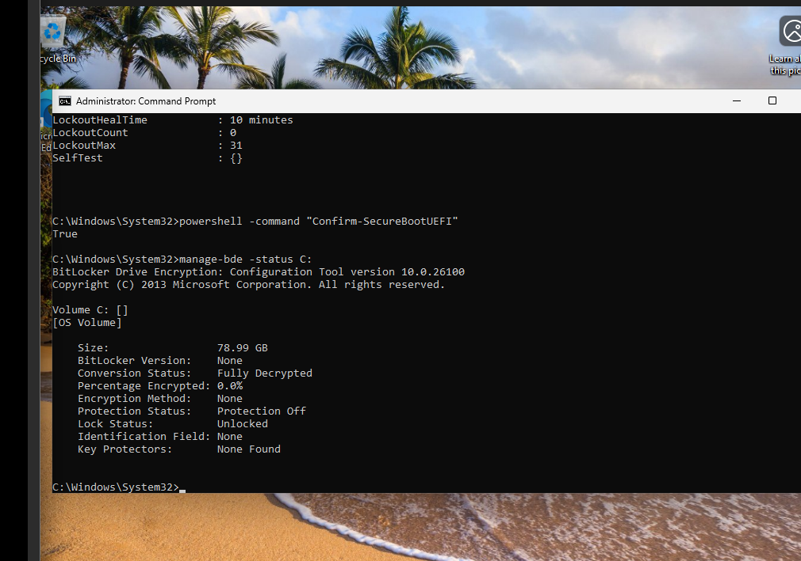
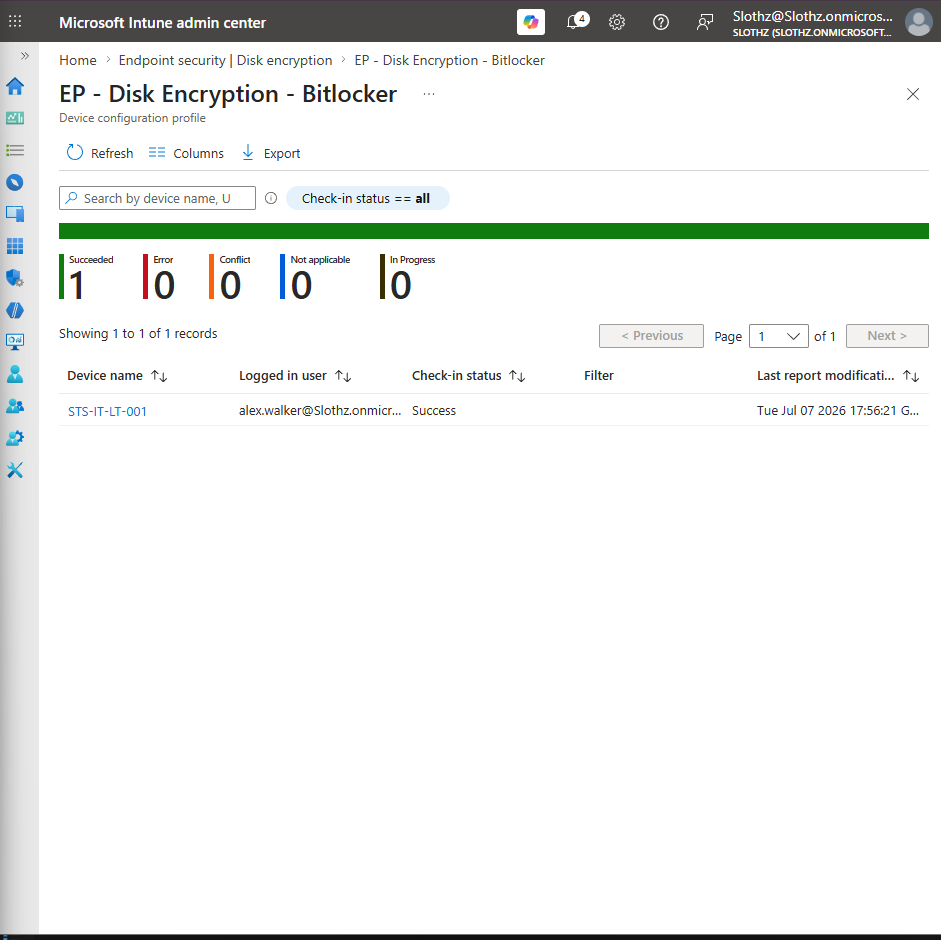
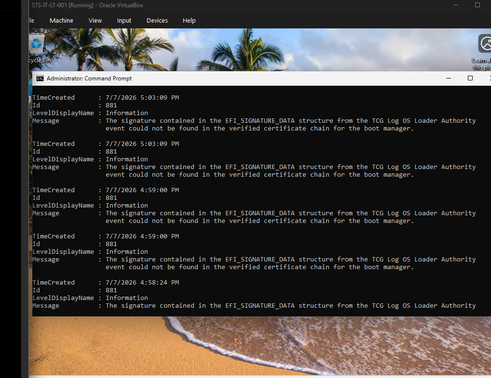
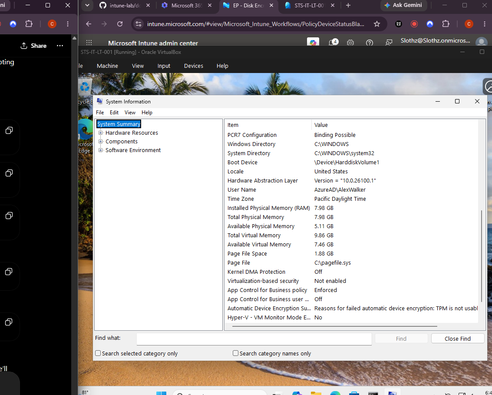

# INT-007 - Configure BitLocker Drive Encryption

## Change Summary

**Requested By:** IT Manager

**Business Reason:**
Slothz Tech Solutions wants to protect company data on corporate-managed Windows devices if a device is lost, stolen, or improperly accessed. BitLocker drive encryption helps protect the operating system drive so company data cannot be easily accessed outside of the managed Windows environment.

**Risk Level:** Medium

**Rollback Plan:**
Remove the BitLocker disk encryption policy assignment from the corporate device group. If encryption has started, decrypt the device using `manage-bde -off C:` after confirming that the recovery key is available.

---

## Business Scenario

Slothz Tech Solutions is improving endpoint security for company-managed Windows devices. Since employees may store or sync company data on corporate laptops, IT needs to ensure that device storage is encrypted.

A BitLocker disk encryption policy will be created in Microsoft Intune and assigned to the corporate device group. The goal is to silently enable BitLocker on corporate-managed Windows devices using TPM-based protection and escrow recovery information to Microsoft Entra ID.

During testing, the Intune policy was successfully delivered to the device, but BitLocker did not begin encryption because the VirtualBox test device reported that the TPM was not usable for automatic device encryption.

---

## Objective

Configure and test a Microsoft Intune BitLocker policy that:

- Requires encryption on corporate-managed Windows devices
- Uses TPM-based protection for the operating system drive
- Avoids startup PINs or startup keys for silent enablement
- Stores recovery information in Microsoft Entra ID
- Applies to the corporate device group
- Verifies both Intune policy deployment and endpoint BitLocker status

---

## Environment

| Component | Details |
|-----------|---------|
| Organization | Slothz Tech Solutions |
| Identity Platform | Microsoft Entra ID |
| Device Management | Microsoft Intune |
| Licensing | Microsoft 365 Business Premium |
| Operating System | Windows 11 Pro |
| Device Name | STS-IT-LT-001 |
| Device Group | DG-Corporate-Devices |
| Policy Type | Endpoint Security - Disk Encryption |
| Policy Name | EP - Disk Encryption - BitLocker |
| Virtualization | Oracle VirtualBox |

---

## Design Decisions

This policy was assigned to **DG-Corporate-Devices** because BitLocker protects the device storage, not a user preference. Device-based targeting ensures that corporate-managed devices receive encryption requirements regardless of which user signs in.

The policy was created under **Endpoint security > Disk encryption** instead of a standard Configuration Profile because BitLocker is an endpoint security control. This keeps disk encryption management separate from general configuration settings and makes the policy easier to find during security reviews.

The policy was designed for silent BitLocker enablement. Startup PINs and startup keys were not required because they introduce user interaction during boot and can prevent silent encryption from completing. TPM-based protection was preferred because it allows the device to protect the operating system drive without requiring users to enter a BitLocker PIN at startup.

Recovery information was configured so that BitLocker recovery data would be stored in Microsoft Entra ID before encryption completed. This is important because IT must be able to recover encrypted devices if users are locked out or the device enters recovery mode.

---

## Evidence

The following screenshots were captured during implementation and troubleshooting.

### Bitlocker Fully Decrypted

### BitLocker Policy Device Success

### BitLocker Event Log

### Lab Limitation

---

## Implementation

The following tasks were completed:

- Verified the starting BitLocker state using `manage-bde -status C:`.
- Confirmed that the operating system drive was fully decrypted before policy deployment.
- Verified Windows Recovery Environment status using `reagentc /info`.
- Verified TPM status using `Get-Tpm` and `tpm.msc`.
- Enabled Secure Boot in the VirtualBox VM.
- Created an Endpoint Security disk encryption policy in Microsoft Intune.
- Named the policy **EP - Disk Encryption - BitLocker**.
- Configured the policy to require device encryption.
- Configured TPM-based startup protection.
- Blocked startup PIN and startup key requirements to support silent enablement.
- Configured recovery settings for the operating system drive.
- Assigned the policy to **DG-Corporate-Devices**.
- Synchronized the device with Microsoft Intune.
- Verified that the policy reported **Success** in Microsoft Intune.

---

## Verification

Verification was completed using Microsoft Intune, Windows command-line tools, registry checks, event logs, and System Information.

The following items were confirmed:

- The BitLocker policy was successfully created in Microsoft Intune.
- The policy was assigned to **DG-Corporate-Devices**.
- **STS-IT-LT-001** reported a successful policy check-in status.
- The device was Microsoft Entra joined.
- MDM enrollment was healthy.
- Local BitLocker policy values were present in the Windows registry.
- TPM was visible and reported as ready in `Get-Tpm` and `tpm.msc`.
- Secure Boot was enabled.
- PCR7 binding was possible.
- The operating system drive remained fully decrypted after policy deployment.
- BitLocker protection remained off.
- No BitLocker key protectors were created.
- System Information reported: **TPM is not usable** for automatic device encryption.

---

## Outcome

The Intune BitLocker policy was successfully deployed to the corporate device group, and the device reported a successful policy status in Microsoft Intune.

However, BitLocker did not begin encryption on **STS-IT-LT-001**. Troubleshooting showed that the policy reached the device, but Windows reported that the TPM was not usable for automatic device encryption inside the VirtualBox environment.

Because the endpoint did not meet the full automatic encryption requirements, the deployment was documented as a partial success with a lab platform limitation. A future test may be completed using a newly built VM with TPM and Secure Boot enabled before Windows installation, or using physical hardware that better supports BitLocker silent enablement.

---

## Lessons Learned

This ticket reinforced the importance of verifying security controls directly on the endpoint instead of relying only on Intune policy status.

Microsoft Intune reported that the BitLocker policy applied successfully, but local verification showed that the drive remained fully decrypted and BitLocker protection was still off. This showed that a successful policy deployment does not always mean the security control is active.

This ticket also showed that lab environments can behave differently from physical enterprise devices. VirtualBox was able to present TPM and Secure Boot to Windows, but Windows still reported that the TPM was not usable for automatic device encryption.

The most important lesson was learning how to separate policy delivery from endpoint enforcement. A policy can be delivered successfully while the endpoint still fails to meet the requirements needed to apply the setting.

---

## Skills Demonstrated

- Microsoft Intune
- Endpoint Security
- BitLocker
- Microsoft Entra ID
- Device Groups
- Windows 11 Endpoint Management
- TPM Validation
- Secure Boot Validation
- Command-Line Troubleshooting
- Registry Verification
- Event Log Review
- Policy Deployment Verification
- Technical Documentation
- GitHub

---

## Challenges Encountered

- Enabling Secure Boot caused Windows to begin device encryption before the Intune policy was deployed.
- The device entered a state where the drive was encrypted but BitLocker protection was off and no key protectors were present.
- The drive had to be decrypted to return to a clean baseline before testing the Intune policy.
- Intune reported the BitLocker policy as successfully applied, but the endpoint remained fully decrypted.
- Troubleshooting confirmed that the policy reached the device, but System Information reported that the TPM was not usable for automatic device encryption.
- The final issue was determined to be related to the VirtualBox test environment rather than the Intune policy assignment.
