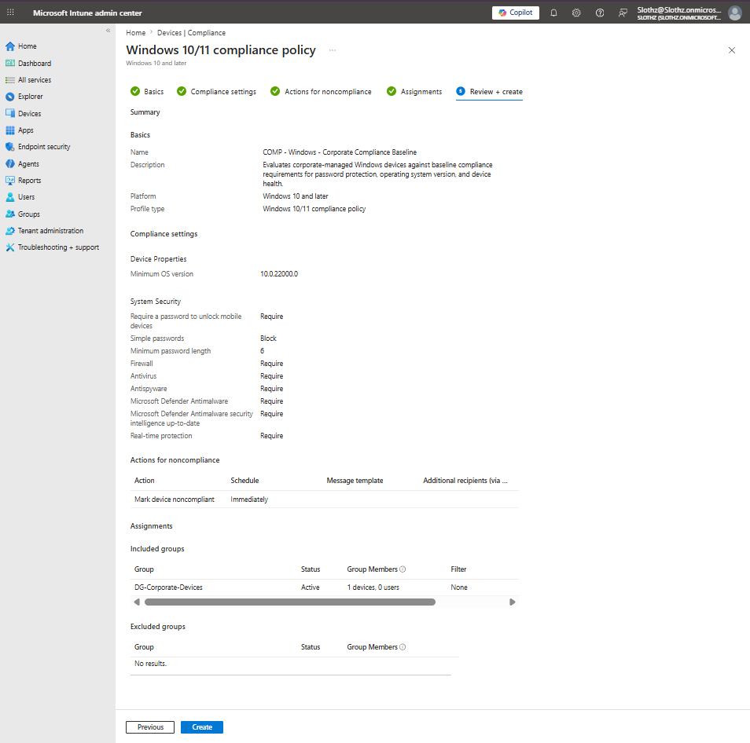
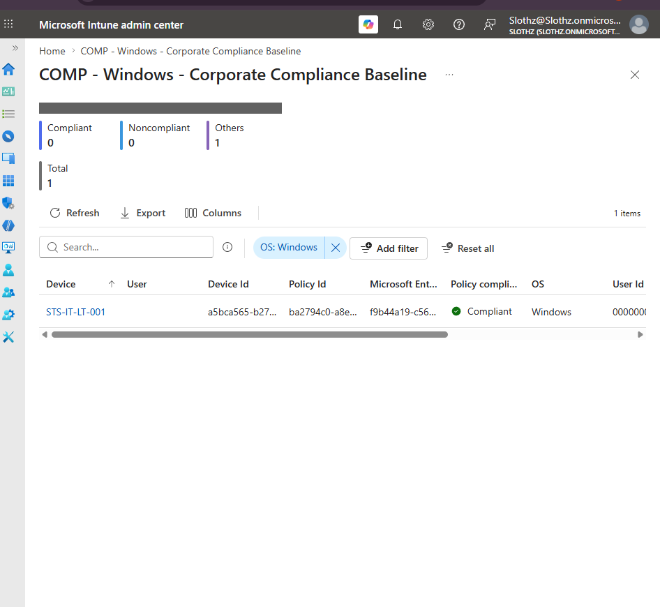

# INT-009 - Create Windows Compliance Policy

## Change Summary

**Requested By:** IT Manager

**Business Reason:**
Slothz Tech Solutions needs to evaluate corporate-managed Windows devices against baseline security requirements before considering them compliant.

**Risk Level:** Low

**Rollback Plan:**
Remove the compliance policy assignment from the corporate device group or modify the compliance settings if devices are incorrectly marked noncompliant.

---

## Business Scenario

Slothz Tech Solutions wants to ensure that corporate Windows devices meet minimum security requirements. A compliance policy will be created in Microsoft Intune to evaluate device health, operating system version, password requirements, firewall status, antivirus status, and Microsoft Defender protection.

This compliance policy provides a foundation for future Conditional Access policies.

---

## Objective

Create a Windows compliance policy that checks whether corporate-managed devices:

- Meet a minimum Windows OS version
- Require a password to unlock the device
- Block simple passwords
- Have firewall enabled
- Have antivirus and antispyware enabled
- Have Microsoft Defender Antimalware enabled
- Have Microsoft Defender security intelligence up to date
- Have real-time protection enabled

---

## Environment

| Component | Details |
|-----------|---------|
| Organization | Slothz Tech Solutions |
| Device Management | Microsoft Intune |
| Identity Platform | Microsoft Entra ID |
| Operating System | Windows 11 Pro |
| Target Device | STS-IT-LT-001 |
| Target Group | DG-Corporate-Devices |
| Policy Type | Windows Compliance Policy |
| Policy Name | COMP - Windows - Corporate Compliance Baseline |

---

## Design Decisions

This policy was assigned to **DG-Corporate-Devices** because compliance should be evaluated on corporate-managed devices regardless of which user signs in.

BitLocker was not required in this baseline compliance policy because the current VirtualBox lab environment had TPM limitations during previous BitLocker testing. The first compliance policy was kept focused on stable baseline checks such as OS version, password requirements, firewall, antivirus, and Microsoft Defender protection.

---

## Key Settings

| Setting | Value |
|---------|-------|
| Minimum OS version | 10.0.22000.0 |
| Require password to unlock device | Require |
| Simple passwords | Block |
| Minimum password length | 6 |
| Firewall | Require |
| Antivirus | Require |
| Antispyware | Require |
| Microsoft Defender Antimalware | Require |
| Microsoft Defender security intelligence up-to-date | Require |
| Real-time protection | Require |
| Mark device noncompliant | Immediately |

---

## Evidence

### Compliance Policy Review

### Device Compliance Status

---

## Verification

Verification was completed using Microsoft Intune.

The following items were confirmed:

- The compliance policy was created successfully.
- The policy was assigned to **DG-Corporate-Devices**.
- **STS-IT-LT-001** evaluated against the compliance policy.
- The device reported a **Compliant** status.

---

## Lessons Learned

This ticket reinforced the difference between configuration profiles and compliance policies. Configuration profiles apply settings to devices, while compliance policies evaluate whether devices meet company requirements.

This compliance policy also provides a foundation for future Conditional Access policies, where access to company resources can be based on device compliance status.

---

## Skills Demonstrated

- Microsoft Intune
- Compliance Policies
- Microsoft Entra ID
- Device Groups
- Windows 11 Endpoint Management
- Microsoft Defender
- Policy Verification
- Technical Documentation
- GitHub
