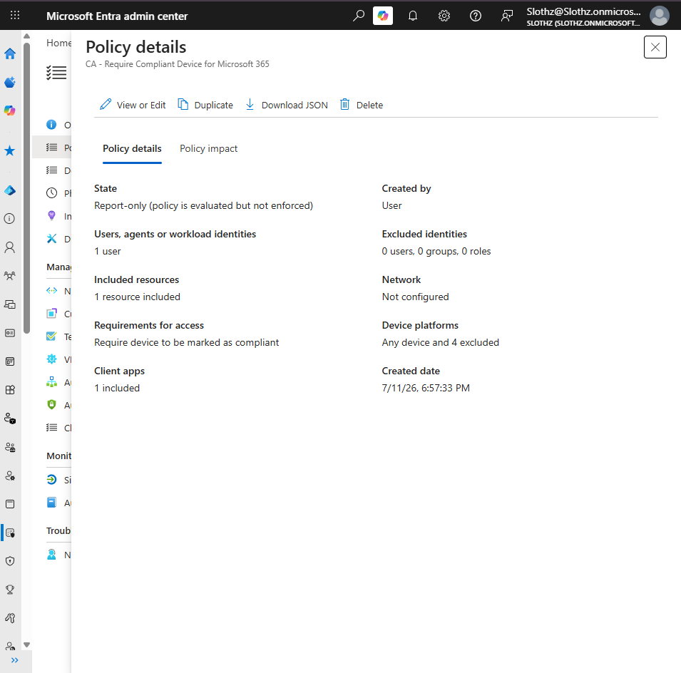

# INT-010 - Create Conditional Access Policy

## Change Summary

**Requested By:** IT Manager

**Business Reason:**
Slothz Tech Solutions wants to begin controlling access to Microsoft 365 resources based on device compliance status.

**Risk Level:** Medium

**Rollback Plan:**
Disable or delete the Conditional Access policy if it causes unexpected sign-in behavior.

---

## Business Scenario

Slothz Tech Solutions created a Windows compliance policy to evaluate whether corporate-managed devices meet baseline security requirements.

To build on that compliance policy, a Conditional Access policy will be created to require a compliant device when accessing Microsoft 365 resources. The policy will be configured in Report-only mode first to safely evaluate the impact before enforcement.

---

## Objective

Create a Conditional Access policy that:

- Targets Alex Walker as a pilot user
- Applies to Microsoft 365 resources
- Requires the device to be marked as compliant
- Runs in Report-only mode
- Avoids enforcing access restrictions until testing is complete

---

## Environment

| Component | Details |
|-----------|---------|
| Organization | Slothz Tech Solutions |
| Identity Platform | Microsoft Entra ID |
| Device Management | Microsoft Intune |
| Target User | Alex Walker |
| Target Resource | Microsoft 365 |
| Required Condition | Device marked as compliant |
| Policy Mode | Report-only |
| Policy Name | CA - Require Compliant Device for Microsoft 365 |

---

## Design Decisions

This policy was configured in **Report-only** mode to safely test Conditional Access behavior before enforcement. Conditional Access policies can affect user sign-in, so testing in Report-only mode reduces the risk of accidentally blocking access.

The policy was targeted to **Alex Walker** instead of all users because this is a pilot deployment. Starting with one test user allows the IT team to validate behavior before expanding the policy to a broader group.

The grant control **Require device to be marked as compliant** was selected because compliance status is determined by Microsoft Intune and shared with Microsoft Entra ID. This allows Microsoft Entra ID to make access decisions based on device health.

---

## Key Settings

| Setting | Value |
|---------|-------|
| Users | Alex Walker |
| Target resources | Microsoft 365 |
| Grant control | Require device to be marked as compliant |
| Device platforms | Windows targeted; macOS, iOS, Android, and Linux excluded |
| Policy state | Report-only |

---

## Evidence

### Conditional Access Policy Details

---

## Verification

Verification was completed using the Microsoft Entra admin center.

The following items were confirmed:

- The Conditional Access policy was created successfully.
- The policy targets one pilot user.
- The policy applies to Microsoft 365 resources.
- The grant control requires the device to be marked as compliant.
- The policy is configured in Report-only mode.

---

## Lessons Learned

This ticket reinforced the relationship between compliance policies and Conditional Access.

Compliance policies evaluate whether a device meets company requirements. Conditional Access can then use that compliance result to control access to company resources.

This ticket also reinforced the importance of using Report-only mode before enforcing Conditional Access policies. Testing first helps prevent accidental lockouts.

---

## Skills Demonstrated

- Microsoft Entra ID
- Conditional Access
- Microsoft Intune
- Compliance Policies
- Microsoft 365 Access Control
- Report-only Policy Testing
- Identity and Device Security
- Technical Documentation
- GitHub
