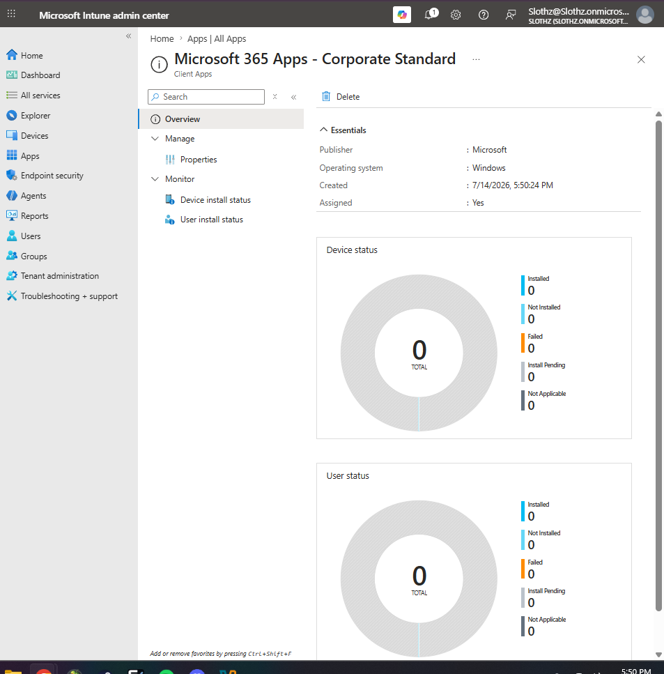
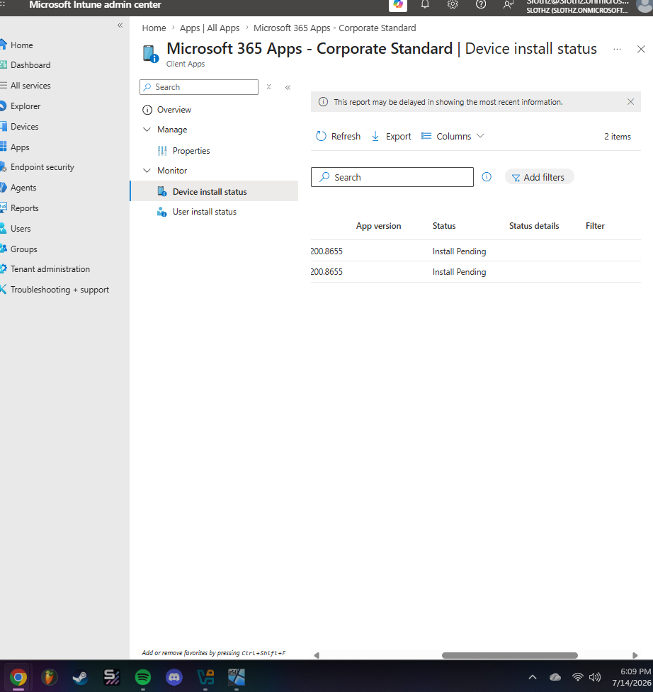
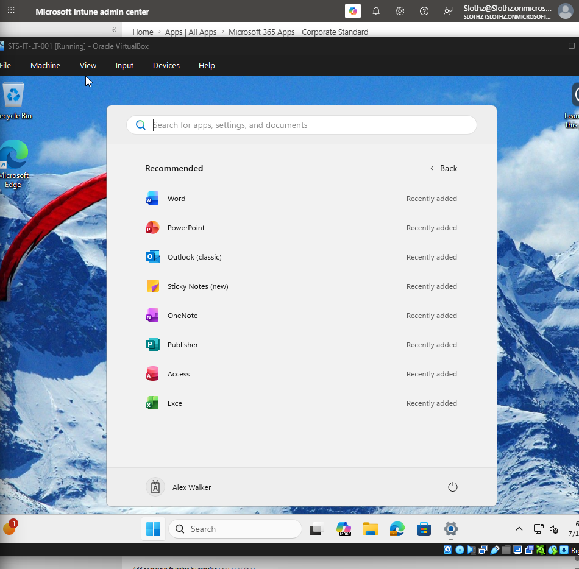

# INT-011 - Deploy Microsoft 365 Apps

## Change Summary

**Requested By:** IT Manager

**Business Reason:**
Slothz Tech Solutions needs corporate-managed Windows devices to automatically receive standard productivity applications so employees can begin working without manually installing Microsoft 365 Apps.

**Risk Level:** Low

**Rollback Plan:**
Remove the required app assignment from the corporate device group or modify the app suite deployment if installation issues occur.

---

## Business Scenario

Slothz Tech Solutions wants new corporate Windows devices to receive the standard Microsoft 365 productivity suite automatically.

Microsoft Intune will be used to deploy Microsoft 365 Apps as a required application to corporate-managed Windows devices.

---

## Objective

Deploy Microsoft 365 Apps through Intune so corporate-managed Windows devices receive:

- Word
- Excel
- PowerPoint
- Outlook
- OneNote
- Teams
- Access
- Publisher

---

## Environment

| Component | Details |
|-----------|---------|
| Organization | Slothz Tech Solutions |
| Device Management | Microsoft Intune |
| Identity Platform | Microsoft Entra ID |
| Operating System | Windows 11 Pro |
| Target Device | STS-IT-LT-001 |
| Target Group | DG-Corporate-Devices |
| App Type | Microsoft 365 Apps for Windows 10 and later |
| App Name | Microsoft 365 Apps - Corporate Standard |

---

## Design Decisions

Microsoft 365 Apps were assigned to **DG-Corporate-Devices** as a required deployment because these applications are part of the standard corporate device baseline.

The deployment used the **64-bit** architecture for modern Windows 11 devices. The **Monthly Enterprise Channel** was selected to provide a predictable update cadence for Microsoft 365 Apps.

The app suite was deployed to devices instead of users because any corporate-managed Windows device should receive the standard productivity apps regardless of which employee signs in.

---

## Key Settings

| Setting | Value |
|---------|-------|
| Architecture | 64-bit |
| Update channel | Monthly Enterprise Channel |
| Remove other versions | Yes |
| Version to install | Latest |
| Shared computer activation | No |
| Accept license terms | Yes |
| Microsoft Search in Bing background service | No |
| Default file format | Office Open XML Format |
| Assignment type | Required |
| Assigned group | DG-Corporate-Devices |

---

## Evidence

### Microsoft 365 Apps Assignment

### Microsoft 365 Apps Install Pending

### Microsoft 365 Apps Installed on Endpoint

---

## Verification

Verification was completed using Microsoft Intune and the Windows 11 endpoint.

The following items were confirmed:

- The Microsoft 365 Apps deployment was created successfully.
- The app suite was assigned to **DG-Corporate-Devices** as a required deployment.
- **STS-IT-LT-001** appeared in the device install status report.
- Intune initially reported the installation as **Install Pending**.
- The Windows endpoint showed Microsoft 365 Apps installed in the Start menu.

---

## Lessons Learned

This ticket reinforced the difference between app assignment and app installation.

Assigning an app in Intune means the device is targeted to receive the application. Installation still depends on the endpoint checking in, processing the assignment, downloading content, installing the application, and reporting status back to Intune.

This ticket also showed that Intune reporting may lag behind the actual endpoint state. The endpoint Start menu confirmed that Microsoft 365 Apps were installed even while Intune still showed the deployment as pending.

---

## Skills Demonstrated

- Microsoft Intune
- Application Deployment
- Microsoft 365 Apps
- Device-Based App Assignment
- Windows 11 Endpoint Management
- Deployment Verification
- Technical Documentation
- GitHub
