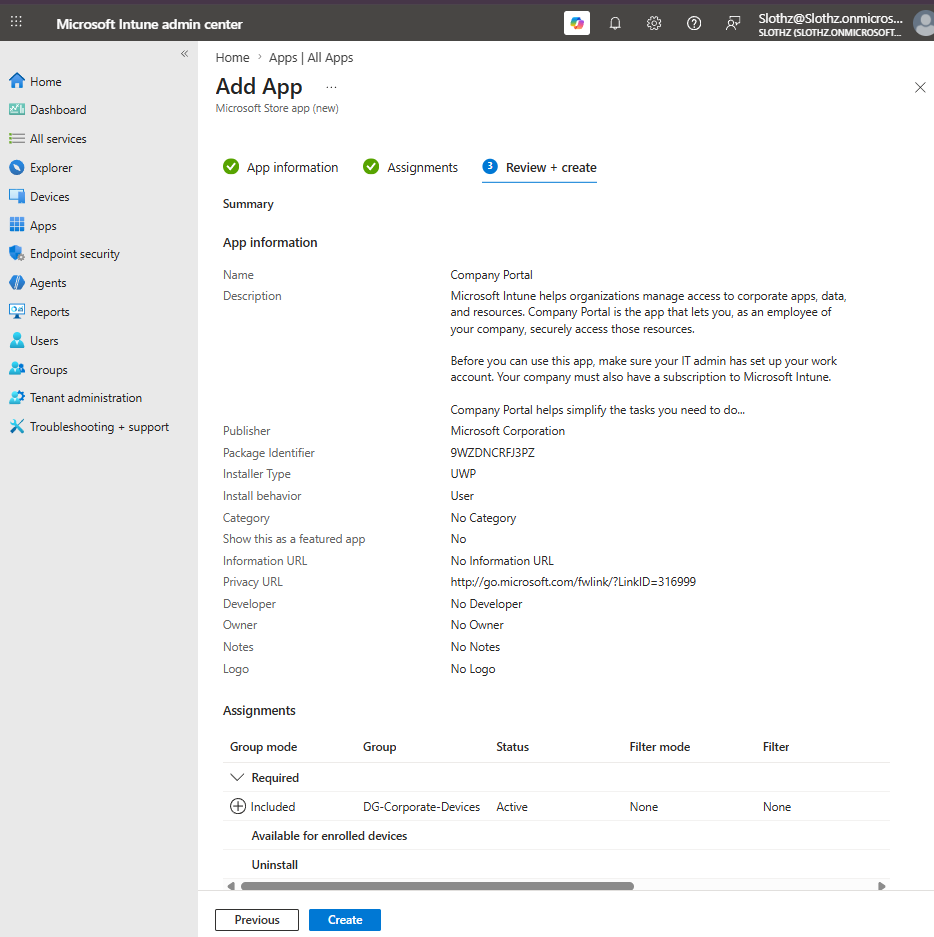
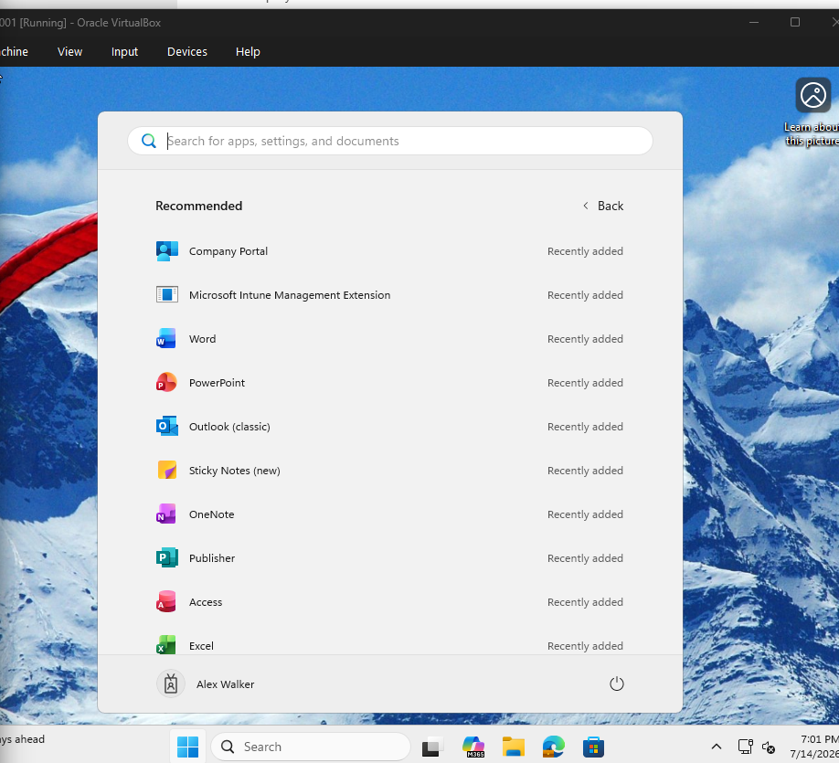

# INT-012 - Deploy Company Portal

## Change Summary

**Requested By:** IT Manager

**Business Reason:**
Slothz Tech Solutions needs Company Portal installed on corporate-managed Windows devices so employees can access approved work apps and resources.

**Risk Level:** Low

**Rollback Plan:**
Remove the required app assignment from the corporate device group or uninstall the app if deployment issues occur.

---

## Business Scenario

Slothz Tech Solutions is preparing to manage application deployment through Microsoft Intune.

Company Portal will be deployed to corporate-managed Windows devices so employees have a central place to access approved company apps and work resources.

---

## Objective

Deploy Company Portal through Microsoft Intune so corporate-managed Windows devices receive the app automatically.

---

## Environment

| Component | Details |
|-----------|---------|
| Organization | Slothz Tech Solutions |
| Device Management | Microsoft Intune |
| Identity Platform | Microsoft Entra ID |
| Operating System | Windows 11 Pro |
| Target Device | STS-IT-LT-001 |
| Target Group | DG-Corporate-Devices |
| App Type | Microsoft Store app (new) |
| App Name | Company Portal |

---

## Design Decisions

Company Portal was assigned to **DG-Corporate-Devices** as a required app because it should be available on all corporate-managed Windows devices.

The app was deployed as required instead of available because Company Portal acts as the user-facing app catalog for future optional application deployments.

---

## Key Settings

| Setting | Value |
|---------|-------|
| App type | Microsoft Store app (new) |
| App name | Company Portal |
| Assignment type | Required |
| Assigned group | DG-Corporate-Devices |
| Install behavior | User |

---

## Evidence

### Company Portal Review and Create

### Company Portal Installed on Endpoint

---

## Verification

Verification was completed using Microsoft Intune and the Windows 11 endpoint.

The following items were confirmed:

- Company Portal was added as a Microsoft Store app in Intune.
- The app was assigned to **DG-Corporate-Devices** as required.
- **STS-IT-LT-001** received the app.
- Company Portal appeared in the Windows Start menu as a recently added app.

---

## Lessons Learned

This ticket reinforced the difference between required and available app assignments.

Required apps install automatically on targeted devices or users. Available apps are published for users to install manually, typically through Company Portal.

Deploying Company Portal first prepares the environment for future available app deployments.

---

## Skills Demonstrated

- Microsoft Intune
- Microsoft Store App Deployment
- Company Portal
- Required App Assignment
- Device-Based App Targeting
- Windows 11 Endpoint Management
- Application Deployment Verification
- Technical Documentation
- GitHub
