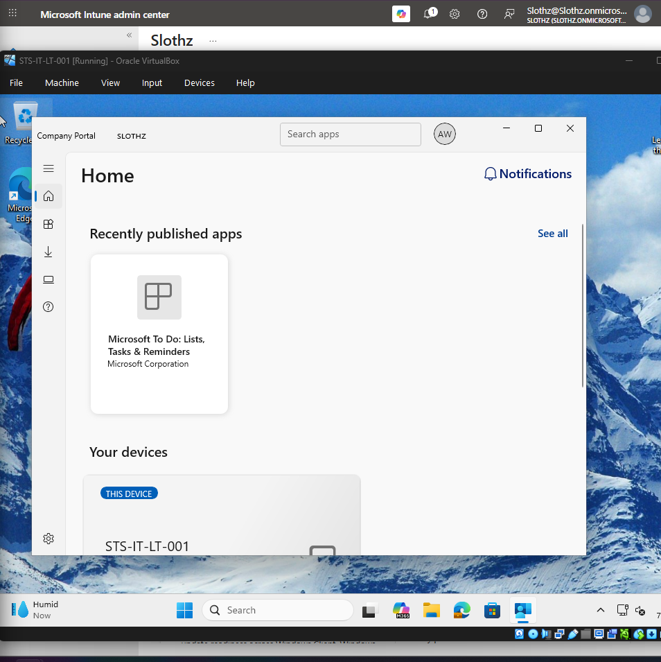

# INT-013 - Deploy Available App Through Company Portal

## Change Summary

**Requested By:** IT Manager

**Business Reason:**
Slothz Tech Solutions needs a way to publish optional productivity applications so employees can install approved apps from Company Portal when needed.

**Risk Level:** Low

**Rollback Plan:**
Remove the available app assignment from the user group or uninstall the app if deployment issues occur.

---

## Business Scenario

Slothz Tech Solutions has deployed Company Portal to corporate-managed Windows devices.

To test user-initiated app installation, Microsoft To Do will be published as an available app for IT users. This allows users to install the app manually from Company Portal without requiring IT to install it automatically on every device.

---

## Objective

Deploy Microsoft To Do as an available app so members of the IT department can install it through Company Portal.

---

## Environment

| Component | Details |
|-----------|---------|
| Organization | Slothz Tech Solutions |
| Device Management | Microsoft Intune |
| Identity Platform | Microsoft Entra ID |
| Operating System | Windows 11 Pro |
| Target Device | STS-IT-LT-001 |
| Target User | Alex Walker |
| Target Group | SG-IT-Users |
| App Type | Microsoft Store app (new) |
| App Name | Microsoft To Do |
| Assignment Type | Available for enrolled devices |

---

## Design Decisions

Microsoft To Do was assigned as **Available for enrolled devices** instead of Required because it is an optional productivity app.

The app was assigned to **SG-IT-Users** because available app deployments are user-focused. Members of the IT department can access the app from Company Portal and choose whether to install it.

This deployment demonstrates how Company Portal can be used as a self-service app catalog for approved company applications.

---

## Key Settings

| Setting | Value |
|---------|-------|
| App type | Microsoft Store app (new) |
| App name | Microsoft To Do |
| Assignment type | Available for enrolled devices |
| Assigned group | SG-IT-Users |
| Install behavior | User |

---

## Evidence

### Microsoft To Do Available in Company Portal

### Microsoft To Do Installed in Company Portal

---

## Verification

Verification was completed using Microsoft Intune, Company Portal, and the Windows 11 endpoint.

The following items were confirmed:

- Microsoft To Do was added as a Microsoft Store app in Intune.
- The app was assigned to **SG-IT-Users** as available.
- Microsoft To Do appeared in Company Portal for Alex Walker.
- The app was installed successfully from Company Portal.
- Company Portal showed Microsoft To Do as **Installed**.

---

## Lessons Learned

This ticket reinforced the difference between required and available app assignments.

Required apps install automatically on targeted devices or users. Available apps appear in Company Portal and allow users to install approved apps manually.

This ticket also showed why Company Portal is important in an Intune-managed environment. It provides users with a self-service app catalog while allowing IT to control which apps are approved.

---

## Skills Demonstrated

- Microsoft Intune
- Microsoft Store App Deployment
- Company Portal
- Available App Assignment
- User-Based App Targeting
- Windows 11 Endpoint Management
- Application Deployment Verification
- Technical Documentation
- GitHub
