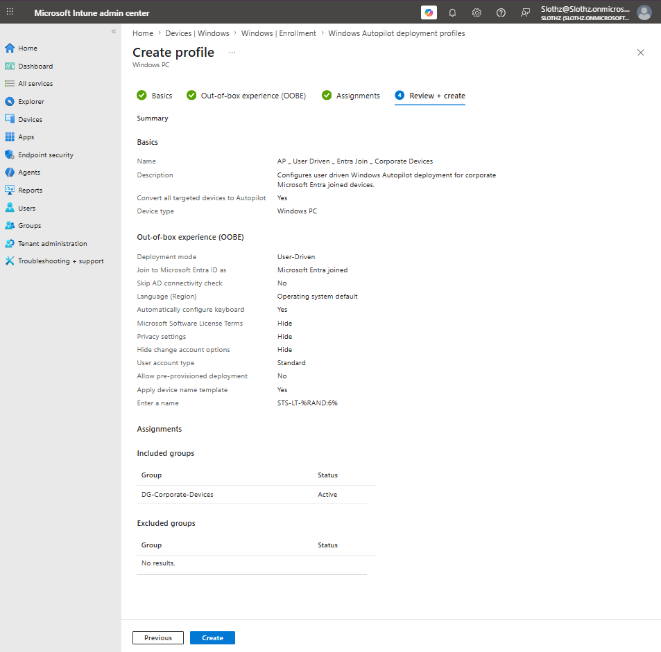
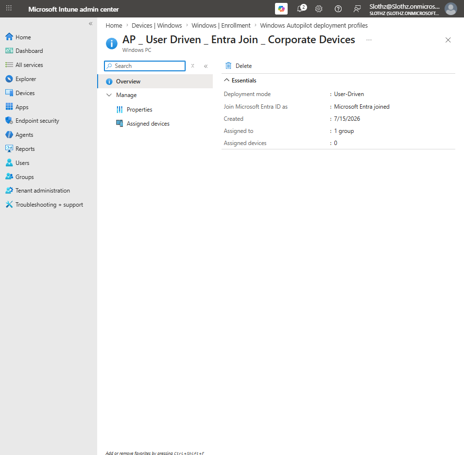
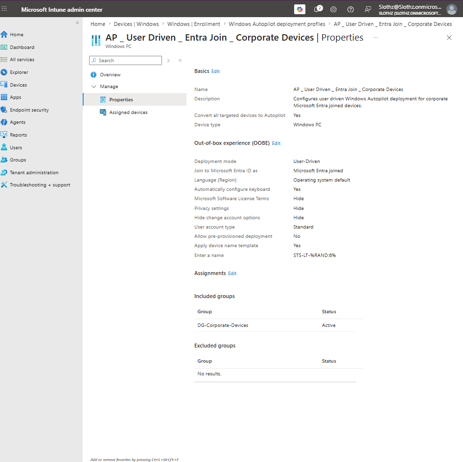

# INT-014 - Create Windows Autopilot Deployment Profile

## Change Summary

**Requested By:** IT Manager

**Business Reason:**
Slothz Tech Solutions wants to prepare for modern Windows device provisioning using Windows Autopilot. Autopilot will help reduce manual setup by allowing corporate devices to join Microsoft Entra ID, enroll into Microsoft Intune, and receive assigned apps and policies during the out-of-box experience.

**Risk Level:** Low

**Rollback Plan:**
Remove the Autopilot deployment profile assignment or delete the profile if the configuration needs to be redesigned.

---

## Business Scenario

Slothz Tech Solutions is moving toward a modern device provisioning process for corporate Windows devices.

Instead of manually configuring each device, IT will create a Windows Autopilot deployment profile that controls the out-of-box experience for corporate devices. This profile will prepare devices to join Microsoft Entra ID, enroll into Microsoft Intune, and apply standard company settings during setup.

---

## Objective

Create a Windows Autopilot deployment profile that:

- Uses user-driven deployment
- Joins devices to Microsoft Entra ID
- Configures users as standard users
- Hides unnecessary OOBE screens
- Applies a device naming template
- Assigns the profile to the corporate device group

---

## Environment

| Component | Details |
|-----------|---------|
| Organization | Slothz Tech Solutions |
| Identity Platform | Microsoft Entra ID |
| Device Management | Microsoft Intune |
| Target Group | DG-Corporate-Devices |
| Profile Type | Windows Autopilot Deployment Profile |
| Deployment Mode | User-Driven |
| Join Type | Microsoft Entra Joined |
| Profile Name | AP _ User Driven _ Entra Join _ Corporate Devices |

---

## Design Decisions

The profile was configured as **User-Driven** because employees will complete the Windows out-of-box experience by signing in with their company account.

The join type was set to **Microsoft Entra joined** because Slothz Tech Solutions is using cloud-based identity and device management instead of traditional on-premises domain join.

The user account type was set to **Standard** to prevent users from becoming local administrators during device setup. This follows the principle of least privilege.

License terms, privacy settings, and change account options were hidden to simplify the setup experience for users.

A device name template was enabled using **STS-LT-%RAND:6%** to automatically apply a consistent naming format while avoiding duplicate device names.

---

## Key Settings

| Setting | Value |
|---------|-------|
| Deployment mode | User-Driven |
| Join to Microsoft Entra ID as | Microsoft Entra joined |
| Microsoft Software License Terms | Hide |
| Privacy settings | Hide |
| Hide change account options | Hide |
| User account type | Standard |
| Allow pre-provisioned deployment | No |
| Language / Region | Operating system default |
| Automatically configure keyboard | Yes |
| Apply device name template | Yes |
| Device name template | STS-LT-%RAND:6% |
| Assigned group | DG-Corporate-Devices |

---

## Evidence

### Autopilot Profile Review and Create

### Autopilot Profile Overview

### Autopilot Profile Properties

---

## Verification

Verification was completed using Microsoft Intune.

The following items were confirmed:

- The Windows Autopilot deployment profile was created successfully.
- The profile was configured for user-driven deployment.
- The profile was configured for Microsoft Entra join.
- The user account type was set to Standard.
- The profile was assigned to **DG-Corporate-Devices**.
- The profile currently shows **0 assigned devices**, indicating that full Autopilot deployment testing requires an Autopilot-registered device.

---

## Outcome

The Windows Autopilot deployment profile was successfully created and assigned.

Full end-to-end Autopilot testing was deferred because no Autopilot-registered device is currently assigned to the profile. A future ticket may register a test device or new VM with Windows Autopilot and validate the complete OOBE provisioning process.

---

## Lessons Learned

This ticket introduced the difference between creating an Autopilot deployment profile and completing an Autopilot deployment.

The deployment profile controls the out-of-box experience, but devices must be registered with Windows Autopilot before they can fully use the profile during provisioning.

This ticket also reinforced the importance of using standard user accounts during device setup to reduce unnecessary local administrator access.

---

## Skills Demonstrated

- Microsoft Intune
- Windows Autopilot
- Microsoft Entra ID
- Device Enrollment
- Deployment Profiles
- User-Driven Provisioning
- Device Naming Templates
- Technical Documentation
- GitHub
