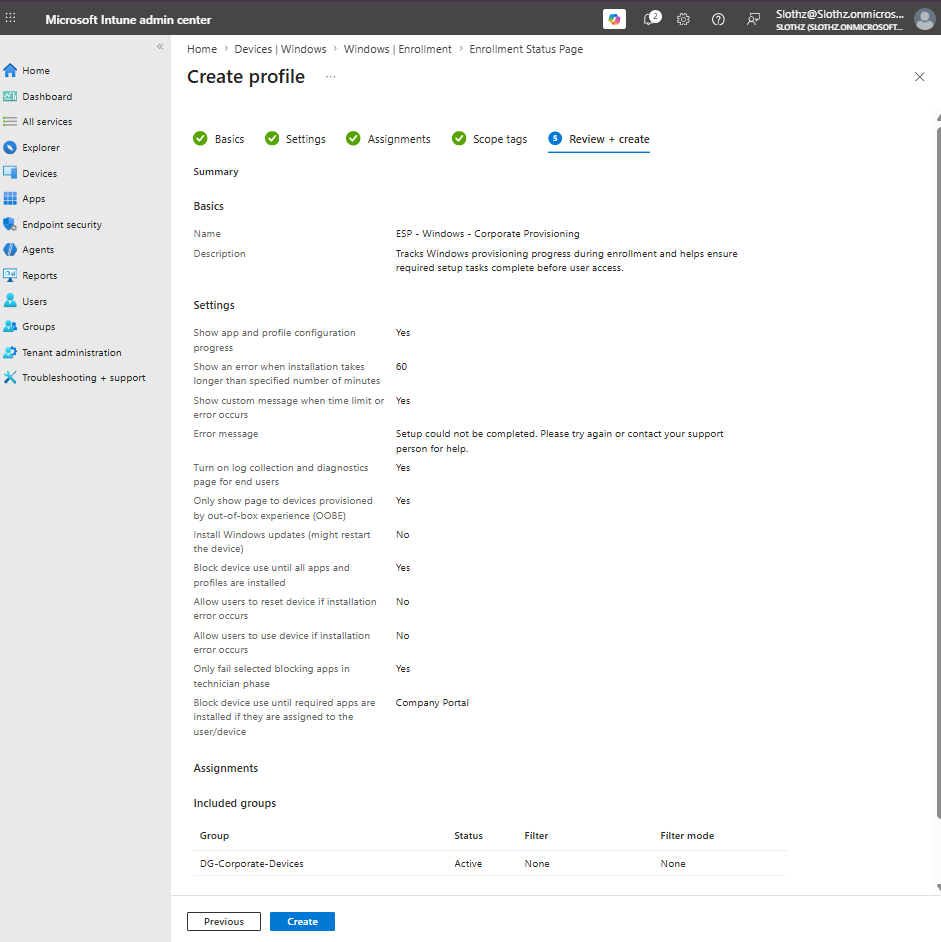
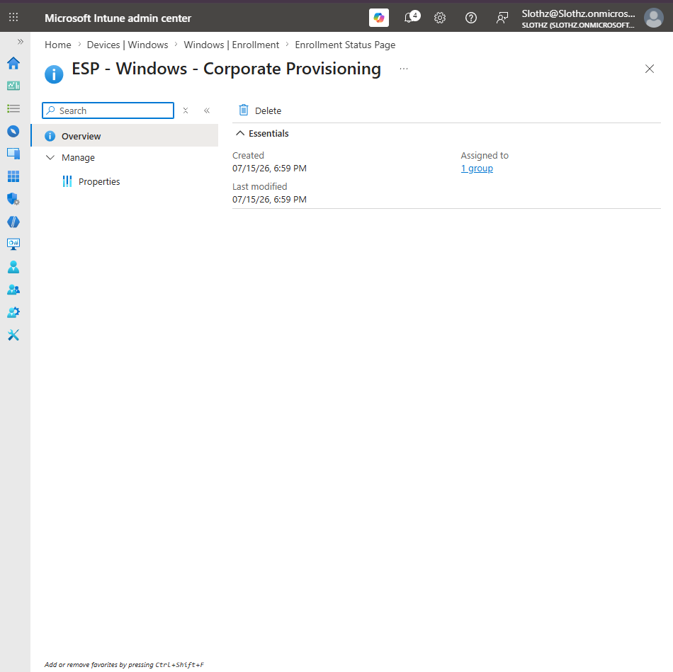
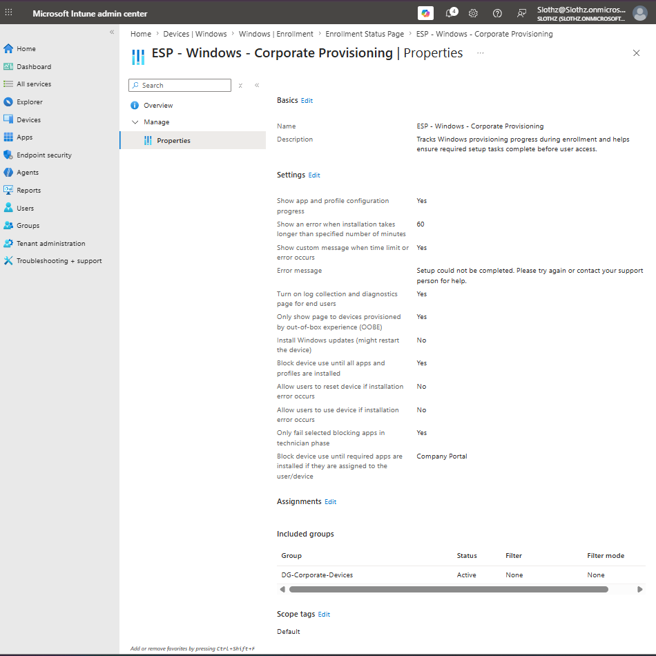

# INT-015 - Create Enrollment Status Page

## Change Summary

**Requested By:** IT Manager

**Business Reason:**
Slothz Tech Solutions wants to improve the Windows provisioning experience by showing setup progress during enrollment and ensuring required setup tasks complete before users access the device.

**Risk Level:** Low

**Rollback Plan:**
Remove the Enrollment Status Page assignment or modify the ESP settings if provisioning delays or setup issues occur.

---

## Business Scenario

Slothz Tech Solutions is preparing for modern Windows provisioning using Windows Autopilot.

An Enrollment Status Page will be configured to show setup progress during device enrollment and first user sign-in. This helps users understand that the device is being prepared and allows IT to control whether required setup items must finish before the user reaches the desktop.

---

## Objective

Create an Enrollment Status Page profile that:

- Shows app and profile configuration progress
- Displays an error if setup exceeds the configured time limit
- Enables log collection and diagnostics
- Applies during OOBE provisioning
- Blocks device use until required setup items complete
- Blocks only on the selected required app, Company Portal
- Assigns the profile to corporate-managed devices

---

## Environment

| Component | Details |
|-----------|---------|
| Organization | Slothz Tech Solutions |
| Device Management | Microsoft Intune |
| Identity Platform | Microsoft Entra ID |
| Target Group | DG-Corporate-Devices |
| Profile Type | Enrollment Status Page |
| Profile Name | ESP - Windows - Corporate Provisioning |
| Blocking App | Company Portal |

---

## Design Decisions

The Enrollment Status Page was configured to show app and profile configuration progress during provisioning. This improves the user experience by making setup progress visible instead of leaving users unsure whether the device is still being configured.

The ESP was assigned to **DG-Corporate-Devices** because provisioning behavior should apply to corporate-managed Windows devices.

The profile was configured to block device use until required setup items complete. However, only **Company Portal** was selected as the blocking required app. Microsoft 365 Apps were not selected as a blocking app because Office installations can take longer and may cause provisioning delays.

Windows updates were not installed during ESP to avoid restarts or delays during the initial provisioning experience.

---

## Key Settings

| Setting | Value |
|---------|-------|
| Show app and profile configuration progress | Yes |
| Timeout | 60 minutes |
| Show custom error message | Yes |
| Turn on log collection and diagnostics | Yes |
| Only show page to devices provisioned by OOBE | Yes |
| Install Windows updates during ESP | No |
| Block device use until all apps and profiles are installed | Yes |
| Allow users to reset device if installation error occurs | No |
| Allow users to use device if installation error occurs | No |
| Only fail selected blocking apps in technician phase | Yes |
| Blocking required app | Company Portal |
| Assigned group | DG-Corporate-Devices |

---

## Evidence

### Enrollment Status Page Review and Create

### Enrollment Status Page Overview

### Enrollment Status Page Properties

---

## Verification

Verification was completed using Microsoft Intune.

The following items were confirmed:

- The Enrollment Status Page profile was created successfully.
- The profile was assigned to **DG-Corporate-Devices**.
- The profile was configured to show app and profile configuration progress.
- The profile blocks device use during provisioning until required setup items complete.
- The selected blocking app is **Company Portal**.

---

## Outcome

The Enrollment Status Page profile was successfully created and assigned.

Full end-to-end ESP testing will occur during a future Autopilot deployment test when an Autopilot-registered device is provisioned through OOBE.

---

## Lessons Learned

This ticket reinforced the relationship between Windows Autopilot and the Enrollment Status Page.

The Autopilot deployment profile controls the out-of-box experience, while the Enrollment Status Page controls setup progress and blocking behavior during provisioning.

This ticket also showed why blocking every required app can create provisioning delays. Selecting only critical blocking apps, such as Company Portal, provides a safer first deployment design.

---

## Skills Demonstrated

- Microsoft Intune
- Windows Autopilot
- Enrollment Status Page
- Device Enrollment
- Provisioning Experience
- Required App Blocking
- Technical Documentation
- GitHub
