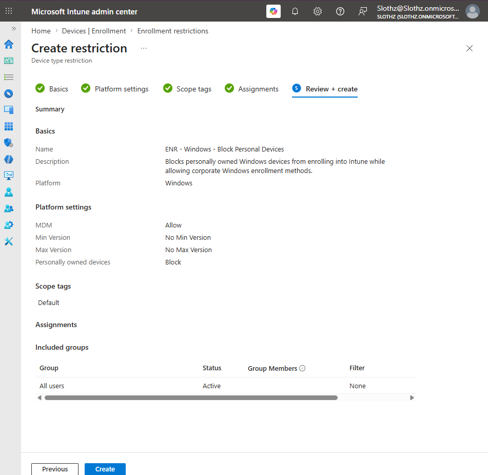
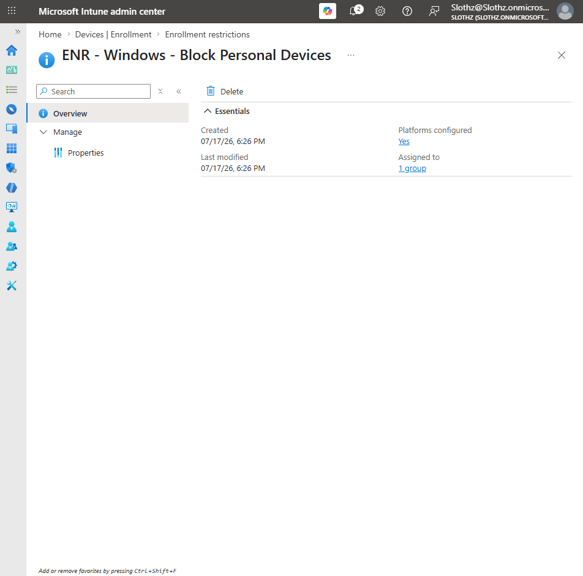
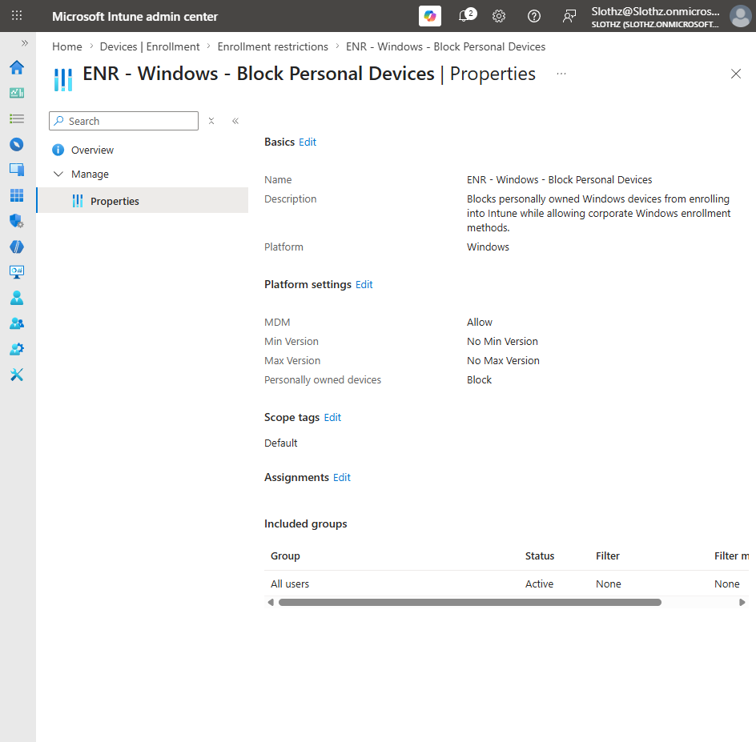

# INT-016 - Configure Enrollment Restrictions

## Change Summary

**Requested By:** IT Manager

**Business Reason:**
Slothz Tech Solutions wants to prevent personally owned Windows devices from enrolling into Intune while continuing to allow corporate Windows enrollment methods.

**Risk Level:** Medium

**Rollback Plan:**
Remove the enrollment restriction assignment or modify the restriction to allow personally owned Windows devices if legitimate enrollment scenarios are blocked.

---

## Business Scenario

Slothz Tech Solutions manages corporate Windows devices through Microsoft Intune.

To reduce the risk of unmanaged personal devices becoming enrolled as company-managed devices, an enrollment restriction was created to block personally owned Windows devices from enrolling. Corporate Windows enrollment methods remain allowed.

---

## Objective

Create a Windows enrollment restriction that:

- Allows Windows MDM enrollment
- Blocks personally owned Windows devices
- Does not configure minimum or maximum OS version restrictions
- Applies to all users during future enrollment attempts

---

## Environment

| Component | Details |
|-----------|---------|
| Organization | Slothz Tech Solutions |
| Device Management | Microsoft Intune |
| Identity Platform | Microsoft Entra ID |
| Restriction Type | Device platform restriction |
| Platform | Windows |
| Assignment | All users |
| Restriction Name | ENR - Windows - Block Personal Devices |

---

## Design Decisions

The restriction was configured to allow Windows MDM enrollment so corporate Windows devices can still enroll into Intune.

Personally owned Windows devices were blocked to reduce the risk of personal devices being enrolled into the corporate management environment.

No minimum or maximum OS version was configured in this ticket. The goal of this change was to control device ownership enrollment behavior, not to create an operating system version restriction.

The restriction was assigned to **All users** because enrollment restrictions apply during the enrollment process, before a device may exist as a managed Intune device.

---

## Key Settings

| Setting | Value |
|---------|-------|
| Platform | Windows |
| MDM | Allow |
| Minimum OS Version | No Min Version |
| Maximum OS Version | No Max Version |
| Personally owned devices | Block |
| Assignment | All users |

---

## Evidence

### Review and Create

### Restriction Overview

### Restriction Properties

---

## Verification

Verification was completed in Microsoft Intune.

The following items were confirmed:

- The Windows enrollment restriction was created successfully.
- Windows MDM enrollment is allowed.
- Personally owned Windows devices are blocked.
- No minimum or maximum OS version restrictions were configured.
- The restriction is assigned to **All users**.

---

## Outcome

The Windows enrollment restriction was successfully created.

Future personally owned Windows enrollment attempts will be blocked, while corporate Windows enrollment methods remain allowed.

Existing enrolled devices are not retroactively removed by this restriction.

---

## Lessons Learned

This ticket demonstrated how enrollment restrictions control which devices are allowed to enroll into Intune.

Enrollment restrictions are different from compliance policies. Enrollment restrictions apply before or during enrollment, while compliance policies evaluate devices after enrollment.

This ticket also reinforced why enrollment restrictions are commonly assigned to users instead of device groups. During enrollment, the device may not exist in Intune yet, so user-based targeting is often more appropriate.

---

## Skills Demonstrated

- Microsoft Intune
- Device Enrollment
- Enrollment Restrictions
- Windows Platform Restrictions
- Corporate vs Personally Owned Device Control
- Microsoft Entra ID
- Technical Documentation
- GitHub
