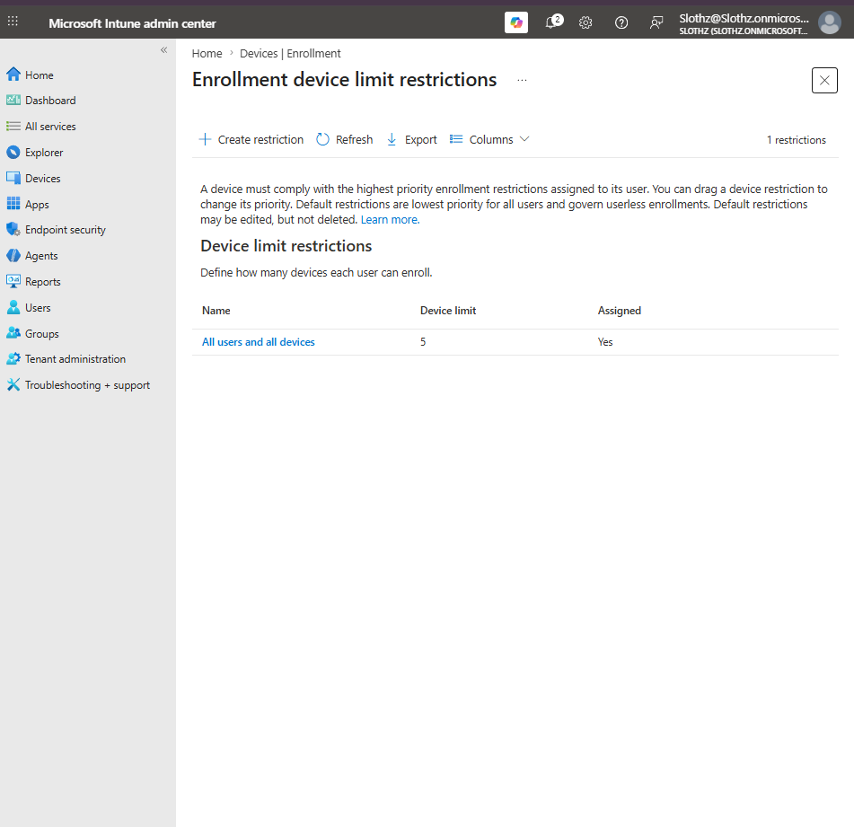
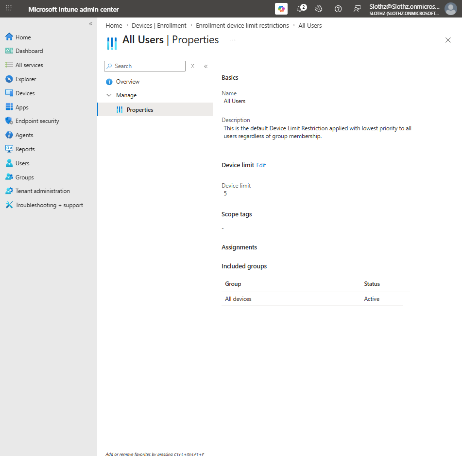

# INT-017 - Validate Device Enrollment Limit Restriction

## Change Summary

**Requested By:** IT Manager

**Business Reason:**
Slothz Tech Solutions wants to confirm that users have a reasonable enrollment limit to prevent excessive device enrollment into Intune.

**Risk Level:** Low

**Rollback Plan:**
No change was made in this ticket. If needed, modify the default device limit restriction or create a higher-priority custom restriction.

---

## Business Scenario

Slothz Tech Solutions uses Microsoft Intune to manage corporate devices.

To reduce the risk of users enrolling too many devices, the existing device enrollment limit restriction was reviewed. The tenant already had a default device limit restriction configured with a limit of five devices.

---

## Objective

Validate the existing device enrollment limit restriction and confirm:

- A device limit restriction already exists
- The configured device limit is 5
- The restriction applies broadly to users/devices
- No duplicate restriction is needed

---

## Environment

| Component | Details |
|-----------|---------|
| Organization | Slothz Tech Solutions |
| Device Management | Microsoft Intune |
| Identity Platform | Microsoft Entra ID |
| Restriction Type | Device limit restriction |
| Existing Restriction Name | All Users |
| Device Limit | 5 |

---

## Validation Summary

The existing default device limit restriction was reviewed in Microsoft Intune.

The restriction named **All Users** was already present and configured with a device limit of **5**. Because this matched the intended lab design, no duplicate device limit restriction was created.

---

## Key Settings

| Setting | Value |
|---------|-------|
| Restriction Name | All Users |
| Device Limit | 5 |
| Description | Default device limit restriction applied to all users |
| Assignment | Broad default assignment |

---

## Evidence

### Device Limit Restrictions Overview

### Device Limit Restriction Properties

---

## Verification

Verification was completed in Microsoft Intune.

The following items were confirmed:

- A device limit restriction already exists.
- The configured device limit is **5**.
- The restriction is active.
- No duplicate restriction was created.

---

## Outcome

The existing device enrollment limit restriction was validated successfully.

No configuration change was required because the existing default restriction already met the lab requirement.

---

## Lessons Learned

This ticket demonstrated that not every lab task requires creating a new policy or restriction.

Before creating new Intune objects, existing default settings should be reviewed to avoid unnecessary duplicates.

This ticket also reinforced the difference between enrollment restriction types:

- Platform restrictions control what type of device can enroll.
- Device limit restrictions control how many devices a user can enroll.

---

## Skills Demonstrated

- Microsoft Intune
- Device Enrollment
- Enrollment Restrictions
- Device Limit Restrictions
- Validation Before Configuration
- Technical Documentation
- GitHub
