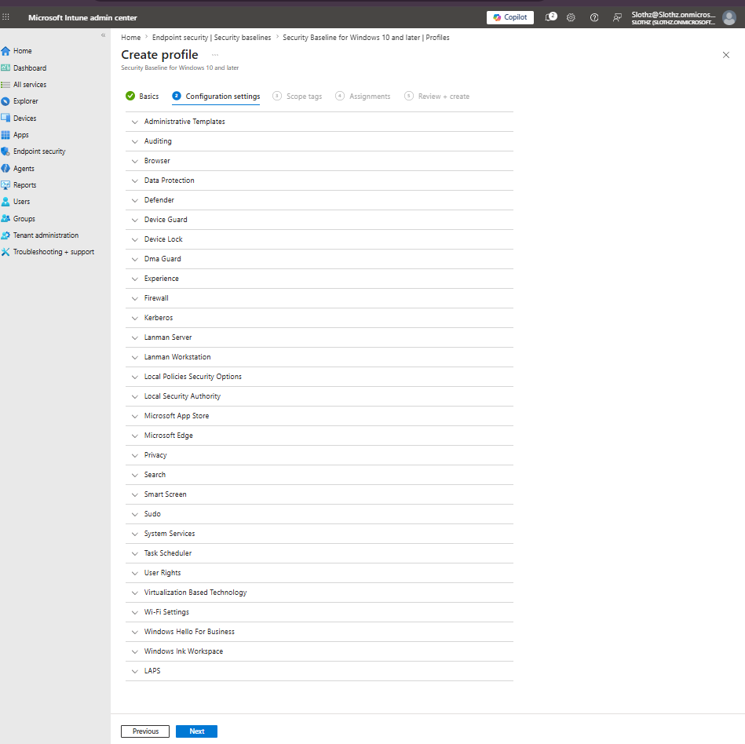
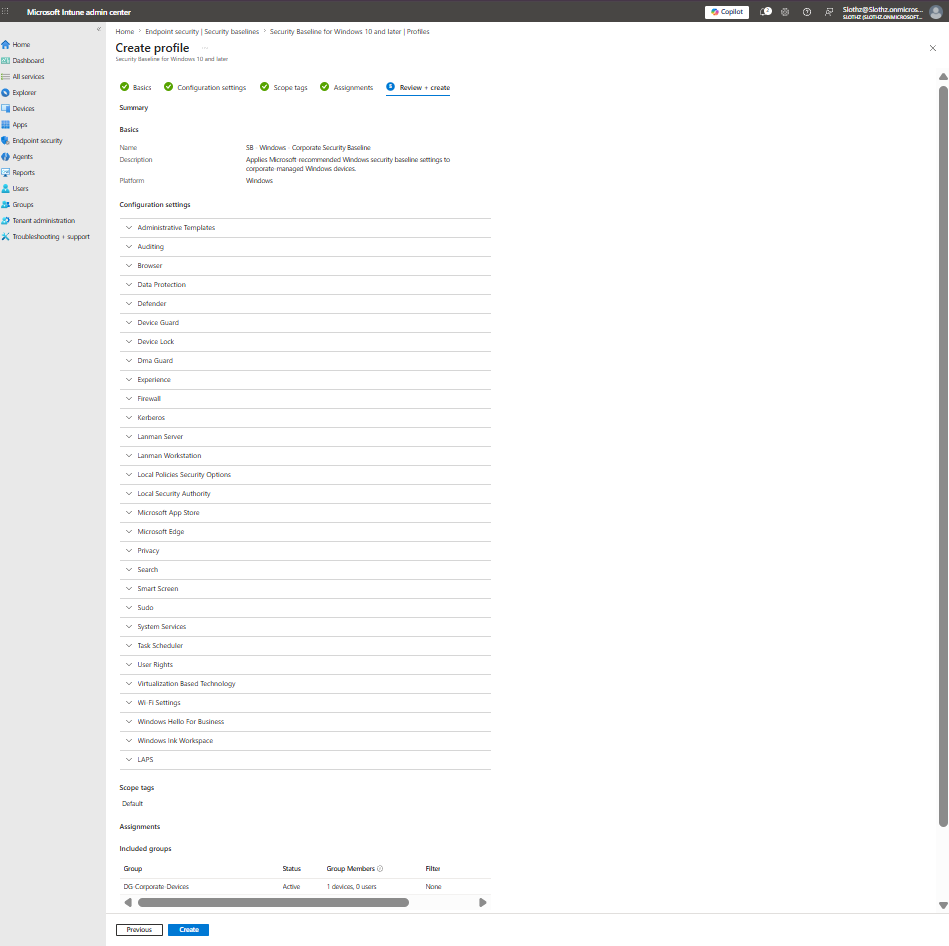
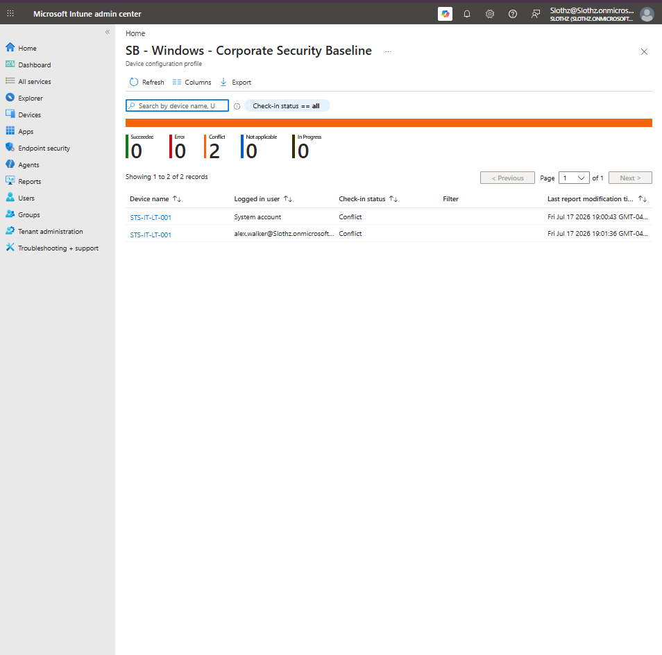
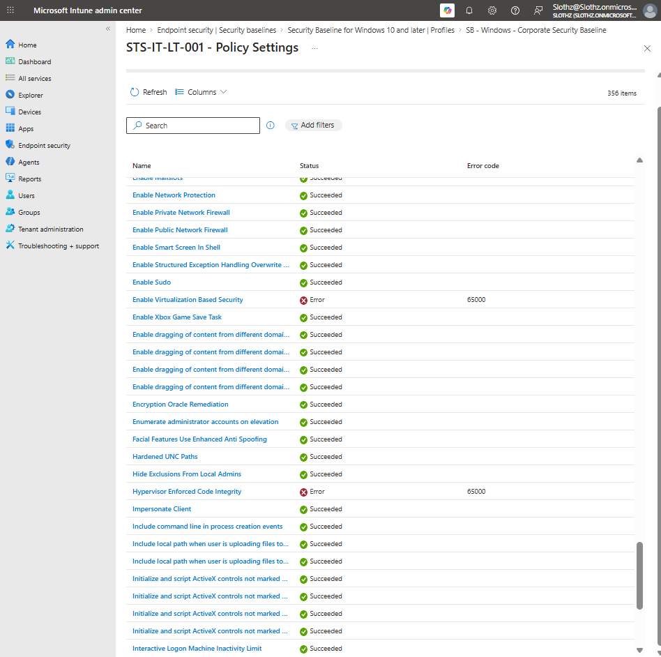
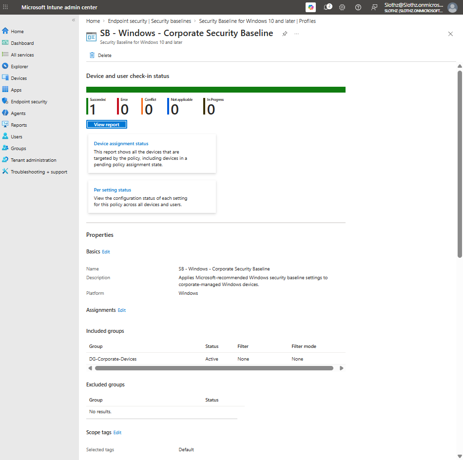

# INT-018 - Configure Windows Security Baseline

## Change Summary

**Requested By:** IT Manager

**Business Reason:**
Slothz Tech Solutions wants to apply Microsoft-recommended Windows security baseline settings to corporate-managed Windows devices to improve endpoint security posture.

**Risk Level:** Medium

**Rollback Plan:**
Remove the security baseline assignment or modify conflicting baseline settings if deployment causes device issues, policy conflicts, or unsupported configuration errors.

---

## Business Scenario

Slothz Tech Solutions manages corporate Windows devices using Microsoft Intune.

To strengthen endpoint security, a Windows security baseline was deployed to the corporate device group. The baseline applies a broad set of recommended security settings, including Defender, firewall, device lock, SmartScreen, local security, browser, and other Windows hardening settings.

Because security baselines include many settings, deployment status was reviewed after assignment to identify any conflicts or unsupported settings.

---

## Objective

Create and deploy a Windows security baseline that:

- Applies Microsoft-recommended Windows security settings
- Targets corporate-managed Windows devices
- Uses the Windows 10 and later security baseline
- Is assigned to `DG-Corporate-Devices`
- Is monitored after deployment for conflicts or errors
- Is adjusted where needed for the VirtualBox lab environment

---

## Environment

| Component | Details |
|-----------|---------|
| Organization | Slothz Tech Solutions |
| Device Management | Microsoft Intune |
| Identity Platform | Microsoft Entra ID |
| Target Device | STS-IT-LT-001 |
| Target Group | DG-Corporate-Devices |
| Baseline Type | Security Baseline for Windows 10 and later |
| Profile Name | SB - Windows - Corporate Security Baseline |

---

## Design Decisions

The **Security Baseline for Windows 10 and later** was selected because the lab device is a Windows 11 Pro corporate-managed device.

The Microsoft Defender for Endpoint baseline was not selected for this ticket because the lab device is a VirtualBox VM, and the Windows security baseline was a better fit for this stage of the lab.

The profile was assigned to `DG-Corporate-Devices` because the baseline should apply to corporate-managed Windows devices, not personal devices.

The baseline was initially deployed using default Microsoft-recommended settings. After deployment, the profile was monitored for conflicts and errors.

---

## Initial Deployment Result

After the baseline was first deployed, Intune reported conflicts and errors for the target device.

Observed issues included:

| Setting | Result |
|---------|--------|
| Enable Virtualization Based Security | Error 65000 |
| Hypervisor Enforced Code Integrity | Error 65000 |
| Minimum Device Password Length | Conflict |

The Virtualization Based Security and Hypervisor Enforced Code Integrity errors were likely related to VirtualBox lab limitations.

The Minimum Device Password Length conflict was likely caused by overlap with existing password or compliance-related settings.

---

## Remediation

The baseline was edited to remove unsupported or overlapping settings from this lab deployment.

The following settings were adjusted to avoid conflicts or unsupported configuration errors:

| Setting | Adjustment |
|---------|------------|
| Enable Virtualization Based Security | Not configured |
| Hypervisor Enforced Code Integrity | Not configured |
| Minimum Device Password Length | Not configured |

After saving the updated baseline, the device was synced and the profile status was reviewed again.

---

## Final Result

After remediation, the baseline reported successful deployment.

| Status | Count |
|--------|-------|
| Succeeded | 1 |
| Error | 0 |
| Conflict | 0 |
| Not applicable | 0 |
| In progress | 0 |

---

## Evidence

### Baseline Configuration Settings

### Baseline Review and Create

### Initial Device Status Conflict

### Policy Setting Errors

### Final Successful Status

---

## Verification

Verification was completed in Microsoft Intune.

The following items were confirmed:

- The Windows security baseline profile was created successfully.
- The profile was assigned to `DG-Corporate-Devices`.
- The profile initially reported conflicts and errors.
- Conflicting or unsupported settings were identified.
- Problem settings were adjusted to `Not configured`.
- The final baseline status showed successful deployment with no remaining conflicts or errors.

---

## Outcome

The Windows security baseline was successfully deployed to the corporate Windows device.

Initial conflicts and errors were resolved through targeted baseline adjustments. The final profile status reported successful deployment.

---

## Lessons Learned

Security baselines are broader than individual configuration profiles. Because they contain many settings, they are more likely to overlap with existing policies or expose lab environment limitations.

This ticket reinforced the importance of monitoring policy deployment after assignment. A profile being created does not mean every setting applied successfully.

The ticket also showed that some security settings, such as Virtualization Based Security and Hypervisor Enforced Code Integrity, may not work reliably in a VirtualBox lab environment even though they are valid security controls for physical corporate devices.

---

## Skills Demonstrated

- Microsoft Intune
- Endpoint Security
- Windows Security Baselines
- Policy Assignment
- Policy Conflict Troubleshooting
- Per-Setting Status Review
- Virtualization Limitation Analysis
- Technical Documentation
- GitHub
