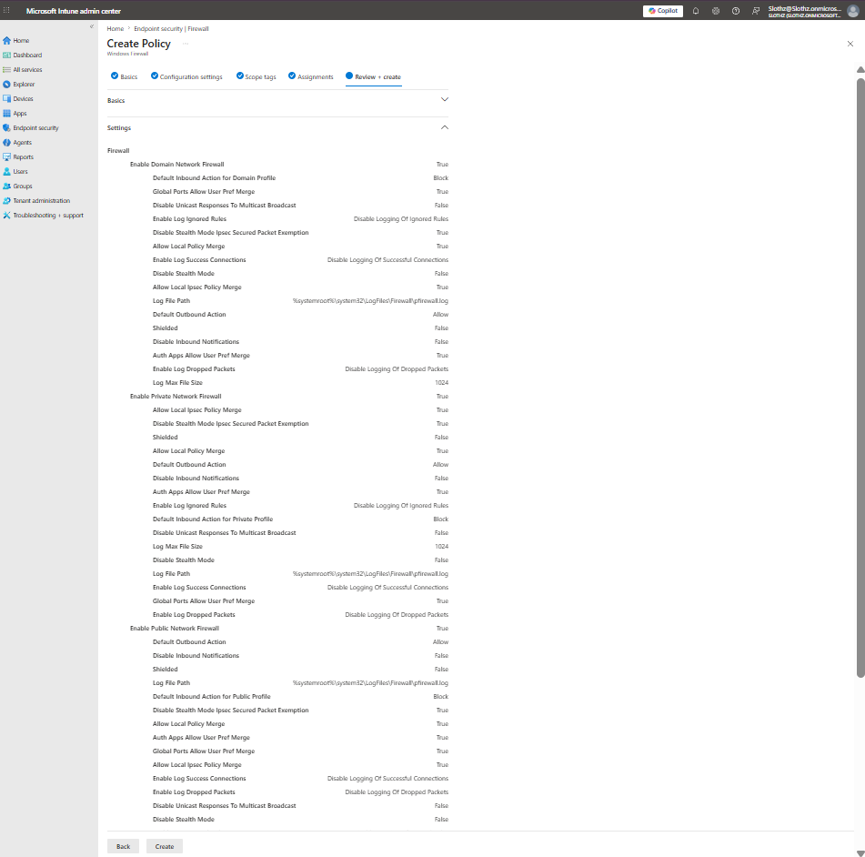
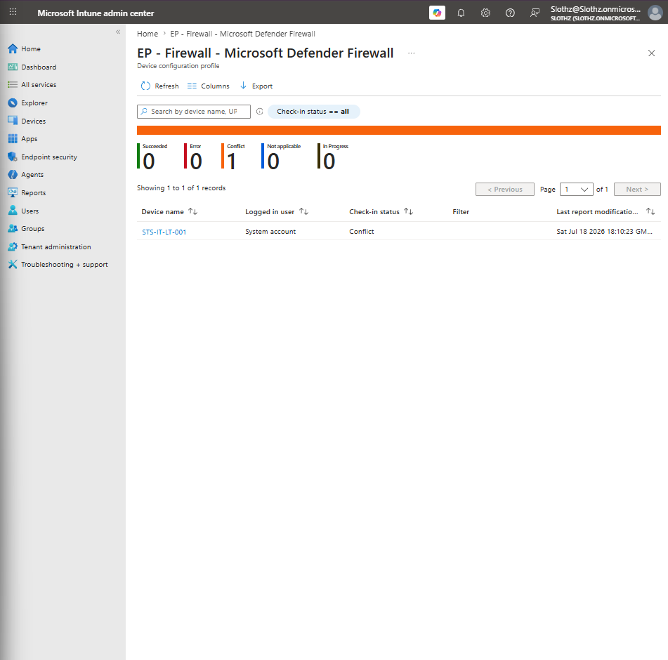
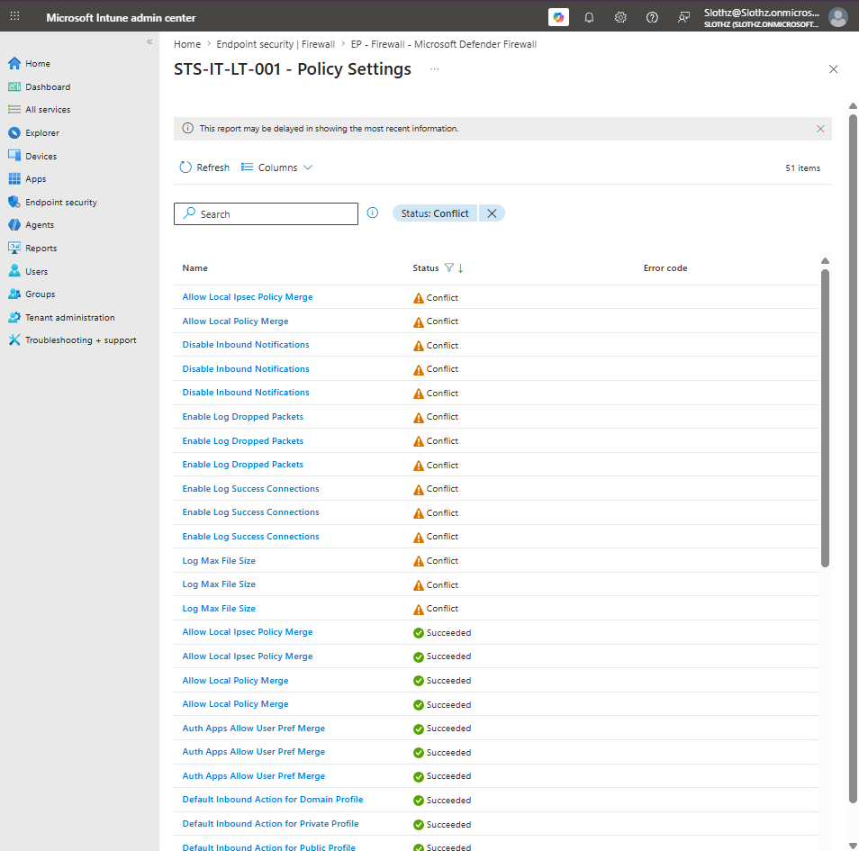
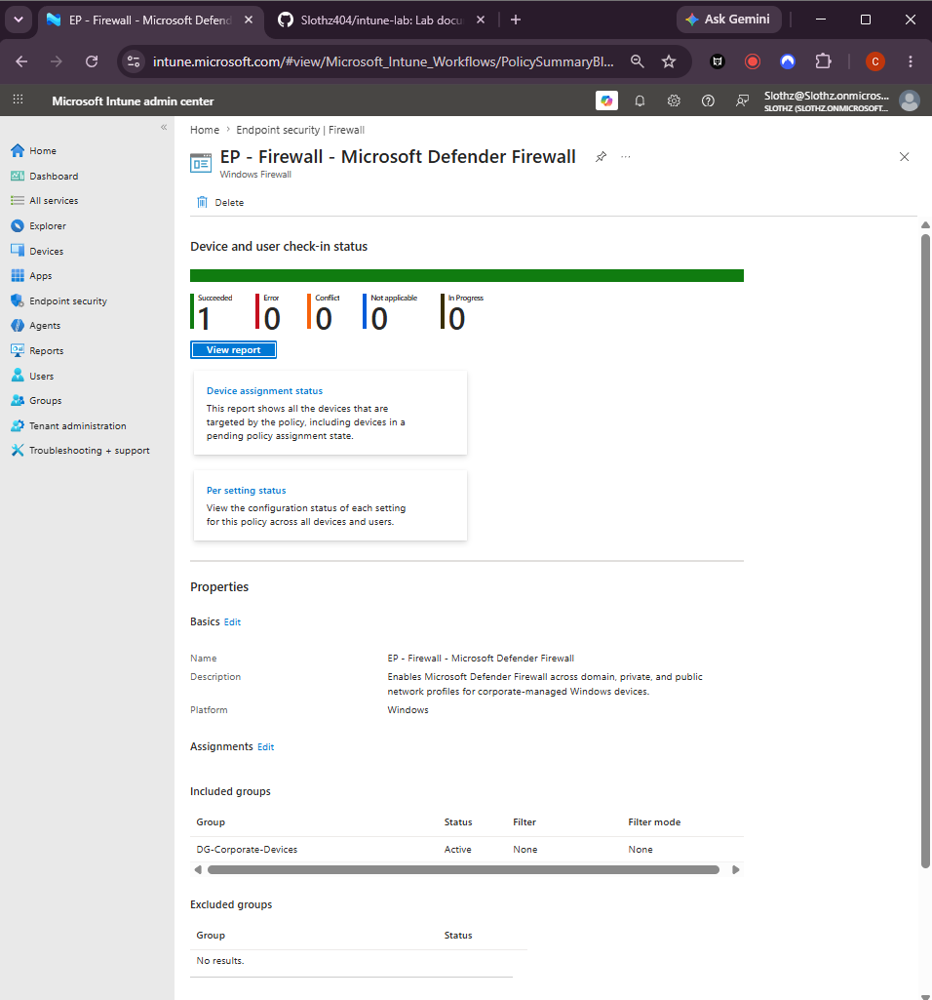

# INT-019 - Configure Microsoft Defender Firewall Policy

## Change Summary

**Requested By:** IT Manager

**Business Reason:**
Slothz Tech Solutions wants Microsoft Defender Firewall enabled across domain, private, and public network profiles on corporate-managed Windows devices.

**Risk Level:** Medium

**Rollback Plan:**
Remove the firewall policy assignment or set firewall settings back to Not configured if the policy causes connectivity or application access issues.

---

## Business Scenario

Slothz Tech Solutions manages corporate Windows devices using Microsoft Intune.

To improve endpoint security, a dedicated Endpoint Security firewall policy was created to manage Microsoft Defender Firewall profile settings. The policy enables firewall protection across domain, private, and public network profiles.

---

## Objective

Create a Microsoft Defender Firewall policy that:

- Enables the Domain network firewall profile
- Enables the Private network firewall profile
- Enables the Public network firewall profile
- Assigns the policy to corporate-managed Windows devices
- Resolves conflicts caused by overlapping firewall settings

---

## Environment

| Component | Details |
|-----------|---------|
| Organization | Slothz Tech Solutions |
| Device Management | Microsoft Intune |
| Identity Platform | Microsoft Entra ID |
| Target Device | STS-IT-LT-001 |
| Target Group | DG-Corporate-Devices |
| Policy Area | Endpoint Security |
| Policy Type | Firewall |
| Profile | Windows Firewall |
| Policy Name | EP - Firewall - Microsoft Defender Firewall |

---

## Design Decisions

A dedicated Endpoint Security firewall policy was created instead of relying only on the Windows security baseline.

The firewall policy was assigned to `DG-Corporate-Devices` because firewall enforcement should apply to corporate-managed Windows devices.

Only the main firewall profile enablement settings were intentionally configured:

| Setting | Value |
|---------|-------|
| Enable Domain Network Firewall | True |
| Enable Private Network Firewall | True |
| Enable Public Network Firewall | True |

Other advanced firewall settings were left as Not configured to reduce overlap and avoid unnecessary conflicts.

---

## Initial Deployment Result

After the firewall policy was first deployed, Intune reported a policy conflict.

| Status | Count |
|--------|-------|
| Succeeded | 0 |
| Error | 0 |
| Conflict | 1 |
| Not applicable | 0 |
| In progress | 0 |

Per-setting review showed conflicts on firewall profile settings such as:

- Allow Local IPsec Policy Merge
- Allow Local Policy Merge
- Disable Inbound Notifications
- Enable Log Dropped Packets
- Enable Log Success Connections
- Log Max File Size

These conflicts indicated that multiple policies were attempting to manage overlapping firewall settings.

---

## Remediation

The firewall policy was edited so that only the required firewall enablement settings remained configured.

Nonessential conflicted settings were changed to **Not configured**, including logging, notification, local policy merge, and IPsec merge settings.

This allowed the dedicated firewall policy to enforce the main firewall profile settings without conflicting with other Intune policies.

---

## Final Result

After remediation and device sync, the firewall policy reported successful deployment.

| Status | Count |
|--------|-------|
| Succeeded | 1 |
| Error | 0 |
| Conflict | 0 |
| Not applicable | 0 |
| In progress | 0 |

---

## Evidence

### Firewall Configuration Settings

### Firewall Review and Create

### Initial Firewall Device Status Conflict

### Firewall Policy Settings Conflict

### Final Firewall Status Succeeded

---

## Verification

Verification was completed in Microsoft Intune.

The following items were confirmed:

- The firewall policy was created successfully.
- The policy was assigned to `DG-Corporate-Devices`.
- Domain, private, and public firewall profiles were enabled.
- Initial policy conflicts were identified.
- Nonessential overlapping firewall settings were set to Not configured.
- Final device status showed successful deployment with no errors or conflicts.

---

## Outcome

Microsoft Defender Firewall was successfully enabled across domain, private, and public network profiles for the corporate Windows device.

Initial conflicts were resolved by limiting the firewall policy to the required firewall profile settings.

---

## Lessons Learned

This ticket reinforced the importance of reviewing per-setting status when an Intune policy reports a conflict.

A policy conflict does not always mean the setting is broken on the endpoint. It often means multiple Intune policies are attempting to manage the same setting.

This ticket also demonstrated the difference between firewall configuration and firewall rules. Firewall configuration controls profile behavior, while firewall rules control specific allowed or blocked traffic.

---

## Skills Demonstrated

- Microsoft Intune
- Endpoint Security
- Microsoft Defender Firewall
- Firewall Profile Management
- Policy Conflict Troubleshooting
- Per-Setting Status Review
- Device Group Assignment
- Technical Documentation
- GitHub
