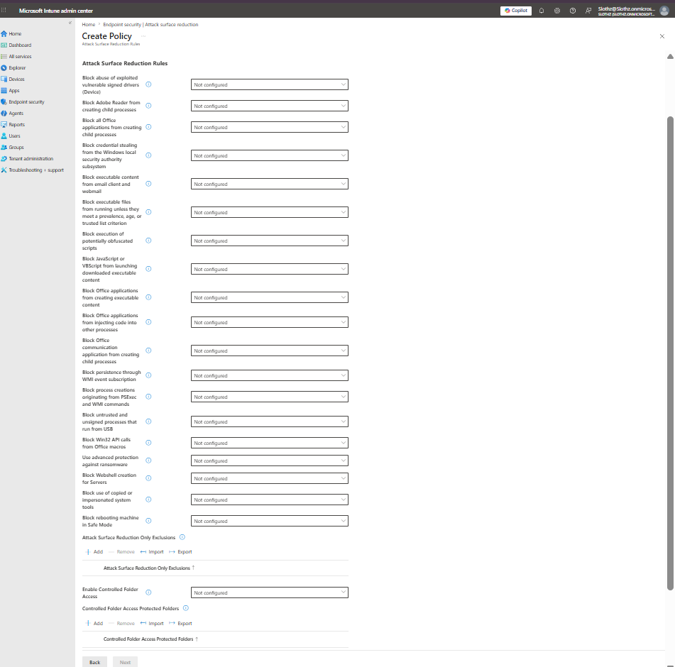
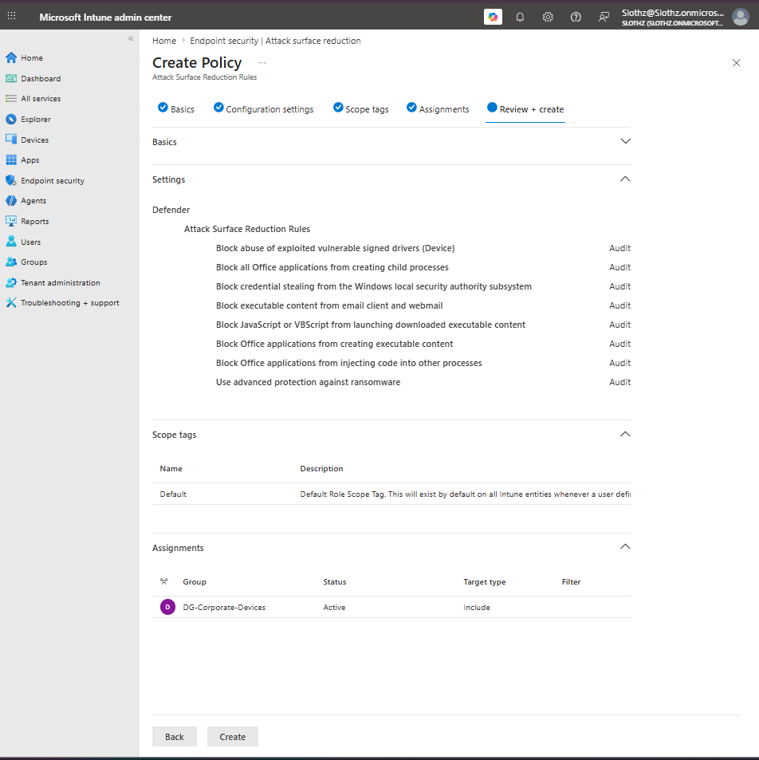
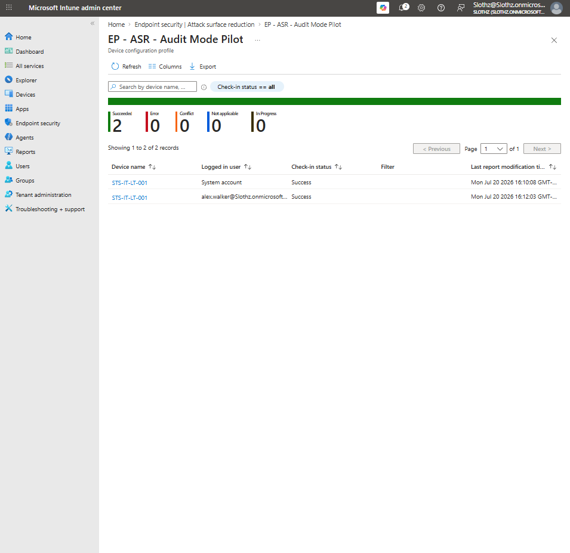
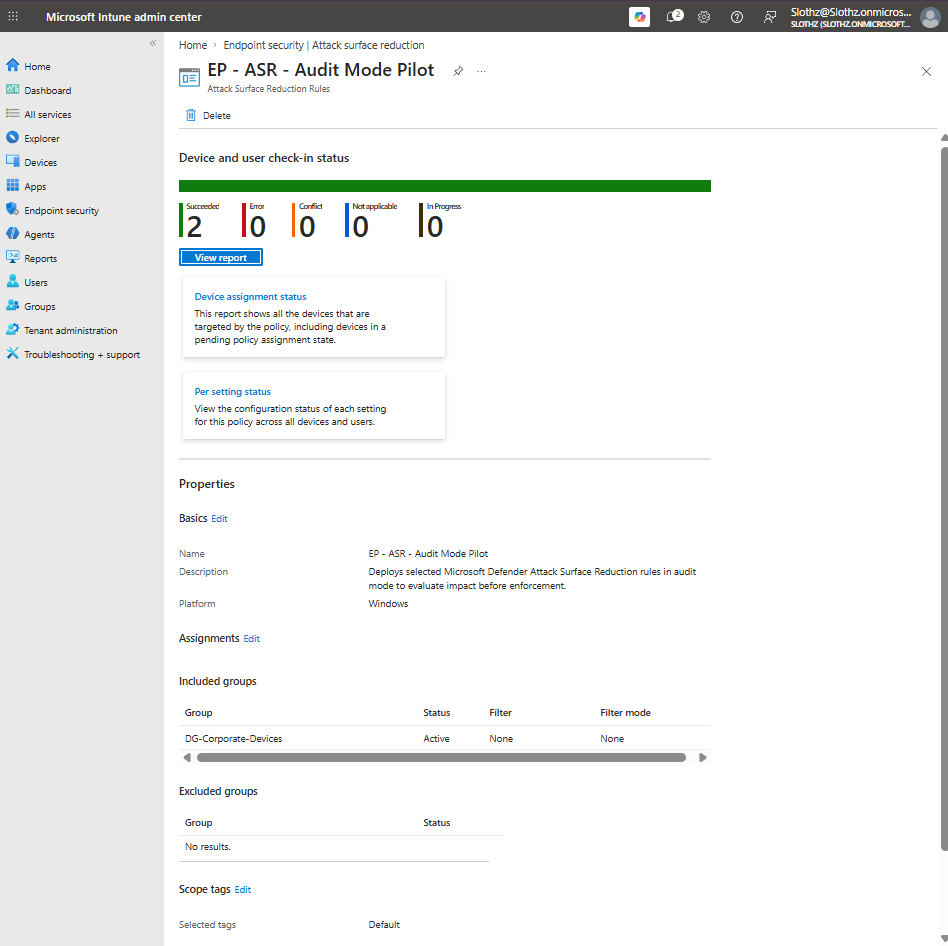

# INT-020 - Configure Attack Surface Reduction Audit Policy

## Change Summary

**Requested By:** IT Manager

**Business Reason:**
Slothz Tech Solutions wants to evaluate Microsoft Defender Attack Surface Reduction rules before enforcing them in block mode.

**Risk Level:** Low

**Rollback Plan:**
Remove the ASR policy assignment or change selected ASR rules back to Not configured if unexpected behavior is observed.

---

## Business Scenario

Slothz Tech Solutions manages corporate Windows devices using Microsoft Intune.

To improve endpoint protection, selected Microsoft Defender Attack Surface Reduction rules were deployed in audit mode. Audit mode allows IT to evaluate potential impact before enforcing rules in block mode.

---

## Objective

Create an Attack Surface Reduction policy that:

- Configures selected ASR rules
- Uses Audit mode for safe pilot testing
- Targets corporate-managed Windows devices
- Avoids immediate user disruption
- Verifies successful policy deployment

---

## Environment

| Component | Details |
|-----------|---------|
| Organization | Slothz Tech Solutions |
| Device Management | Microsoft Intune |
| Identity Platform | Microsoft Entra ID |
| Target Device | STS-IT-LT-001 |
| Target Group | DG-Corporate-Devices |
| Policy Area | Endpoint Security |
| Policy Type | Attack Surface Reduction Rules |
| Policy Name | EP - ASR - Audit Mode Pilot |

---

## Design Decisions

The ASR policy was configured in **Audit** mode instead of **Block** mode.

Audit mode was selected because ASR rules can affect normal user workflows, especially rules involving Office applications, scripts, executable content, and ransomware protection.

This allows the organization to evaluate ASR rule impact before moving selected rules into enforcement.

The policy was assigned to `DG-Corporate-Devices` because ASR rules should apply to corporate-managed Windows devices.

---

## Configured ASR Rules

The following rules were configured in Audit mode:

| ASR Rule | Mode |
|----------|------|
| Block abuse of exploited vulnerable signed drivers | Audit |
| Block all Office applications from creating child processes | Audit |
| Block credential stealing from the Windows local security authority subsystem | Audit |
| Block executable content from email client and webmail | Audit |
| Block JavaScript or VBScript from launching downloaded executable content | Audit |
| Block Office applications from creating executable content | Audit |
| Block Office applications from injecting code into other processes | Audit |
| Use advanced protection against ransomware | Audit |

---

## Settings Left Not Configured

The following settings were intentionally left Not configured for this pilot:

- Controlled Folder Access
- Controlled Folder Access protected folders
- ASR exclusions
- Rules that may require additional compatibility testing

---

## Evidence

### ASR Configuration Settings

### ASR Review and Create

### ASR Policy Overview

### ASR Status Succeeded

---

## Verification

Verification was completed in Microsoft Intune.

The following items were confirmed:

- The ASR policy was created successfully.
- The policy was assigned to `DG-Corporate-Devices`.
- Selected ASR rules were configured in Audit mode.
- The policy reported successful deployment.
- No errors or conflicts were reported.

Final policy status:

| Status | Count |
|--------|-------|
| Succeeded | 2 |
| Error | 0 |
| Conflict | 0 |
| Not applicable | 0 |
| In progress | 0 |

---

## Outcome

The Attack Surface Reduction audit policy was successfully deployed.

Selected ASR rules are now configured in Audit mode, allowing the organization to evaluate impact before enforcing the rules in Block mode.

---

## Lessons Learned

Attack Surface Reduction rules help reduce common attack techniques used by malware and malicious scripts.

Deploying ASR rules directly in Block mode can create user disruption if legitimate workflows are affected. Audit mode provides a safer pilot approach before enforcement.

This ticket reinforced the importance of phased security rollouts: test first, review impact, then enforce.

---

## Skills Demonstrated

- Microsoft Intune
- Endpoint Security
- Microsoft Defender
- Attack Surface Reduction Rules
- Audit Mode Deployment
- Device Group Assignment
- Policy Verification
- Technical Documentation
- GitHub
