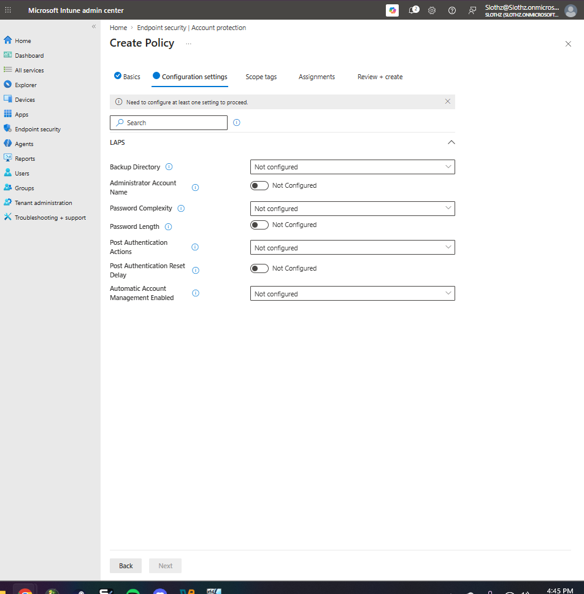
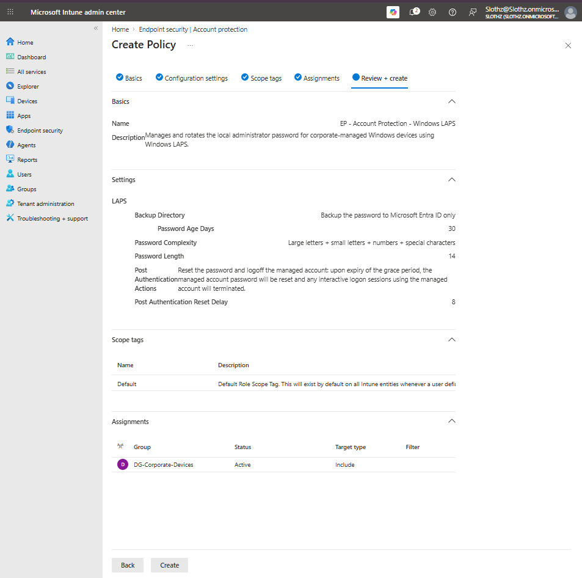
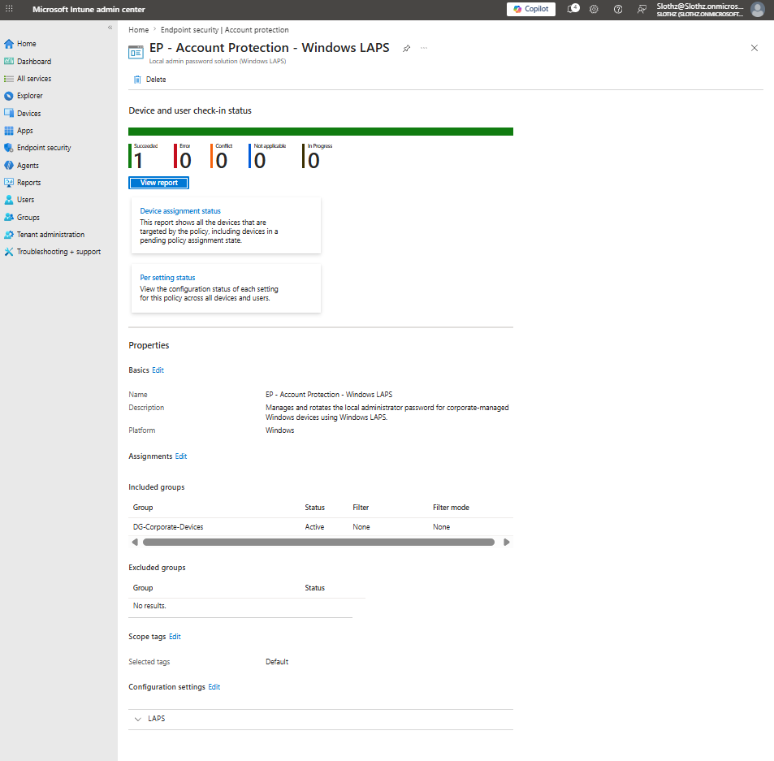

# INT-021 - Configure Windows LAPS Policy

## Change Summary

**Requested By:** IT Manager

**Business Reason:**
Slothz Tech Solutions wants to improve local administrator password security by managing and rotating local administrator passwords on corporate-managed Windows devices.

**Risk Level:** Medium

**Rollback Plan:**
Remove the Windows LAPS policy assignment or modify the LAPS configuration if local administrator password management causes access or recovery issues.

---

## Business Scenario

Slothz Tech Solutions manages corporate Windows devices using Microsoft Intune.

To reduce the risk of shared or unmanaged local administrator passwords, a Windows LAPS policy was deployed. The policy backs up the local administrator password to Microsoft Entra ID and rotates it on a scheduled basis.

---

## Objective

Create a Windows LAPS policy that:

- Backs up the local administrator password to Microsoft Entra ID
- Rotates the password every 30 days
- Uses strong password complexity
- Applies to corporate-managed Windows devices
- Verifies successful policy deployment

---

## Environment

| Component | Details |
|-----------|---------|
| Organization | Slothz Tech Solutions |
| Device Management | Microsoft Intune |
| Identity Platform | Microsoft Entra ID |
| Target Device | STS-IT-LT-001 |
| Target Group | DG-Corporate-Devices |
| Policy Area | Endpoint Security |
| Policy Type | Account Protection |
| Profile | Local admin password solution (Windows LAPS) |
| Policy Name | EP - Account Protection - Windows LAPS |

---

## Design Decisions

The policy was configured to back up the local administrator password to **Microsoft Entra ID only** because the lab device is Microsoft Entra joined and managed through Intune.

The policy was assigned to `DG-Corporate-Devices` because Windows LAPS is a device-level security control and should apply to corporate-managed devices.

The administrator account name was left unconfigured for this initial deployment. This avoids relying on a custom local administrator account that may not exist on the device.

A 30-day password age was selected to provide regular password rotation without creating unnecessary administrative overhead in the lab.

---

## Key Settings

| Setting | Value |
|---------|-------|
| Backup Directory | Microsoft Entra ID only |
| Password Age Days | 30 |
| Password Complexity | Large letters + small letters + numbers + special characters |
| Password Length | 14 |
| Post Authentication Actions | Reset password and log off managed account |
| Post Authentication Reset Delay | 8 |
| Assignment | DG-Corporate-Devices |

---

## Evidence

### Windows LAPS Configuration Settings

### Windows LAPS Review and Create

### Windows LAPS Status Succeeded

---

## Verification

Verification was completed in Microsoft Intune.

The following items were confirmed:

- The Windows LAPS policy was created successfully.
- The policy was assigned to `DG-Corporate-Devices`.
- Password backup was configured for Microsoft Entra ID.
- Password complexity and rotation settings were configured.
- The policy reported successful deployment.

Final policy status:

| Status | Count |
|--------|-------|
| Succeeded | 1 |
| Error | 0 |
| Conflict | 0 |
| Not applicable | 0 |
| In progress | 0 |

---

## Outcome

The Windows LAPS policy was successfully deployed to the corporate Windows device.

Local administrator password management is now configured through Intune with password backup to Microsoft Entra ID.

---

## Lessons Learned

Windows LAPS helps reduce the risk of shared or unmanaged local administrator passwords.

This ticket reinforced that LAPS is a device-level security control and should be assigned to device groups rather than user groups.

This ticket also showed the importance of understanding which local administrator account is being managed. Leaving the administrator account name unconfigured is a safer first deployment when a custom local administrator account has not been created.

---

## Skills Demonstrated

- Microsoft Intune
- Endpoint Security
- Account Protection
- Windows LAPS
- Microsoft Entra ID Password Backup
- Local Administrator Password Management
- Device Group Assignment
- Policy Verification
- Technical Documentation
- GitHub
