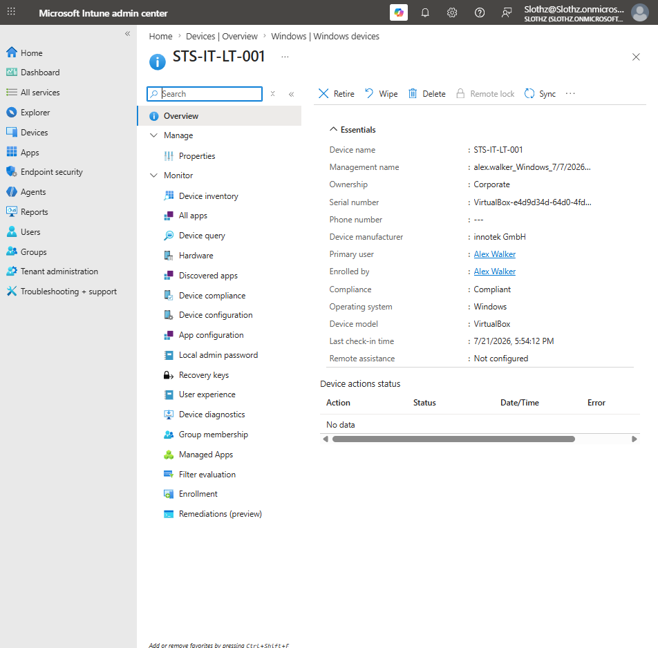
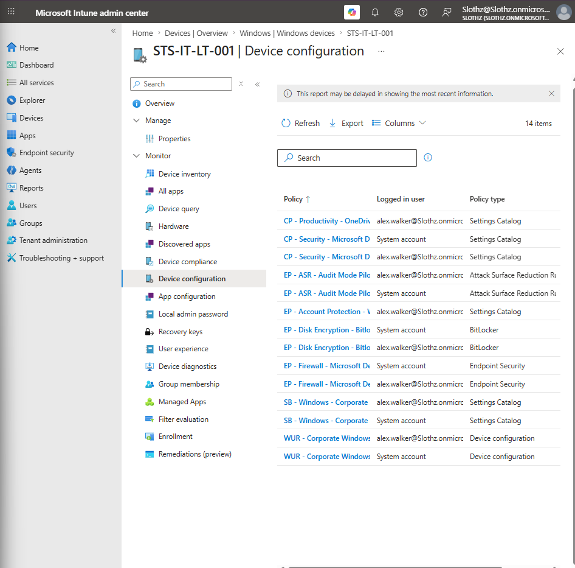
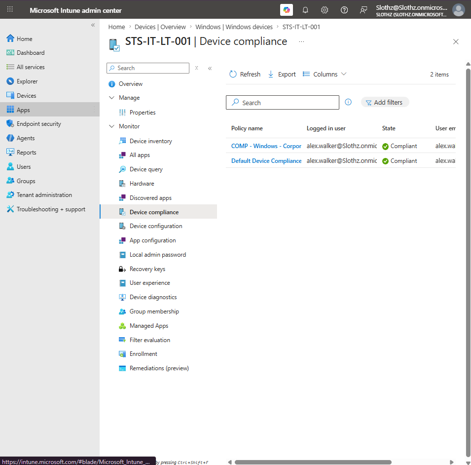
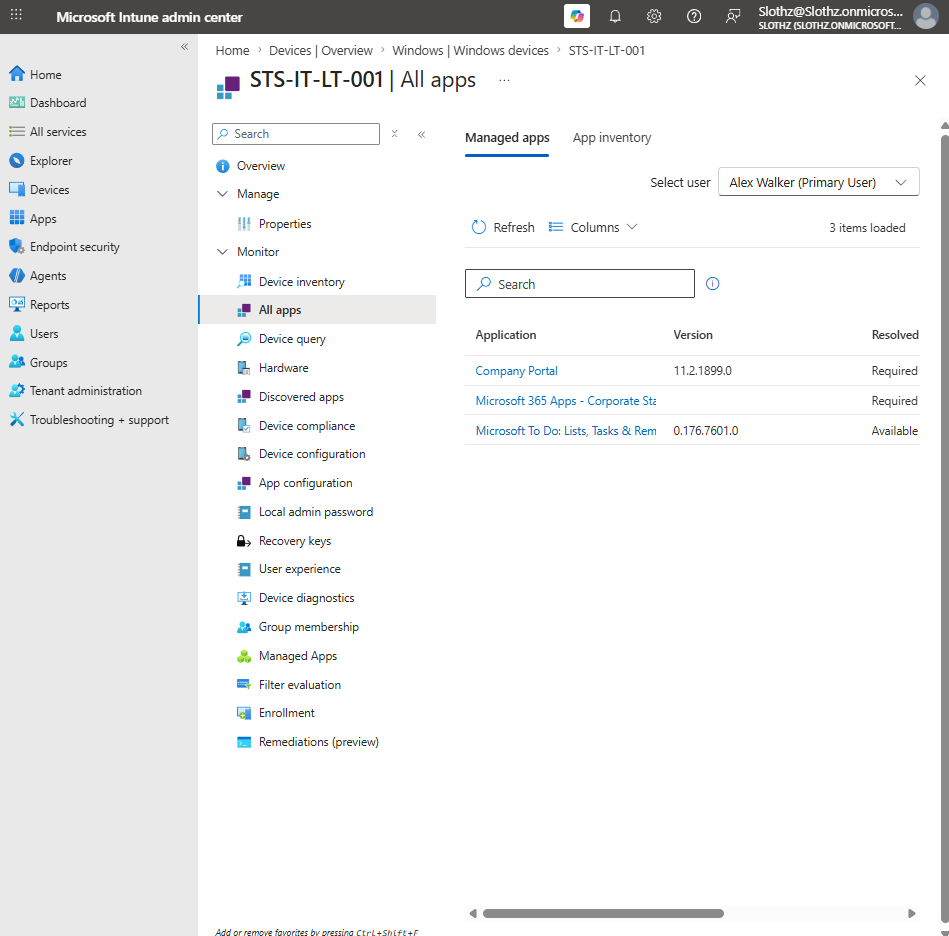
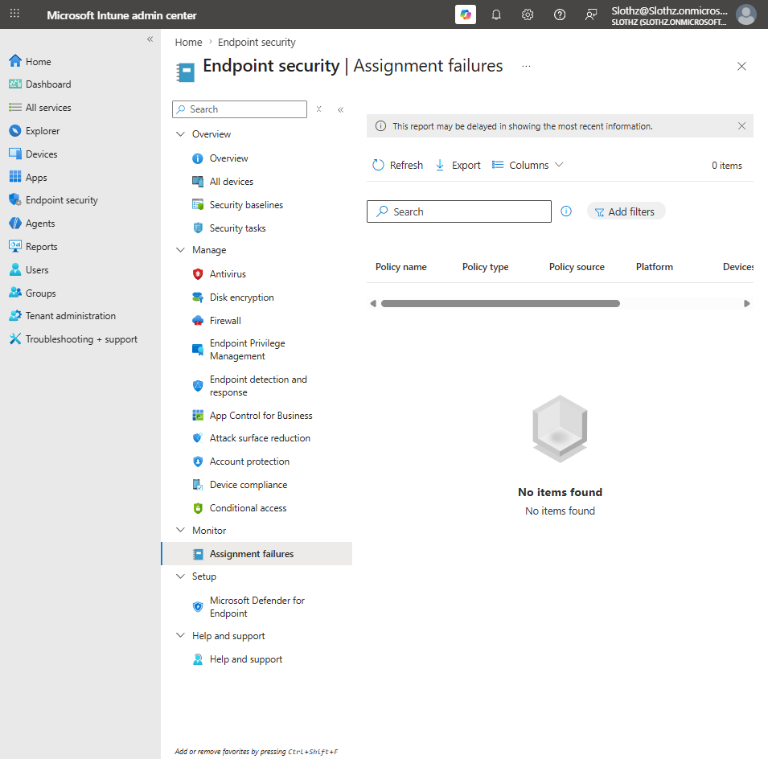
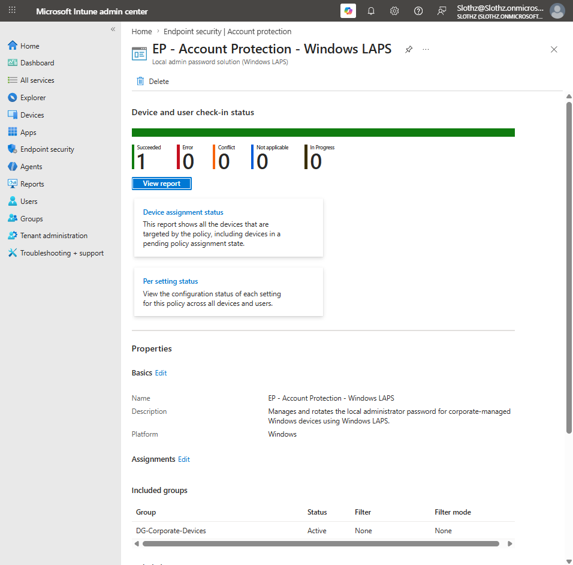

# INT-023 - Device Reporting and Policy Monitoring

## Change Summary

**Requested By:** IT Manager

**Business Reason:**
Slothz Tech Solutions wants to document where administrators can verify device health, policy deployment, compliance status, app status, and endpoint security assignment issues in Microsoft Intune.

**Risk Level:** Low

**Rollback Plan:**
No configuration changes were made in this ticket. This ticket documents monitoring and reporting locations only.

---

## Business Scenario

Slothz Tech Solutions manages corporate Windows devices using Microsoft Intune.

After deploying device configuration profiles, compliance policies, applications, and endpoint security policies, IT needs a repeatable workflow for verifying deployment status and identifying problems.

This ticket documents key Intune monitoring locations for the corporate Windows device `STS-IT-LT-001`.

---

## Objective

Document an Intune monitoring workflow that verifies:

- Device overview and check-in status
- Compliance policy status
- Device configuration policy status
- App deployment status
- Endpoint security assignment failures
- Endpoint security policy status

---

## Environment

| Component | Details |
|-----------|---------|
| Organization | Slothz Tech Solutions |
| Device Management | Microsoft Intune |
| Identity Platform | Microsoft Entra ID |
| Target Device | STS-IT-LT-001 |
| Primary User | Alex Walker |
| Device Ownership | Corporate |
| Operating System | Windows |
| Management State | Intune managed |

---

## Monitoring Areas Reviewed

The following Intune monitoring areas were reviewed:

| Area | Purpose |
|------|---------|
| Device Overview | Confirms device identity, ownership, compliance, OS, primary user, and last check-in |
| Device Configuration | Shows configuration profiles and endpoint security policies assigned to the device |
| Device Compliance | Shows compliance policies and compliance state |
| All Apps | Shows managed app assignments and install status |
| Endpoint Security Assignment Failures | Shows endpoint security assignment failures across policies |
| Endpoint Security Policy Status | Shows deployment status for a specific endpoint security policy |

---

## Evidence

### Device Overview

### Device Configuration Monitoring

### Device Compliance Monitoring

### Device App Monitoring

### Endpoint Security Assignment Failures

### Endpoint Security Policy Status

---

## Verification Summary

### Device Overview

The device overview confirmed that `STS-IT-LT-001` is a corporate-owned Windows device managed by Intune.

The overview also showed:

- Device name
- Ownership
- Primary user
- Compliance state
- Operating system
- Device manufacturer/model
- Last check-in time

This view is useful as the first place to confirm whether the device is active, enrolled, and checking in.

---

### Device Configuration Monitoring

The device configuration page showed multiple assigned policies and profiles, including:

- OneDrive configuration
- Microsoft Defender configuration
- Attack Surface Reduction policy
- Windows LAPS policy
- BitLocker policy
- Firewall policy
- Windows security baseline
- Windows Update Ring

This view is useful for confirming which policies are assigned to the device and whether they are reporting under the expected user or system context.

---

### Device Compliance Monitoring

The device compliance page showed compliance policies assigned to the device.

Both the custom corporate compliance policy and default device compliance policy reported a compliant state.

This view is useful for verifying whether the device meets compliance requirements that can later be used by Conditional Access.

---

### App Monitoring

The All Apps page showed managed applications associated with the device and primary user.

Observed apps included:

- Company Portal
- Microsoft 365 Apps
- Microsoft To Do

This view is useful for confirming app assignment type and app presence from the device record.

---

### Endpoint Security Assignment Failures

The Endpoint Security Assignment Failures report showed no items found.

This confirms that there were no current endpoint security assignment failures at the time of review.

---

### Endpoint Security Policy Status

The Windows LAPS endpoint security policy showed successful deployment.

Final status:

| Status | Count |
|--------|-------|
| Succeeded | 1 |
| Error | 0 |
| Conflict | 0 |
| Not applicable | 0 |
| In progress | 0 |

This confirms that endpoint security policies should be reviewed individually when validating deployment.

---

## Outcome

A repeatable Intune monitoring workflow was documented successfully.

The workflow shows where an administrator can verify device status, policy deployment, compliance status, app assignment, endpoint security policy status, and assignment failures.

No configuration changes were made in this ticket.

---

## Lessons Learned

Creating Intune policies is only part of endpoint administration. Administrators also need to know where to verify whether policies applied successfully.

Different monitoring areas answer different questions:

- Device Overview confirms device identity and check-in.
- Device Configuration confirms assigned policies.
- Device Compliance confirms compliance state.
- All Apps confirms managed app status.
- Endpoint Security Assignment Failures helps identify assignment problems.
- Individual endpoint security policies show deployment success, conflict, error, or in-progress states.

This ticket reinforced that troubleshooting starts by identifying the correct report or status page.

---

## Skills Demonstrated

- Microsoft Intune
- Device Monitoring
- Policy Monitoring
- Compliance Reporting
- App Deployment Monitoring
- Endpoint Security Reporting
- Assignment Failure Review
- Technical Documentation
- GitHub
