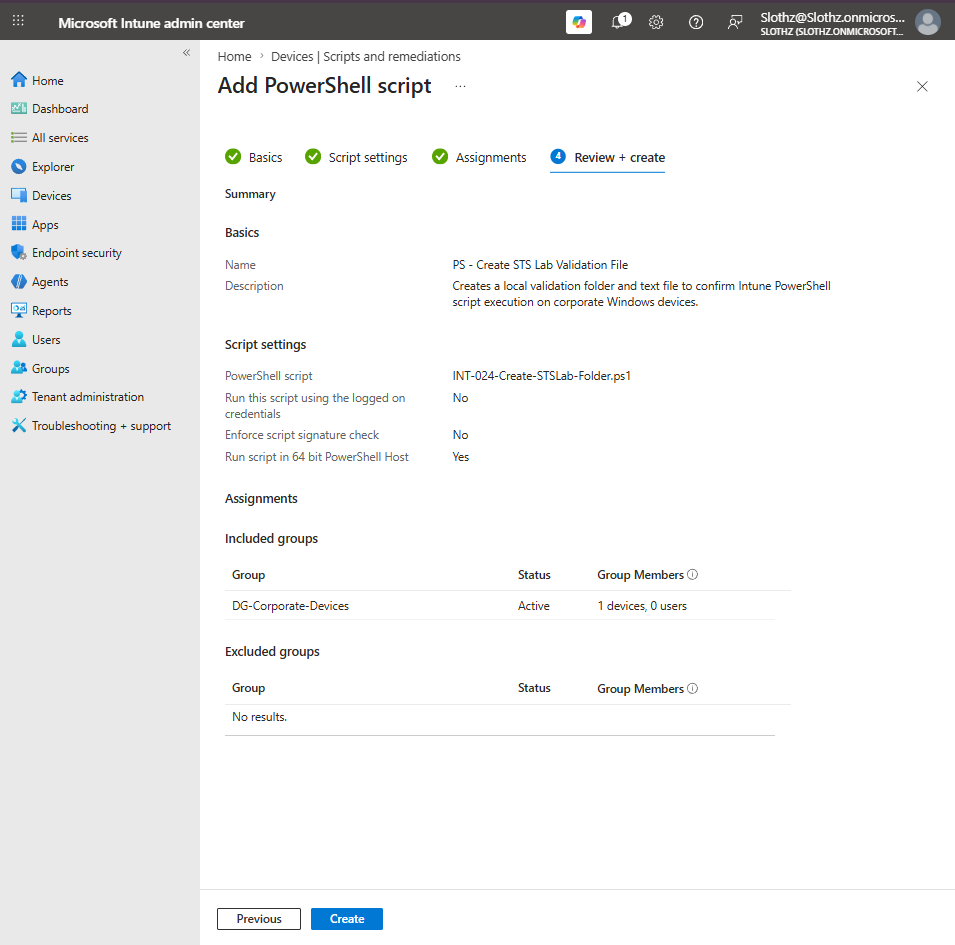
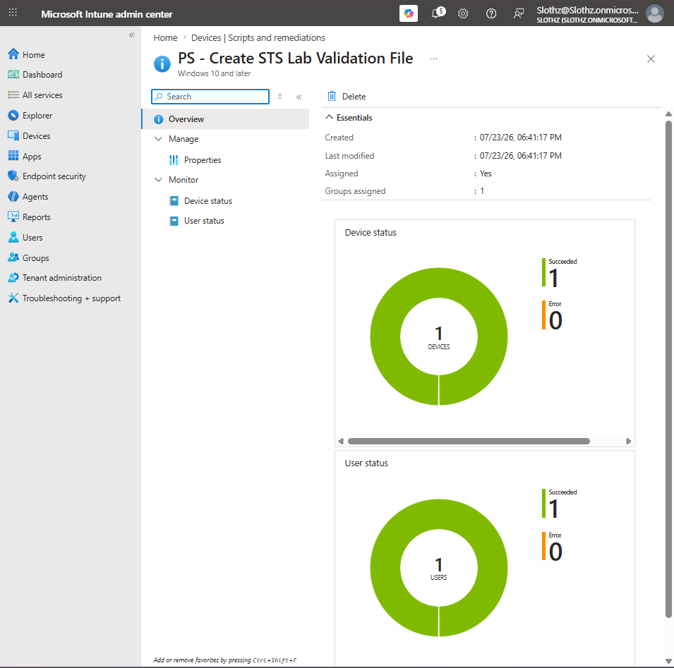
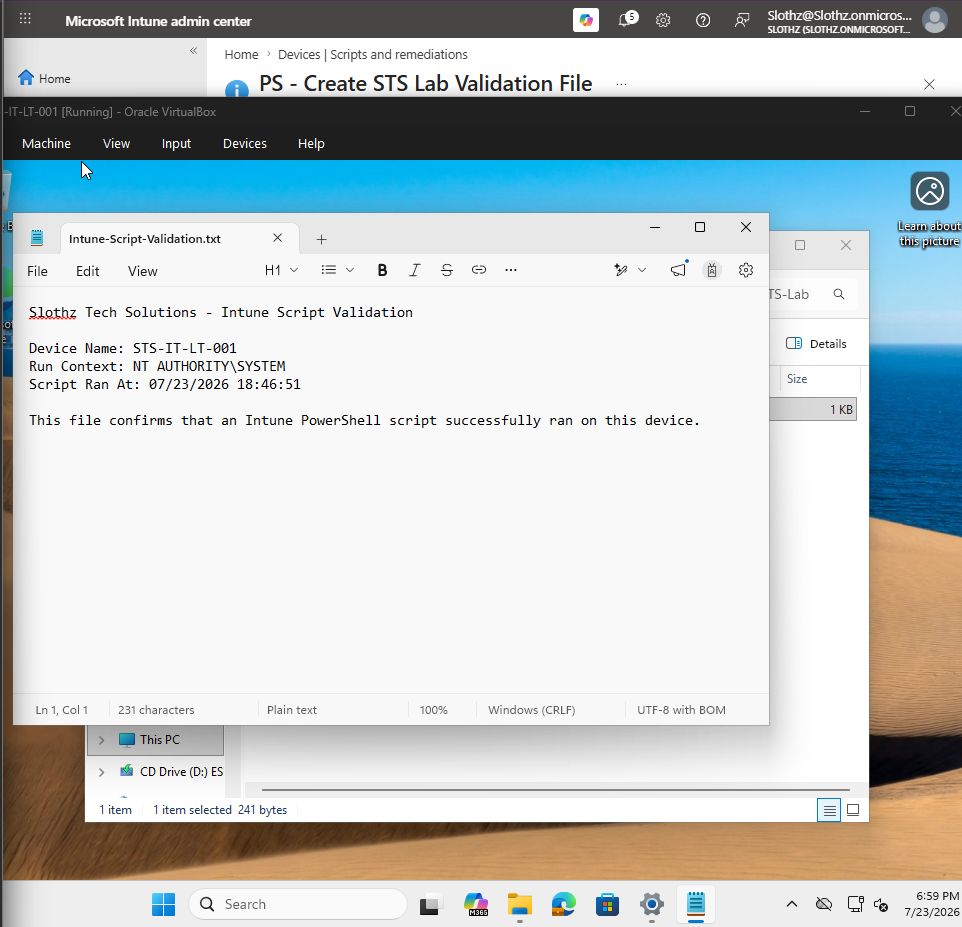

# INT-024 - Deploy PowerShell Script with Intune

## Change Summary

**Requested By:** IT Manager

**Business Reason:**
Slothz Tech Solutions wants to validate that Microsoft Intune can deploy and run PowerShell scripts on corporate-managed Windows devices.

**Risk Level:** Low

**Rollback Plan:**
Delete the Intune PowerShell script policy if no longer needed. The validation folder and file can be manually removed from the endpoint.

---

## Business Scenario

Slothz Tech Solutions uses Microsoft Intune to manage corporate Windows devices.

IT needs the ability to deploy PowerShell scripts for device configuration, validation, troubleshooting, and future remediation tasks.

This ticket validates PowerShell script deployment by using Intune to create a local validation folder and text file on the corporate Windows device `STS-IT-LT-001`.

---

## Objective

Deploy a safe PowerShell script through Microsoft Intune that:

- Runs on a corporate-managed Windows device
- Runs in system context
- Creates a local validation folder
- Writes a validation text file
- Provides endpoint evidence that the script executed successfully

---

## Environment

| Component | Details |
|-----------|---------|
| Organization | Slothz Tech Solutions |
| Device Management | Microsoft Intune |
| Identity Platform | Microsoft Entra ID |
| Target Device | STS-IT-LT-001 |
| Primary User | Alex Walker |
| Assignment Group | DG-Corporate-Devices |
| Script Type | PowerShell |
| Execution Context | System |

---

## Script Details

| Setting | Configuration |
|---------|---------------|
| Script Name | PS - Create STS Lab Validation File |
| Script File | INT-024-Create-STSLab-Folder.ps1 |
| Run using logged-on credentials | No |
| Enforce script signature check | No |
| Run script in 64-bit PowerShell host | Yes |
| Assignment | DG-Corporate-Devices |

---

## PowerShell Script

```powershell
$FolderPath = "C:\STS-Lab"
$FilePath = "$FolderPath\Intune-Script-Validation.txt"

if (!(Test-Path -Path $FolderPath)) {
    New-Item -Path $FolderPath -ItemType Directory -Force | Out-Null
}

$Content = @"
Slothz Tech Solutions - Intune Script Validation

Device Name: $env:COMPUTERNAME
Run Context: $([System.Security.Principal.WindowsIdentity]::GetCurrent().Name)
Script Ran At: $(Get-Date)

This file confirms that an Intune PowerShell script successfully ran on this device.
"@

$Content | Out-File -FilePath $FilePath -Encoding UTF8 -Force
```

---

## Evidence

### PowerShell Script Review and Create



### PowerShell Script Overview



### Endpoint Validation File



---

## Verification

The Intune script overview showed successful deployment.

| Status | Count |
|--------|-------|
| Device Succeeded | 1 |
| Device Error | 0 |
| User Succeeded | 1 |
| User Error | 0 |

The endpoint validation file was created at:

```text
C:\STS-Lab\Intune-Script-Validation.txt
```

The validation file confirmed:

```text
Run Context: NT AUTHORITY\SYSTEM
```

This confirms that the script ran in system context rather than as the signed-in user.

---

## Outcome

The PowerShell script was successfully deployed through Microsoft Intune.

The script created the expected local folder and validation file on `STS-IT-LT-001`.

The endpoint evidence confirmed that the script ran as `NT AUTHORITY\SYSTEM`, matching the Intune setting to not run the script using logged-on user credentials.

---

## Lessons Learned

Intune can deploy PowerShell scripts to managed Windows devices for configuration, validation, and troubleshooting.

The setting **Run this script using the logged on credentials** controls whether the script runs as the signed-in user or in system context.

For this ticket, the setting was configured as **No**, which caused the script to run as `NT AUTHORITY\SYSTEM`.

This reinforced the difference between user context and device/system context in Intune reporting and execution.

---

## Skills Demonstrated

- Microsoft Intune
- PowerShell Script Deployment
- Device-Based Assignment
- System Context Execution
- Endpoint Validation
- Script Monitoring
- Technical Documentation
- GitHub
