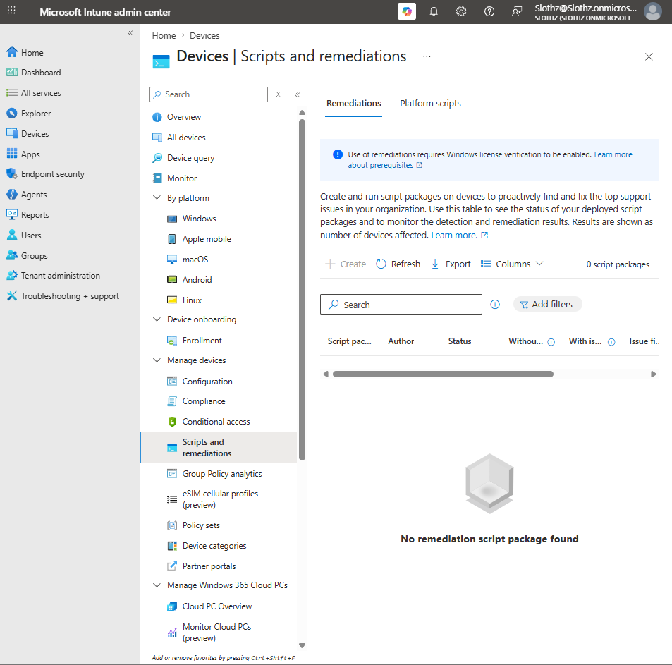

# INT-025 - Validate Remediations Licensing Requirement

## Change Summary

**Requested By:** IT Manager

**Business Reason:**  
Slothz Tech Solutions wants to evaluate Microsoft Intune Remediations as a method for detecting and fixing common endpoint issues.

**Risk Level:** Low

**Rollback Plan:**  
No configuration changes were made. The ticket documents a licensing and prerequisite limitation only.

---

## Business Scenario

Slothz Tech Solutions uses Microsoft Intune to manage corporate Windows devices.

After successfully deploying a PowerShell platform script in INT-024, IT evaluated Intune Remediations to determine whether detection and remediation scripts could be used for proactive endpoint repair.

During validation, the Intune admin center showed that Remediations require Windows license verification before script packages can be created.

---

## Objective

Validate whether Microsoft Intune Remediations can be used in the current lab tenant.

The intended remediation package would have:

- Detected whether a validation file existed
- Returned a noncompliant result if the file was missing
- Created the missing file using a remediation script
- Reported remediation results back to Intune

---

## Environment

| Component | Details |
|-----------|---------|
| Organization | Slothz Tech Solutions |
| Device Management | Microsoft Intune |
| Identity Platform | Microsoft Entra ID |
| License | Microsoft 365 Business Premium |
| Target Device | STS-IT-LT-001 |
| Intended Assignment Group | DG-Corporate-Devices |
| Feature Evaluated | Intune Remediations |

---

## Validation Result

When reviewing **Intune admin center > Devices > Scripts and remediations > Remediations**, the portal displayed the following message:

> Use of remediations requires Windows license verification to be enabled.

The **Create** option was unavailable, preventing creation of a remediation script package.

---

## Evidence

### Remediations License Verification Blocked

---

## Findings

Microsoft Intune Remediations require specific Windows licensing and license verification before the feature can be used.

The current lab uses Microsoft 365 Business Premium. Because the lab does not currently include an eligible Windows Enterprise, Education, or VDA license for Remediations, the feature was not enabled.

No license attestation was enabled because the tenant should only confirm ownership of eligible licenses when those licenses are actually present.

---

## Outcome

The remediation package was not created.

The ticket successfully validated that Intune Remediations are blocked in the current lab due to licensing and Windows license verification requirements.

This was documented as a real-world prerequisite limitation instead of bypassing or misrepresenting the lab configuration.

---

## Lessons Learned

Intune features may depend on licensing, tenant-level prerequisites, or feature-specific verification settings.

PowerShell platform scripts and Remediations are related but different:

- Platform scripts run a PowerShell script on assigned devices.
- Remediations use a detection script to identify a problem and a remediation script to fix it.
- A remediation script only runs when the detection script detects an issue.

This ticket reinforced that administrators must verify licensing and prerequisites before planning a deployment.

---

## Skills Demonstrated

- Microsoft Intune
- Remediations Prerequisite Review
- Licensing Validation
- Tenant Feature Verification
- PowerShell Remediation Planning
- Technical Documentation
- GitHub
