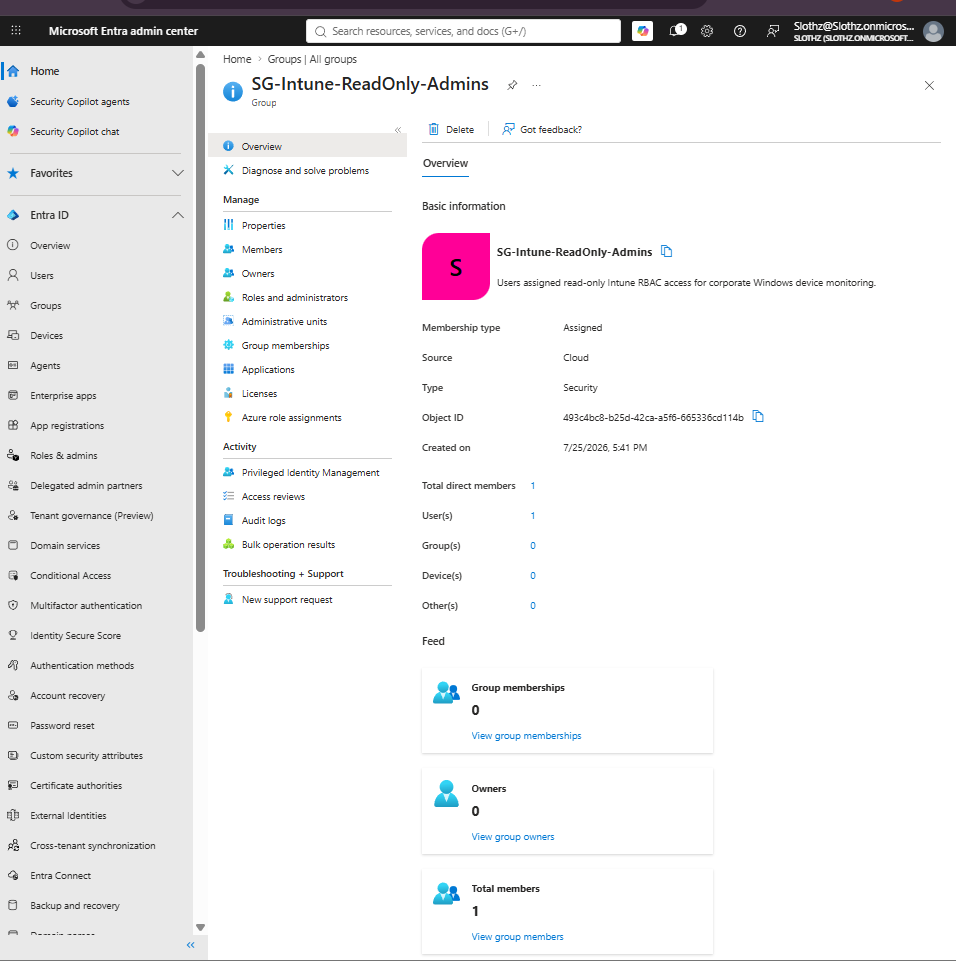
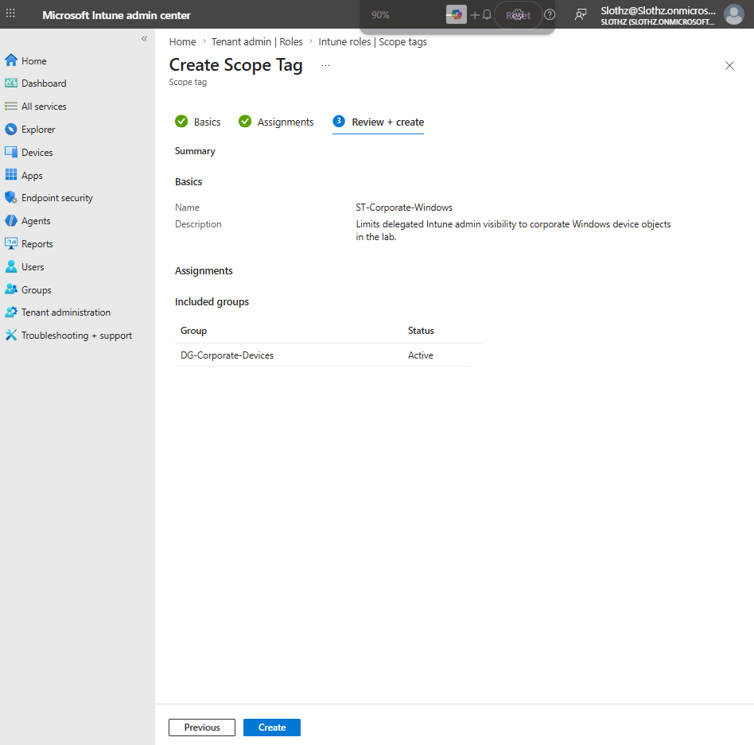
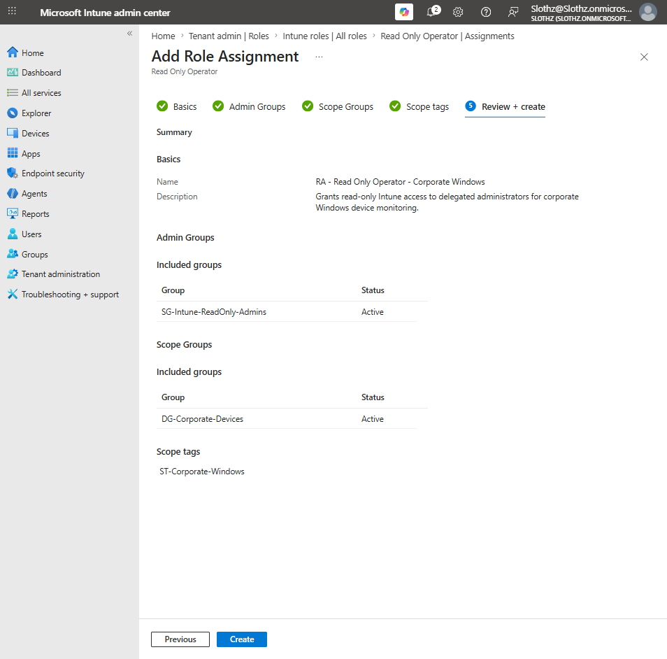
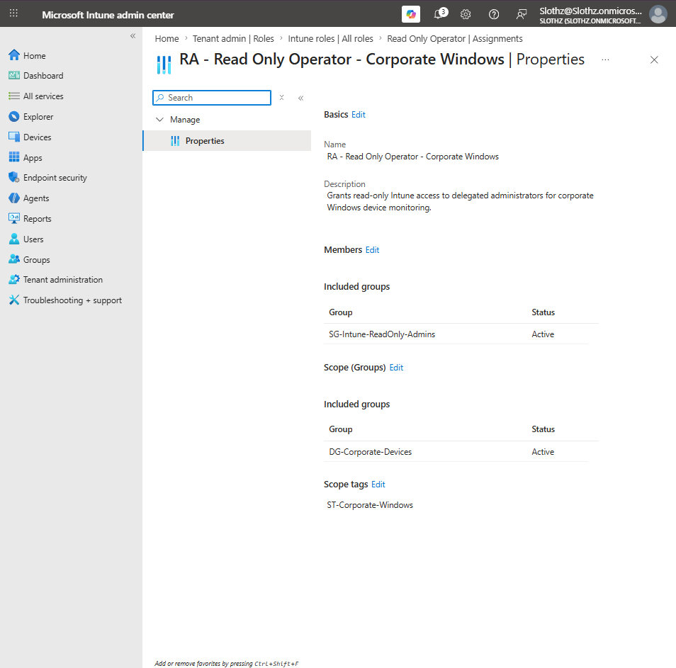
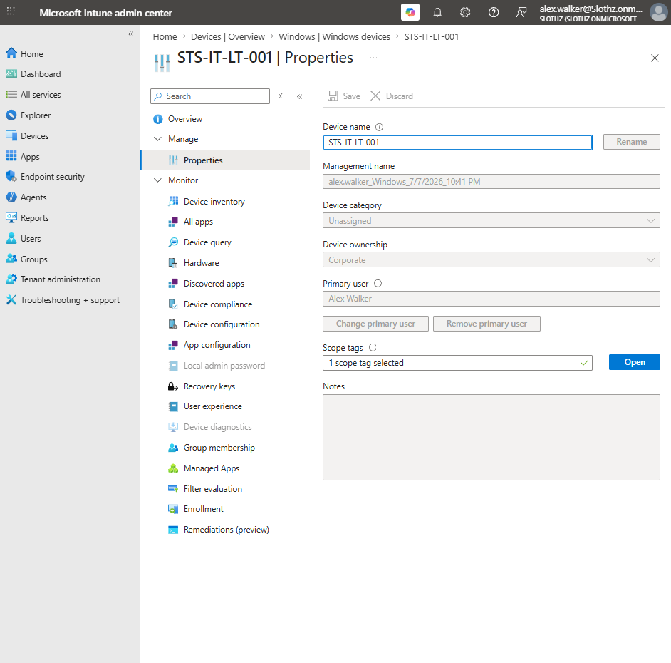
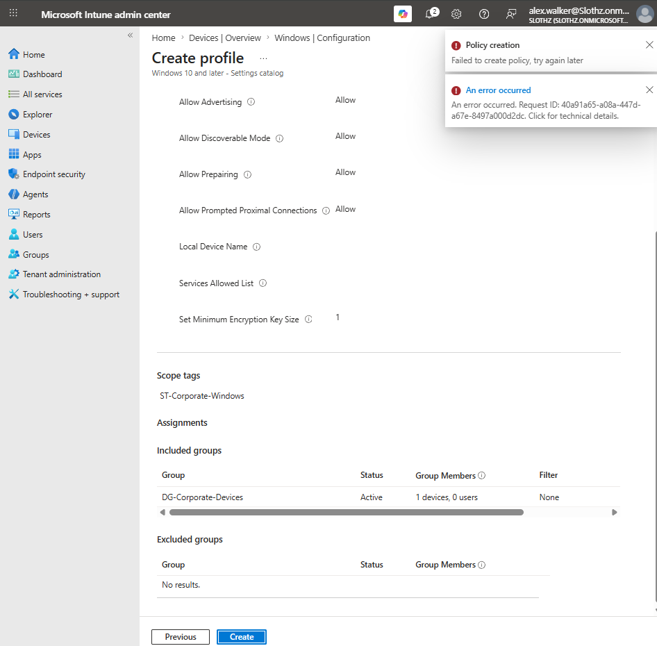

# INT-026 - Configure Intune RBAC and Scope Tags

## Change Summary

**Requested By:** IT Manager

**Business Reason:**  
Slothz Tech Solutions wants to delegate limited Intune access to IT staff without granting full administrative permissions.

**Risk Level:** Medium

**Rollback Plan:**  
Remove the Read Only Operator role assignment from the delegated admin group. If needed, remove the scope tag assignment from the corporate device group.

---

## Business Scenario

Slothz Tech Solutions uses Microsoft Intune to manage corporate Windows devices.

Instead of giving every IT user full Intune administrator permissions, the organization wants to follow least privilege by assigning limited read-only access to delegated IT staff.

This ticket configures a scoped Intune RBAC assignment for Alex Walker so he can view corporate Windows device information without being able to create or modify policies.

---

## Objective

Configure Intune role-based access control using:

- A delegated admin security group
- A built-in Intune role
- A scope group
- A scope tag

The goal is to allow read-only access to corporate Windows device information while blocking policy creation or modification.

---

## Environment

| Component | Details |
|-----------|---------|
| Organization | Slothz Tech Solutions |
| Device Management | Microsoft Intune |
| Identity Platform | Microsoft Entra ID |
| Delegated Admin User | Alex Walker |
| Admin Group | SG-Intune-ReadOnly-Admins |
| Built-in Role | Read Only Operator |
| Scope Group | DG-Corporate-Devices |
| Scope Tag | ST-Corporate-Windows |
| Target Device | STS-IT-LT-001 |

---

## RBAC Design

| RBAC Component | Purpose |
|---------------|---------|
| Admin Group | Defines who receives the delegated Intune permissions |
| Role | Defines what actions the delegated admin can perform |
| Scope Group | Defines which users or devices are in scope |
| Scope Tag | Defines which Intune objects are visible or manageable |

For this lab, Alex Walker was added to the `SG-Intune-ReadOnly-Admins` group.

That group was assigned the built-in Intune role `Read Only Operator`.

The role assignment was limited to the `DG-Corporate-Devices` scope group and the `ST-Corporate-Windows` scope tag.

---

## Configuration Summary

| Setting | Configuration |
|---------|---------------|
| Admin Group | SG-Intune-ReadOnly-Admins |
| Admin User | Alex Walker |
| Intune Role | Read Only Operator |
| Role Assignment | RA - Read Only Operator - Corporate Windows |
| Scope Group | DG-Corporate-Devices |
| Scope Tag | ST-Corporate-Windows |

---

## Evidence

### Read-Only Admin Group Members

### Scope Tag Review and Create

### RBAC Role Assignment Review and Create

### RBAC Role Assignment Overview

### Alex Read-Only Intune Access

### Alex Read-Only Create Policy Blocked

---

## Verification

Alex Walker was able to sign in to the Intune admin center and view the scoped corporate Windows device `STS-IT-LT-001`.

The device properties page showed that Alex could view device information such as:

- Device name
- Ownership
- Primary user
- Scope tag
- Device properties

Alex then attempted to create a configuration profile. The policy creation attempt failed, confirming that the delegated role did not allow policy creation.

This validates that the Read Only Operator role allowed visibility while preventing administrative changes.

---

## Outcome

Intune RBAC was successfully configured using a least privilege model.

Alex Walker received read-only Intune access through group-based role assignment.

The role assignment was limited using a scope group and scope tag.

The test confirmed that Alex could view scoped Intune information but could not create new policies.

---

## Lessons Learned

Intune RBAC controls administrative access inside the Intune admin center.

The role determines what actions an admin can perform.

The admin group determines who receives the role assignment.

The scope group determines which users or devices the delegated admin can manage.

The scope tag helps control which Intune objects are visible or manageable.

This ticket reinforced the principle of least privilege by giving Alex Walker only the access needed for monitoring, without granting full Intune administrator permissions.

---

## Skills Demonstrated

- Microsoft Intune
- Role-Based Access Control
- Scope Tags
- Scope Groups
- Least Privilege Administration
- Delegated Administration
- Microsoft Entra ID Security Groups
- Access Validation
- Technical Documentation
- GitHub
