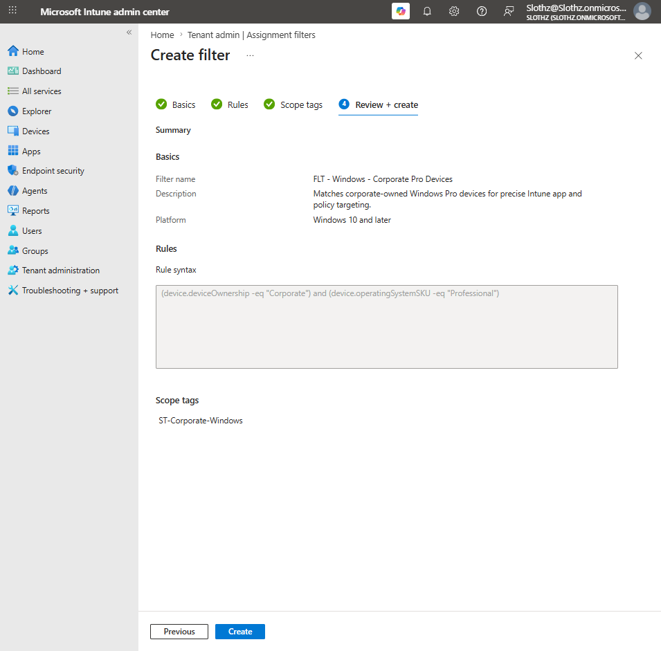
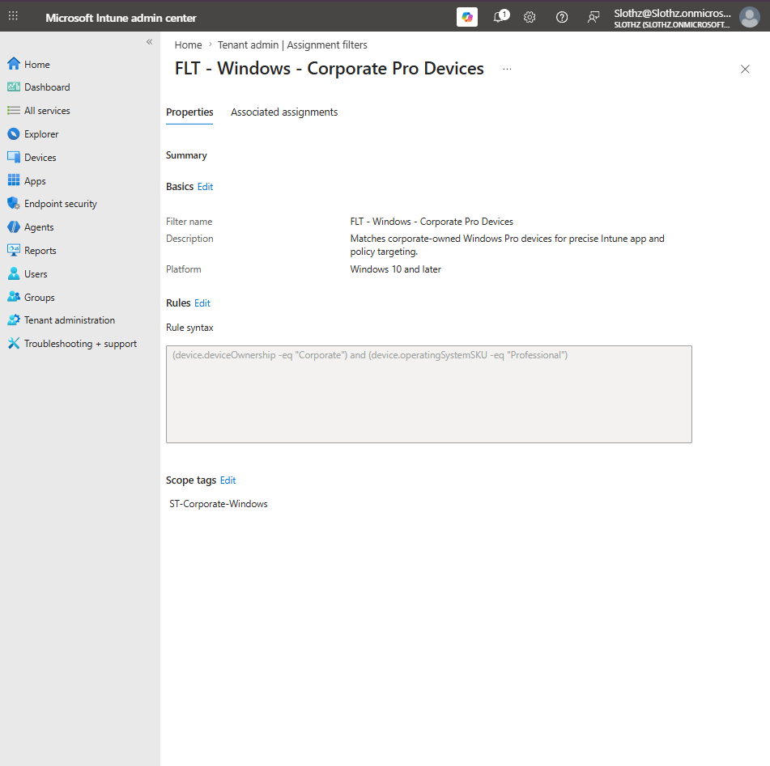
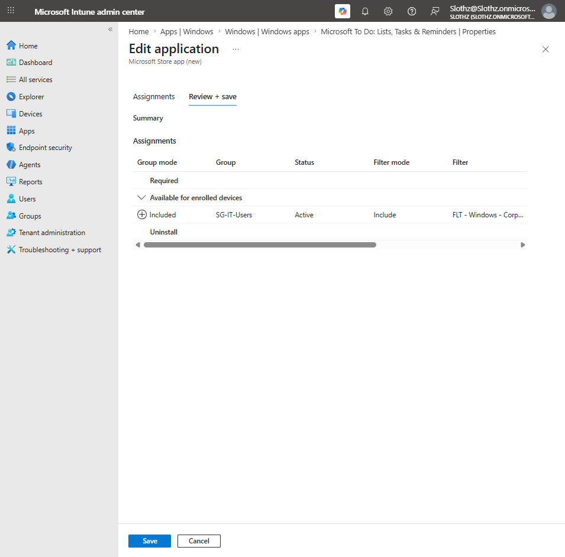
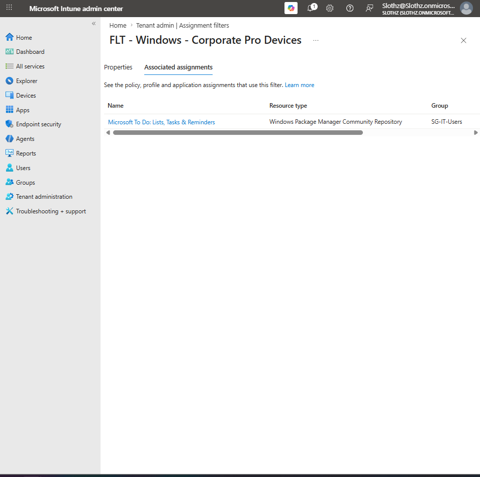

# INT-027 - Create Intune Assignment Filter

## Change Summary

**Requested By:** IT Manager

**Business Reason:**  
Slothz Tech Solutions wants to improve Intune assignment targeting by using filters to narrow app and policy deployment based on device properties.

**Risk Level:** Low

**Rollback Plan:**  
Remove the assignment filter from the Microsoft To Do app assignment. If the filter is no longer needed, delete the assignment filter from Intune.

---

## Business Scenario

Slothz Tech Solutions uses Microsoft Intune to assign apps and policies to users and devices.

Security groups are useful for broad targeting, but filters allow administrators to narrow assignments based on device properties such as ownership, operating system, device model, or Windows edition.

This ticket creates an Intune assignment filter for corporate-owned Windows Pro devices and applies it to an existing Microsoft To Do app assignment.

---

## Objective

Create and validate an Intune assignment filter that targets corporate-owned Windows Pro devices.

The filter will then be applied to the existing Microsoft To Do available app assignment for IT users.

---

## Environment

| Component | Details |
|-----------|---------|
| Organization | Slothz Tech Solutions |
| Device Management | Microsoft Intune |
| Identity Platform | Microsoft Entra ID |
| Target Device | STS-IT-LT-001 |
| Device Ownership | Corporate |
| Operating System | Windows |
| Windows Edition | Professional |
| User Group | SG-IT-Users |
| App Used for Validation | Microsoft To Do |
| Scope Tag | ST-Corporate-Windows |

---

## Filter Configuration

| Setting | Configuration |
|---------|---------------|
| Filter Name | FLT - Windows - Corporate Pro Devices |
| Description | Matches corporate-owned Windows Pro devices for precise Intune app and policy targeting. |
| Platform | Windows 10 and later |
| Scope Tag | ST-Corporate-Windows |

---

## Filter Rule

The assignment filter used the following rule:

`(device.deviceOwnership -eq "Corporate") and (device.operatingSystemSKU -eq "Professional")`

This rule matches devices that are both:

- Corporate-owned
- Running Windows Professional

---

## Assignment Filter Design

| Component | Purpose |
|-----------|---------|
| Group Assignment | Determines who or what receives the app or policy |
| Assignment Filter | Narrows the assignment based on device properties |
| Filter Rule | Defines the device conditions that must match |
| Scope Tag | Controls visibility and management of the filter object for delegated Intune admins |

For this lab, the Microsoft To Do app remained assigned to `SG-IT-Users`, but the assignment was filtered to only include devices matching `FLT - Windows - Corporate Pro Devices`.

---

## Evidence

### Assignment Filter Review and Create

### Assignment Filter Overview

### Filtered App Assignment

### Assignment Filter Associated Assignments

---

## Verification

The filter was created successfully in Microsoft Intune.

The filter rule matched corporate-owned Windows Professional devices.

The Microsoft To Do app assignment was updated to use the filter in Include mode.

Assignment configuration:

| Setting | Value |
|---------|-------|
| App | Microsoft To Do |
| Assignment Type | Available for enrolled devices |
| Assigned Group | SG-IT-Users |
| Filter Mode | Include |
| Filter | FLT - Windows - Corporate Pro Devices |

After saving the app assignment, the filter's Associated assignments page showed Microsoft To Do using the filter.

This confirmed that the assignment filter was actively associated with an Intune app assignment.

---

## Outcome

The Intune assignment filter was created and applied successfully.

The filter now allows app or policy assignments to be narrowed to corporate-owned Windows Pro devices.

This ticket demonstrated how groups and filters work together:

- Groups define the broad assignment target.
- Filters narrow the assignment using device properties.

---

## Lessons Learned

Assignment filters do not replace groups. They refine group-based assignments.

The filter rule determines which devices match the assignment.

The scope tag does not determine which devices match the filter. The scope tag controls which delegated Intune admins can see or manage the filter object.

This ticket reinforced the difference between assignment targeting and RBAC visibility.

---

## Skills Demonstrated

- Microsoft Intune
- Assignment Filters
- App Assignment Targeting
- Device Property Filtering
- Scope Tags
- Microsoft Entra ID Groups
- Least Privilege Administration
- Technical Documentation
- GitHub
