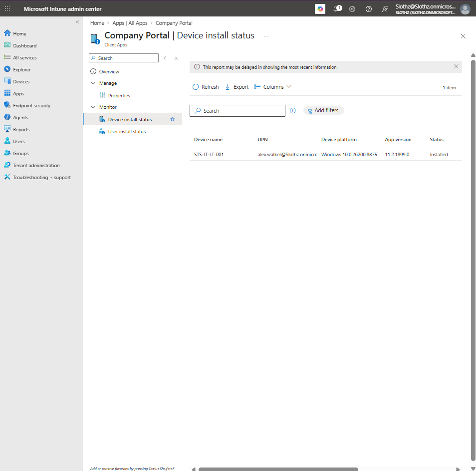
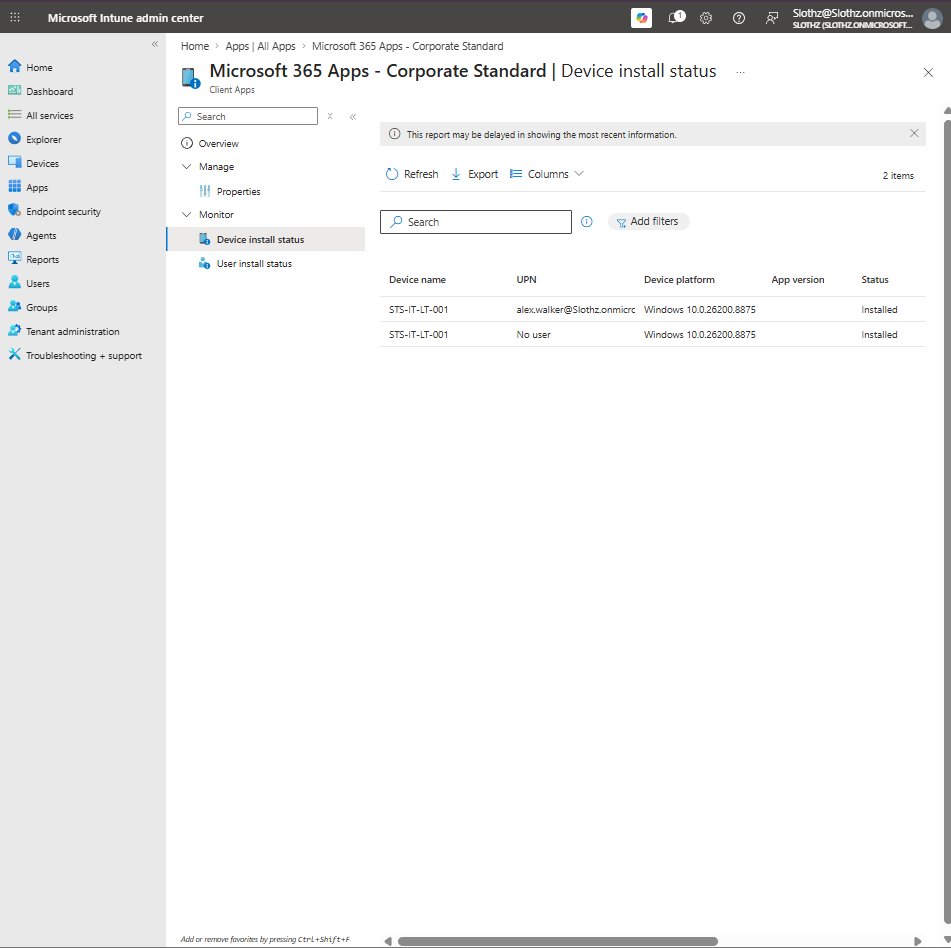
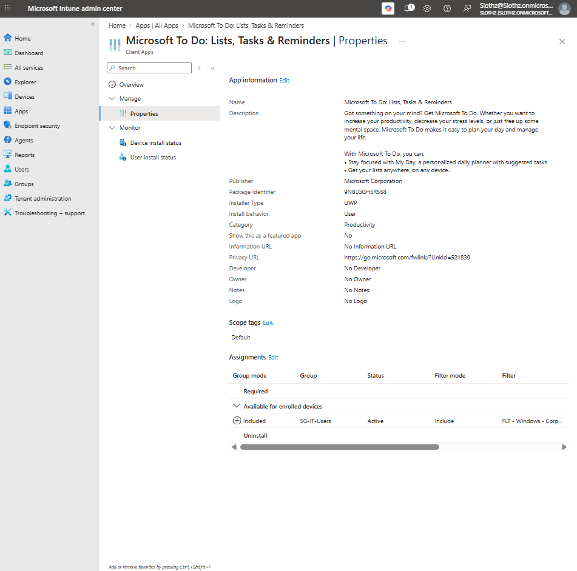
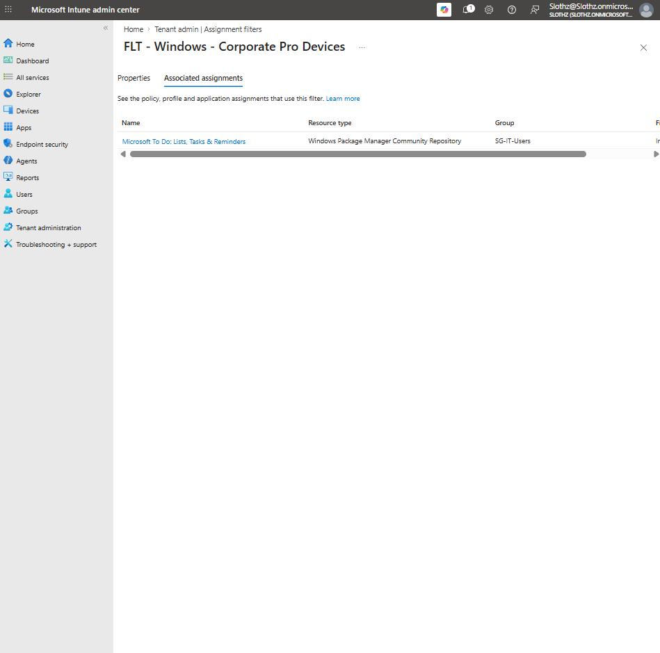

# INT-028 - Troubleshoot App Deployment Status

## Change Summary

**Requested By:** IT Manager

**Business Reason:**  
Slothz Tech Solutions wants to document how Intune administrators can verify and troubleshoot app deployment status for managed Windows devices.

**Risk Level:** Low

**Rollback Plan:**  
No configuration changes were made for this ticket. This ticket documents app deployment monitoring and troubleshooting evidence.

---

## Business Scenario

Slothz Tech Solutions deploys applications to corporate Windows devices using Microsoft Intune.

After apps are assigned, administrators need to verify whether the apps installed successfully, are pending, failed, or are affected by assignment targeting.

This ticket reviews the deployment status of previously assigned applications and confirms how app assignment filters affect app targeting.

---

## Objective

Validate app deployment status for existing Intune-managed applications.

The ticket reviews:

- Company Portal
- Microsoft 365 Apps
- Microsoft To Do
- Microsoft To Do filtered assignment
- Assignment filter associated assignments

---

## Environment

| Component | Details |
|-----------|---------|
| Organization | Slothz Tech Solutions |
| Device Management | Microsoft Intune |
| Identity Platform | Microsoft Entra ID |
| Target Device | STS-IT-LT-001 |
| Primary User | Alex Walker |
| Device Ownership | Corporate |
| App Assignment Group | SG-IT-Users |
| Assignment Filter | FLT - Windows - Corporate Pro Devices |

---

## Apps Reviewed

| Application | Assignment Type | Expected Result |
|-------------|-----------------|----------------|
| Company Portal | Required | Installed on corporate device |
| Microsoft 365 Apps - Corporate Standard | Required | Installed on corporate device |
| Microsoft To Do | Available for enrolled devices | Available/installed for IT users on matching devices |

---

## Evidence

### Company Portal Device Install Status

### Microsoft 365 Apps Device Install Status

### Microsoft To Do Device Install Status

### Assignment Filter Associated Assignments

---

## Verification Summary

### Company Portal

The Company Portal app showed a row-level device install status for `STS-IT-LT-001`.

| Field | Result |
|-------|--------|
| Device | STS-IT-LT-001 |
| User | Alex Walker |
| Status | Installed |

This confirmed that the required Company Portal deployment completed successfully.

---

### Microsoft 365 Apps

Microsoft 365 Apps showed installed status for `STS-IT-LT-001`.

Two status rows appeared:

| User Context | Status |
|-------------|--------|
| Alex Walker | Installed |
| No user | Installed |

The `No user` row was treated as a device/no-user reporting context rather than a failure.

This reinforced that Intune app reporting can show both user-associated and device-level reporting entries.

---

### Microsoft To Do

Microsoft To Do showed installed status for `STS-IT-LT-001`.

| Field | Result |
|-------|--------|
| Device | STS-IT-LT-001 |
| User | Alex Walker |
| Assignment Type | Available for enrolled devices |
| Status | Installed |

This confirmed that the available app assignment was visible and usable by the assigned user.

---

### Microsoft To Do Filtered Assignment

The Microsoft To Do assignment showed:

| Setting | Value |
|---------|-------|
| Assignment Type | Available for enrolled devices |
| Group | SG-IT-Users |
| Filter Mode | Include |
| Filter | FLT - Windows - Corporate Pro Devices |

This confirmed that the app assignment was narrowed using the assignment filter created in INT-027.

---

### Associated Assignments

The assignment filter's Associated assignments page showed Microsoft To Do using the filter.

This confirmed that the filter was actively associated with an app assignment.

---

## Troubleshooting Notes

When troubleshooting Intune app deployment, administrators should check:

- Whether the app is assigned
- Whether the assignment is Required or Available
- Whether the target user or device is included in the assigned group
- Whether an assignment filter is included or excluded
- Whether the device matches the filter rule
- Whether Intune reports Installed, Pending, Failed, Not installed, or Not applicable
- Whether endpoint evidence matches Intune reporting

For this ticket, all reviewed apps showed Installed status.

---

## Outcome

App deployment status was successfully reviewed for multiple Intune-managed applications.

The ticket confirmed that:

- Company Portal installed successfully
- Microsoft 365 Apps installed successfully
- Microsoft To Do installed successfully
- Microsoft To Do uses an Include assignment filter
- The assignment filter shows Microsoft To Do as an associated assignment

This ticket reinforced how to validate app deployment using Intune reporting instead of only checking whether an app appears on the endpoint.

---

## Lessons Learned

Intune app troubleshooting requires reviewing both assignment configuration and deployment status.

A summary chart can show overall app status, but row-level install status is stronger troubleshooting evidence because it identifies the specific device, user, and result.

Required apps are installed automatically by Intune.

Available apps are offered to users through Company Portal.

Assignment filters do not replace groups. They narrow group-based assignments based on device properties.

Scope tags and assignment filters are different:

- Scope tags control Intune object visibility for delegated admins.
- Assignment filters control which devices match an app or policy assignment.

---

## Skills Demonstrated

- Microsoft Intune
- App Deployment Monitoring
- App Install Status Review
- Company Portal
- Microsoft 365 Apps Deployment Review
- Available App Assignment Review
- Assignment Filter Validation
- Troubleshooting Documentation
- Technical Documentation
- GitHub
