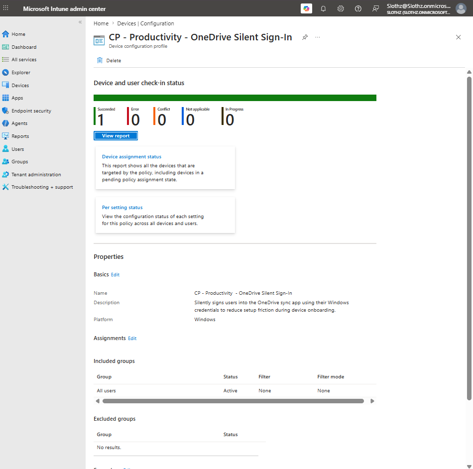
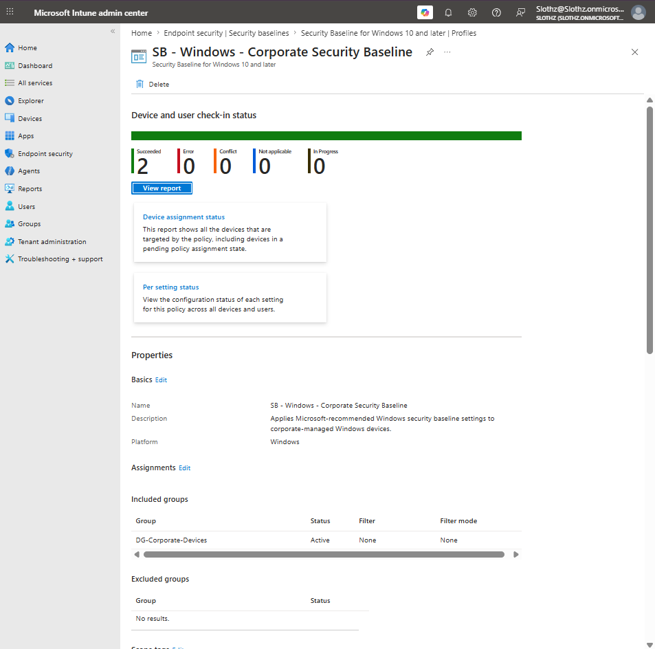
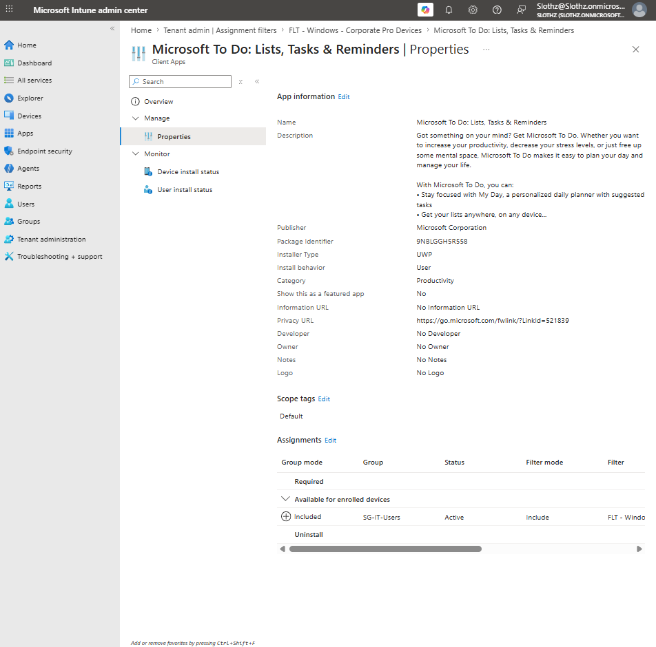
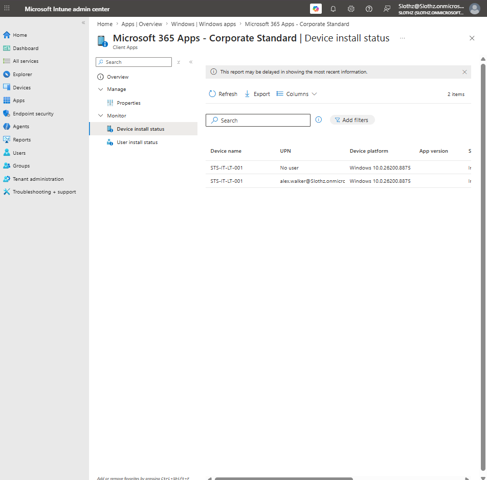

# INT-029 - Troubleshoot Policy Assignment and Targeting

## Change Summary

**Requested By:** IT Manager

**Business Reason:**  
Slothz Tech Solutions wants to document how Intune administrators can identify whether policies and apps are targeted to users, devices, or narrowed by assignment filters.

**Risk Level:** Low

**Rollback Plan:**  
No configuration changes were made. This ticket documents assignment and reporting evidence only.

---

## Business Scenario

Slothz Tech Solutions manages Windows devices using Microsoft Intune.

As the environment grows, administrators need to understand why some settings follow users, why some apply directly to devices, and why some assignments only apply when a device matches a filter.

This ticket documents examples of user-targeted assignments, device-targeted assignments, filtered assignments, and Intune reporting context.

---

## Objective

Troubleshoot and document different Intune targeting models:

- User-targeted assignment
- Device-targeted assignment
- Filtered assignment
- Reporting context such as signed-in user, System account, or No user

---

## Environment

| Component | Details |
|-----------|---------|
| Organization | Slothz Tech Solutions |
| Device Management | Microsoft Intune |
| Identity Platform | Microsoft Entra ID |
| Target Device | STS-IT-LT-001 |
| Primary User | Alex Walker |
| Device Group | DG-Corporate-Devices |
| User Group | SG-IT-Users |
| Assignment Filter | FLT - Windows - Corporate Pro Devices |

---

## Targeting Models Reviewed

| Targeting Type | Example Used | Purpose |
|---------------|--------------|---------|
| User-targeted assignment | OneDrive Silent Sign-In | Shows a setting assigned to users |
| Device-targeted assignment | Windows Security Baseline | Shows a policy assigned to a device group |
| Filtered assignment | Microsoft To Do | Shows a group assignment narrowed by device properties |
| Reporting context | Microsoft 365 Apps | Shows user-associated and device/no-user reporting context |

---

## Evidence

### User-Targeted Assignment

### Device-Targeted Assignment

### Filtered Assignment

### Reporting Context Evidence

---

## Verification Summary

### User-Targeted Assignment

The OneDrive Silent Sign-In configuration profile was assigned to **All users**.

This means the policy follows the signed-in user rather than being limited to one specific device.

| Setting | Result |
|---------|--------|
| Policy | CP - Productivity - OneDrive Silent Sign-In |
| Assignment | All users |
| Filter | None |
| Targeting Type | User-targeted |

This is appropriate for OneDrive silent sign-in because the setting relates to the signed-in user's Windows credentials and OneDrive experience.

---

### Device-Targeted Assignment

The Windows Security Baseline was assigned to `DG-Corporate-Devices`.

This means the policy applies to corporate-managed devices in the device group, regardless of which user signs in.

| Setting | Result |
|---------|--------|
| Policy | SB - Windows - Corporate Security Baseline |
| Assignment | DG-Corporate-Devices |
| Filter | None |
| Targeting Type | Device-targeted |

This is appropriate for baseline security settings because they should apply to the corporate device itself.

---

### Filtered Assignment

Microsoft To Do was assigned to `SG-IT-Users` as an available app, with an Include assignment filter.

| Setting | Result |
|---------|--------|
| App | Microsoft To Do |
| Assignment Type | Available for enrolled devices |
| Group | SG-IT-Users |
| Filter Mode | Include |
| Filter | FLT - Windows - Corporate Pro Devices |

This means the group assignment determines the user target, while the assignment filter narrows the assignment to matching corporate Windows Pro devices.

---

### Reporting Context

Microsoft 365 Apps showed reporting rows for both Alex Walker and No user.

This does not automatically indicate a failure.

| Reporting Context | Meaning |
|-------------------|---------|
| Alex Walker | User-associated reporting context |
| No user | Device/no-user reporting context |
| System account | Windows device/system context |

This reinforces that Intune reporting can separate device-level and user-associated results.

---

## Troubleshooting Logic

When troubleshooting Intune assignment and targeting issues, administrators should ask:

- Is the item assigned to users or devices?
- Is the assigned group correct?
- Is an assignment filter included or excluded?
- Does the device match the filter rule?
- Is the status reporting under a signed-in user, System account, or No user?
- Does the endpoint behavior match Intune reporting?

---

## Outcome

Policy and app targeting models were successfully reviewed and documented.

This ticket confirmed that:

- OneDrive Silent Sign-In is user-targeted.
- The Windows Security Baseline is device-targeted.
- Microsoft To Do uses a filtered assignment.
- Microsoft 365 Apps can show both user-associated and device/no-user reporting entries.

No configuration changes were required.

---

## Lessons Learned

User-targeted assignments follow users.

Device-targeted assignments apply to devices.

Assignment filters narrow app or policy targeting based on device properties.

Scope tags and assignment filters are different:

- Scope tags control which Intune objects delegated admins can see or manage.
- Assignment filters control which devices match an app or policy assignment.

Intune reporting context matters:

- System account means Windows/device/system context.
- Signed-in user means the human user context.
- No user can represent device-level or no-user app reporting context.

Understanding targeting and reporting context is required for accurate Intune troubleshooting.

---

## Skills Demonstrated

- Microsoft Intune
- Policy Assignment Review
- App Assignment Review
- User Targeting
- Device Targeting
- Assignment Filters
- Reporting Context Analysis
- Troubleshooting Documentation
- Technical Documentation
- GitHub
