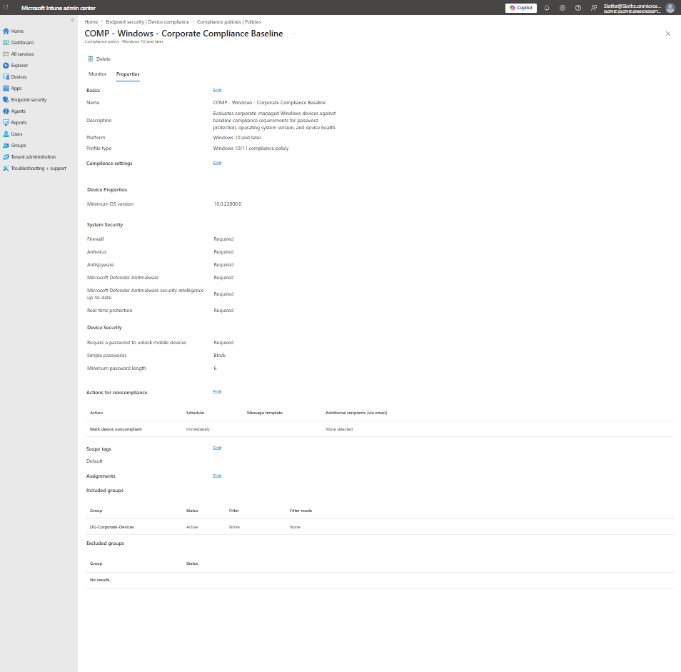
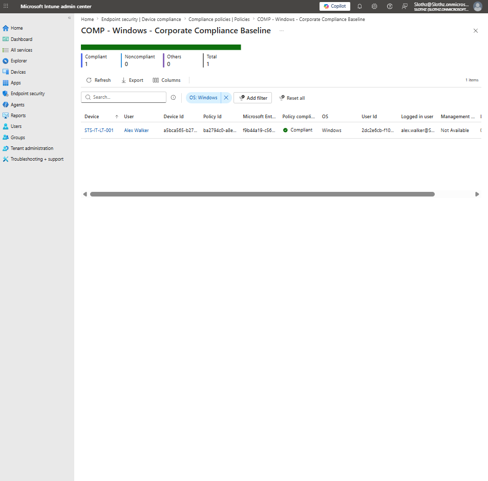
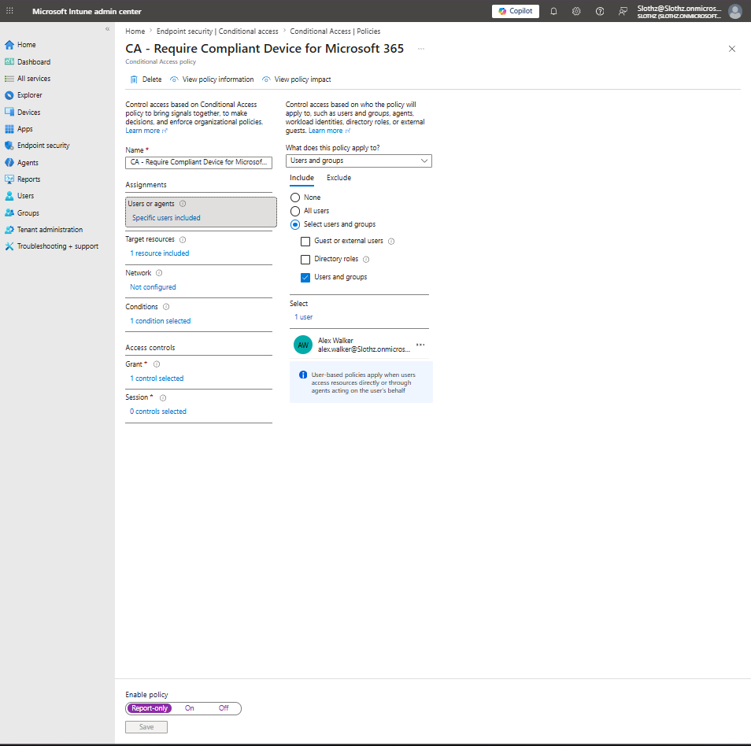
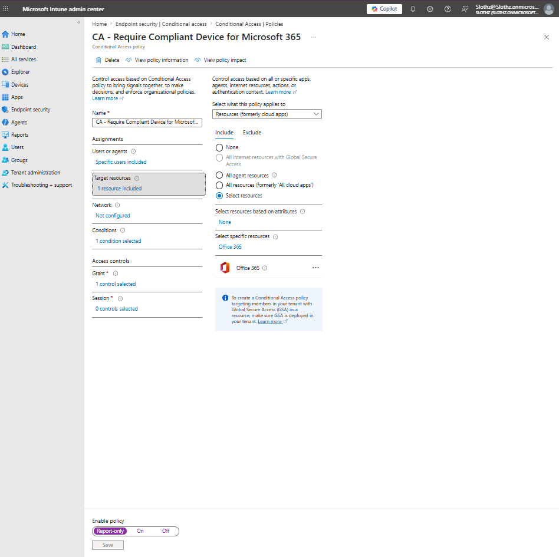
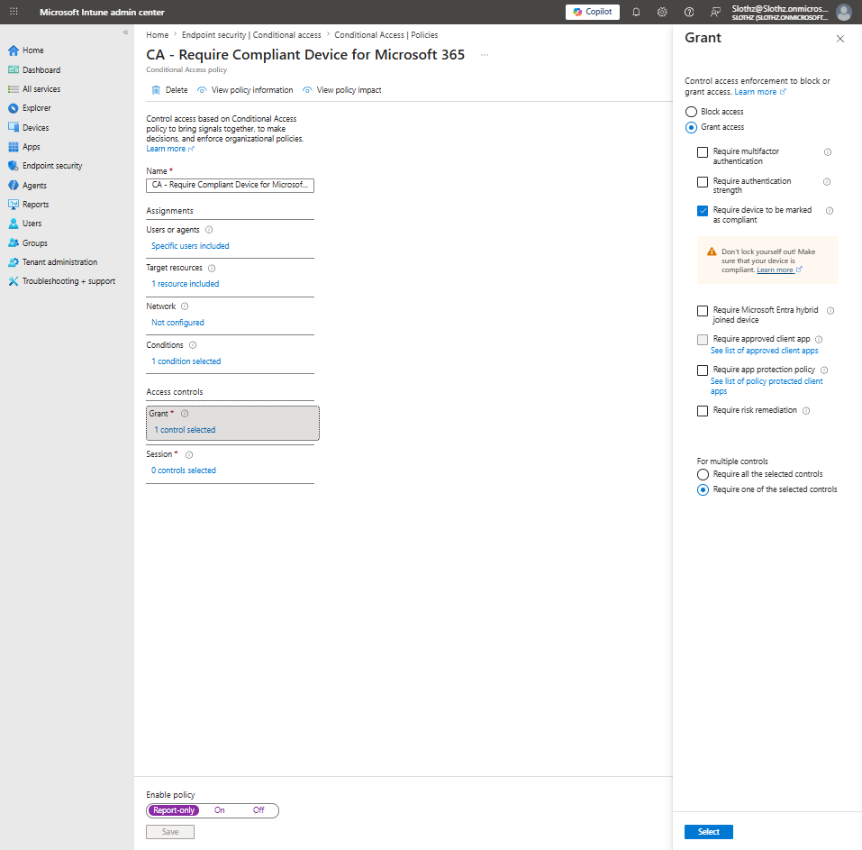

# INT-030 - Troubleshoot Compliance and Conditional Access Targeting

## Change Summary

**Requested By:** IT Manager

**Business Reason:**  
Slothz Tech Solutions wants to validate the relationship between Intune compliance policies and Conditional Access policies before enforcing access controls.

**Risk Level:** Medium

**Rollback Plan:**  
No configuration changes were made. This ticket documents existing compliance and Conditional Access targeting only.

---

## Business Scenario

Slothz Tech Solutions uses Microsoft Intune to evaluate corporate Windows device compliance.

The organization also uses Conditional Access to test requiring compliant devices before allowing access to Microsoft 365 resources.

Before enforcing the Conditional Access policy, IT needs to confirm that the correct user, device, compliance policy, and cloud resource are targeted.

---

## Objective

Troubleshoot and document the compliance and Conditional Access targeting chain:

- Compliance policy assignment
- Device compliance state
- Conditional Access user targeting
- Conditional Access target resource
- Conditional Access grant control
- Report-only policy mode

---

## Environment

| Component | Details |
|-----------|---------|
| Organization | Slothz Tech Solutions |
| Device Management | Microsoft Intune |
| Identity Platform | Microsoft Entra ID |
| Target Device | STS-IT-LT-001 |
| Primary User | Alex Walker |
| Device Group | DG-Corporate-Devices |
| Compliance Policy | COMP - Windows - Corporate Compliance Baseline |
| Conditional Access Policy | CA - Require Compliant Device for Microsoft 365 |
| Target Resource | Office 365 |
| Policy Mode | Report-only |

---

## Access Control Chain

The access control design uses the following chain:

| Layer | Purpose |
|-------|---------|
| Compliance Policy | Evaluates whether the Windows device meets security requirements |
| Device Compliance State | Shows whether the specific device is compliant |
| Conditional Access Policy | Uses compliance state as a condition for access |
| Grant Control | Requires the device to be marked as compliant |
| Report-only Mode | Tests policy impact without enforcing access control |

---

## Evidence

### Compliance Policy Targeting

### Device Compliance State

### Conditional Access User Targeting

### Conditional Access Target Resource

### Conditional Access Grant Control

---

## Verification Summary

### Compliance Policy Targeting

The compliance policy `COMP - Windows - Corporate Compliance Baseline` was assigned to `DG-Corporate-Devices`.

| Setting | Result |
|---------|--------|
| Policy | COMP - Windows - Corporate Compliance Baseline |
| Assignment | DG-Corporate-Devices |
| Filter | None |
| Platform | Windows 10 and later |

This confirms that the compliance policy targets the corporate device group.

---

### Device Compliance State

The device compliance report showed `STS-IT-LT-001` as compliant.

| Field | Result |
|-------|--------|
| Device | STS-IT-LT-001 |
| User | Alex Walker |
| Logged-in User | alex.walker |
| Compliance State | Compliant |
| Operating System | Windows |

This confirms that the target device currently meets the compliance policy requirements.

---

### Conditional Access User Targeting

The Conditional Access policy `CA - Require Compliant Device for Microsoft 365` targeted a specific user.

| Setting | Result |
|---------|--------|
| Included User | Alex Walker |
| Policy Mode | Report-only |
| User Targeting | Specific user included |

This confirms that the Conditional Access policy is scoped safely to Alex Walker instead of all users.

---

### Conditional Access Target Resource

The Conditional Access policy targeted Office 365.

| Setting | Result |
|---------|--------|
| Target Resource | Office 365 |
| Resource Selection | Selected resource |
| Policy Mode | Report-only |

This confirms that the policy applies to Microsoft 365 access rather than every cloud application.

---

### Conditional Access Grant Control

The grant control required the device to be marked as compliant.

| Setting | Result |
|---------|--------|
| Access Control | Grant access |
| Requirement | Require device to be marked as compliant |
| Policy Mode | Report-only |

This confirms that Conditional Access is using Intune compliance state as an access requirement.

---

## Troubleshooting Logic

When troubleshooting compliance and Conditional Access targeting, administrators should verify:

- Which compliance policy applies to the device
- Whether the device is compliant or noncompliant
- Which users are targeted by the Conditional Access policy
- Which cloud resources are targeted
- Which grant controls are required
- Whether the policy is enforcing or running in Report-only mode

For this ticket, the device was compliant and the Conditional Access policy was scoped to Alex Walker, Office 365, and the requirement to use a compliant device.

---

## Outcome

Compliance and Conditional Access targeting were successfully reviewed.

This ticket confirmed that:

- The compliance policy targets `DG-Corporate-Devices`.
- `STS-IT-LT-001` is compliant.
- Alex Walker is targeted by the Conditional Access policy.
- Office 365 is the target resource.
- The grant control requires the device to be marked as compliant.
- The policy is in Report-only mode for safe testing.

No configuration changes were made.

---

## Lessons Learned

Compliance policies and Conditional Access policies work together, but they do different jobs.

A compliance policy evaluates device health.

Conditional Access uses that compliance result to make access decisions.

Report-only mode allows administrators to test the impact of a Conditional Access policy without enforcing it immediately.

This ticket reinforced the access chain:

- Intune evaluates device compliance.
- The device reports compliant or noncompliant.
- Conditional Access checks whether the targeted user is accessing the targeted resource.
- Conditional Access applies the grant control.
- Report-only mode logs the result without enforcing access restrictions.

---

## Skills Demonstrated

- Microsoft Intune
- Device Compliance Review
- Conditional Access Review
- Report-only Policy Validation
- Grant Control Review
- Microsoft 365 Access Targeting
- Troubleshooting Documentation
- Technical Documentation
- GitHub
