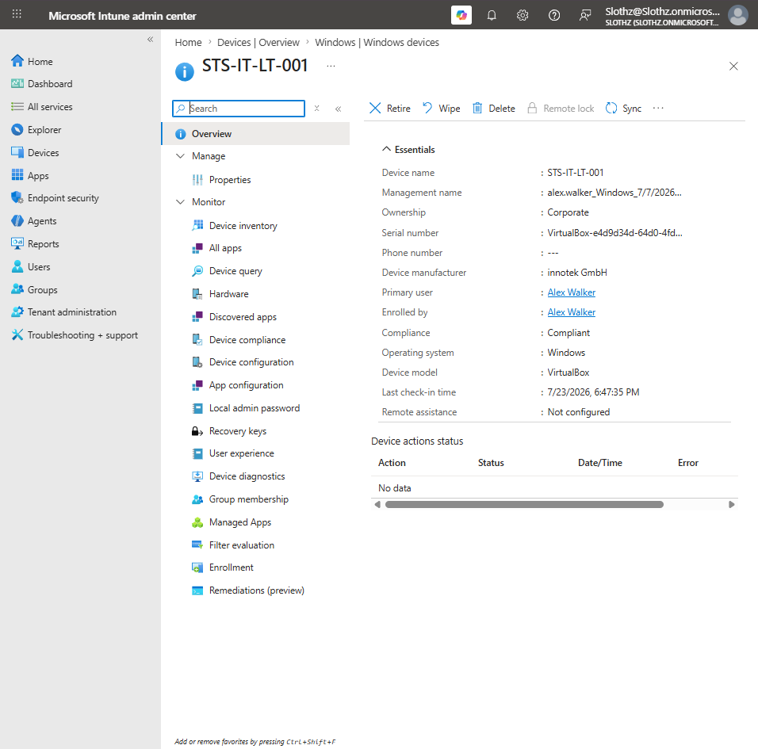
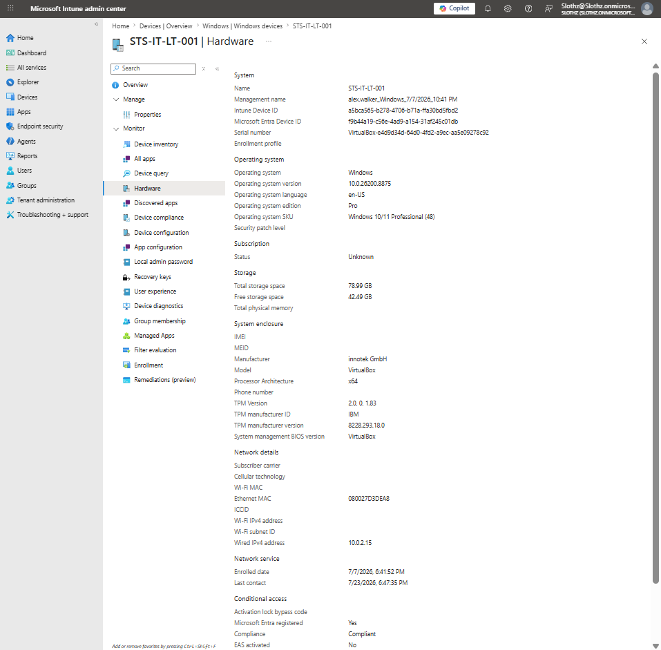
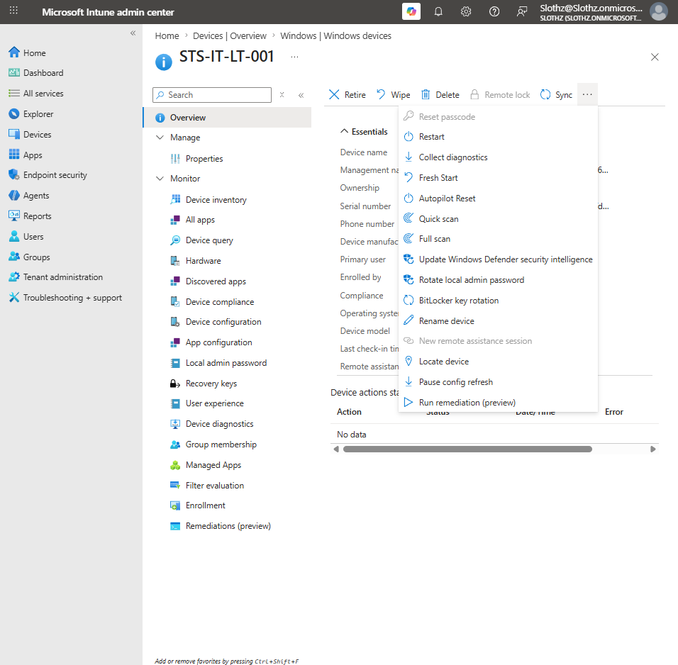
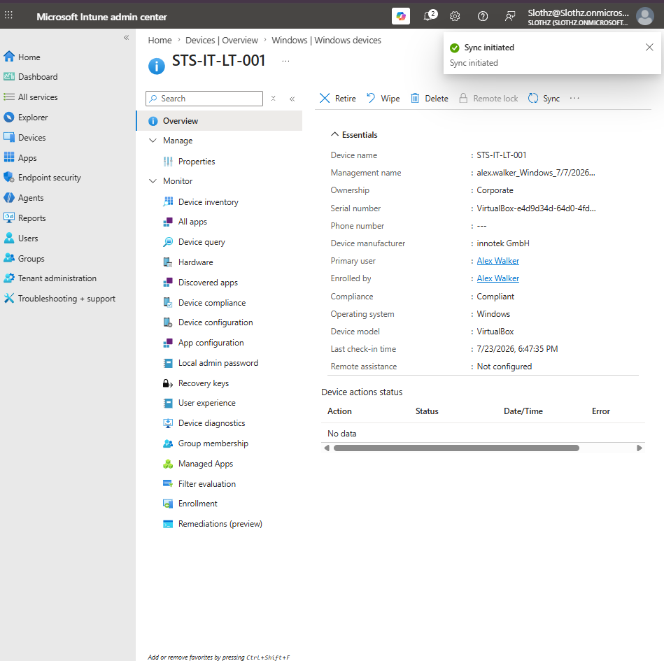

# INT-031 - Review Device Inventory and Remote Actions

## Change Summary

**Requested By:** IT Manager

**Business Reason:**  
Slothz Tech Solutions wants to document how Intune administrators can review managed device details, hardware inventory, and available remote actions without performing destructive actions.

**Risk Level:** Low

**Rollback Plan:**  
No destructive changes were made. The only action performed was a safe device Sync request.

---

## Business Scenario

Slothz Tech Solutions manages corporate Windows devices using Microsoft Intune.

Administrators need to inspect managed device records, confirm device health, review inventory information, and understand which remote actions are available from the Intune admin center.

This ticket reviews the corporate device `STS-IT-LT-001` and performs a safe Sync action.

---

## Objective

Review and document Intune device inventory and remote action evidence for a corporate-managed Windows device.

The ticket validates:

- Device identity
- Corporate ownership
- Primary user
- Compliance state
- Last check-in
- Hardware and operating system inventory
- Available remote actions
- Safe Sync action

---

## Environment

| Component | Details |
|-----------|---------|
| Organization | Slothz Tech Solutions |
| Device Management | Microsoft Intune |
| Identity Platform | Microsoft Entra ID |
| Target Device | STS-IT-LT-001 |
| Primary User | Alex Walker |
| Device Ownership | Corporate |
| Operating System | Windows |
| Device Model | VirtualBox |

---

## Evidence

### Device Overview and Last Check-In

### Device Hardware Inventory

### Remote Actions Available

### Device Sync Action

---

## Verification Summary

### Device Overview

The device overview confirmed key device information.

| Field | Result |
|-------|--------|
| Device Name | STS-IT-LT-001 |
| Ownership | Corporate |
| Primary User | Alex Walker |
| Enrolled By | Alex Walker |
| Compliance | Compliant |
| Operating System | Windows |
| Device Model | VirtualBox |
| Last Check-In | Visible in Intune |

This confirmed that the device is enrolled, corporate-owned, Intune-managed, and reporting compliance status.

---

### Hardware and Operating System Inventory

The hardware inventory page showed detailed device inventory information.

Reviewed inventory included:

- Device name
- Management name
- Intune device ID
- Microsoft Entra device ID
- Serial number
- Operating system
- Operating system version
- Operating system edition
- Operating system SKU
- Storage information
- Manufacturer and model
- Processor architecture
- TPM information
- Network information
- Last contact

This confirmed that Intune collects inventory details useful for troubleshooting, lifecycle management, and endpoint review.

---

### Remote Actions

The device record showed several remote actions available from Intune.

Observed actions included:

- Retire
- Wipe
- Delete
- Sync
- Restart
- Collect diagnostics
- Fresh Start
- Autopilot Reset
- Quick scan
- Full scan
- Update Windows Defender security intelligence
- Rotate local admin password
- BitLocker key rotation
- Rename device

Only safe review was performed. Destructive actions such as Wipe, Retire, Delete, Fresh Start, and Autopilot Reset were not used.

---

### Sync Action

The Sync action was initiated successfully.

Sync is a safe remote action that asks the device to check in with Intune and look for updated policies, apps, and management instructions.

The portal confirmed:

| Action | Result |
|--------|--------|
| Sync | Initiated |

---

## Outcome

Device inventory and remote action review was completed successfully.

The ticket confirmed that `STS-IT-LT-001` is a corporate-owned, compliant, Intune-managed Windows device with visible hardware inventory and available remote actions.

A safe Sync action was initiated to request a device check-in.

No destructive remote actions were performed.

---

## Lessons Learned

The Intune device overview is a strong first place to confirm device identity, ownership, primary user, compliance state, and last check-in.

Hardware inventory provides deeper troubleshooting information such as OS version, edition, storage, TPM, manufacturer, and network details.

Remote actions should be used carefully. Some actions are safe, such as Sync, while others can be destructive or disruptive.

Administrators should understand the purpose and risk of each remote action before using it.

---

## Skills Demonstrated

- Microsoft Intune
- Device Inventory Review
- Hardware Inventory Review
- Remote Device Actions
- Device Sync
- Endpoint Troubleshooting
- Device Lifecycle Awareness
- Technical Documentation
- GitHub
