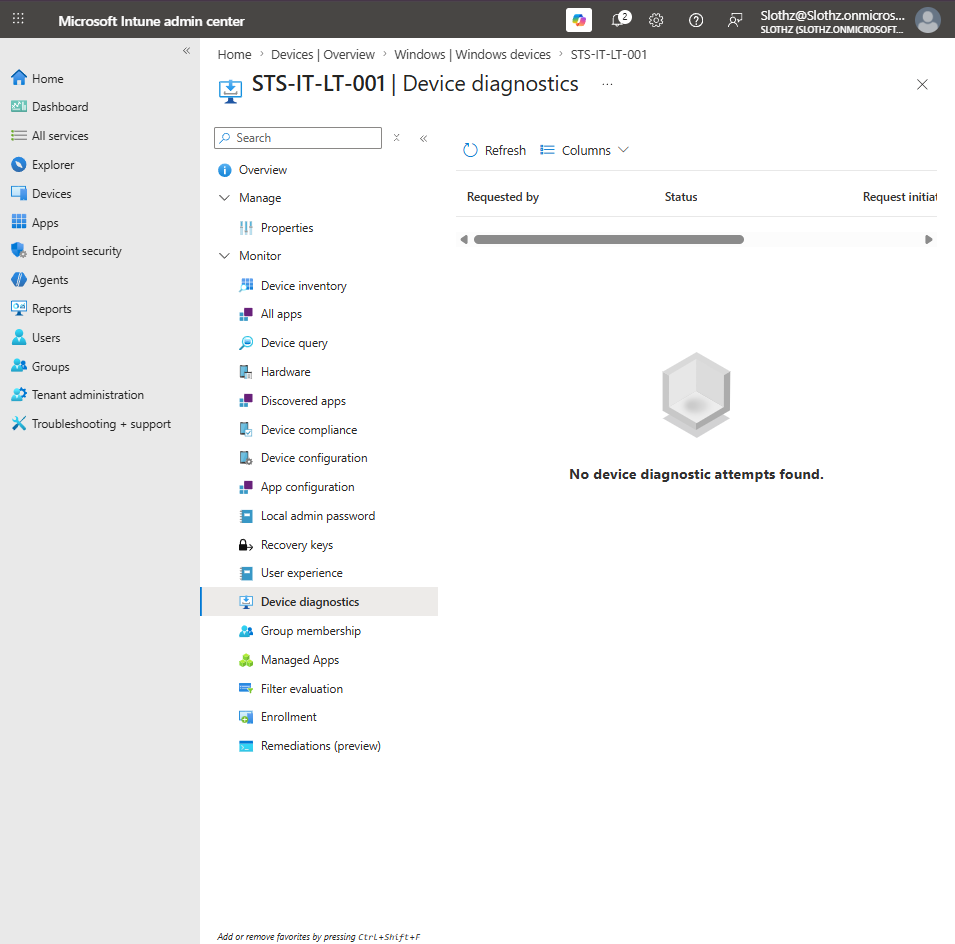
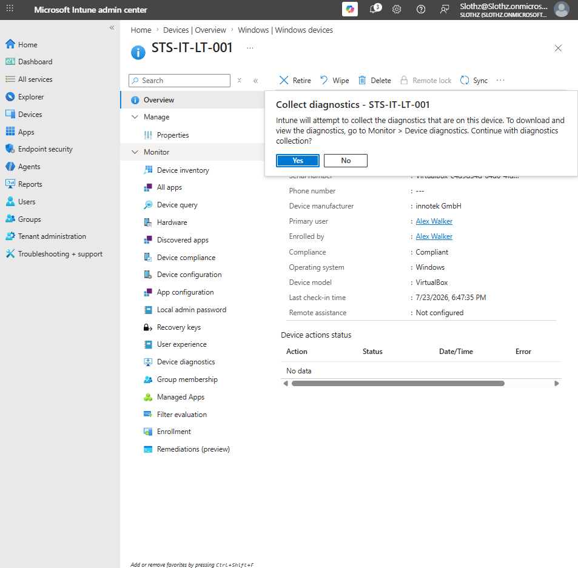
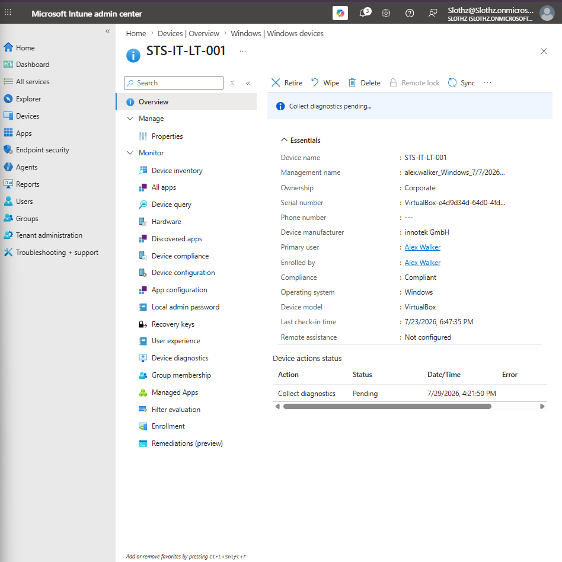
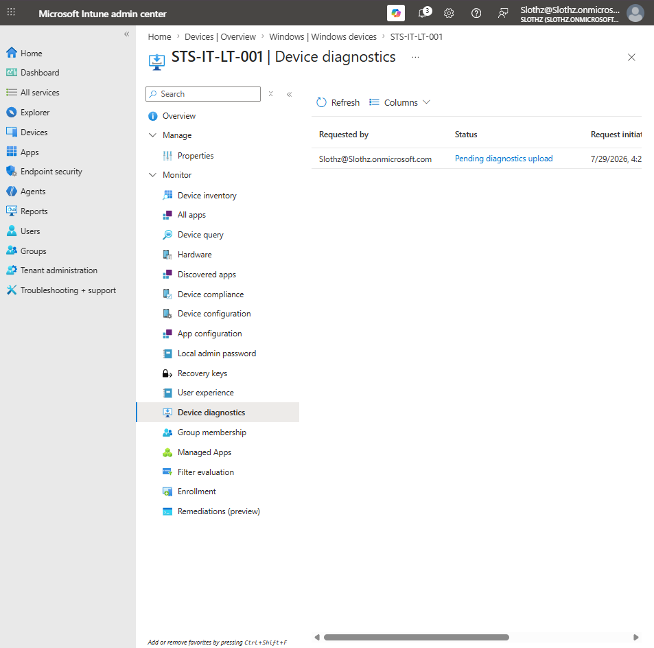
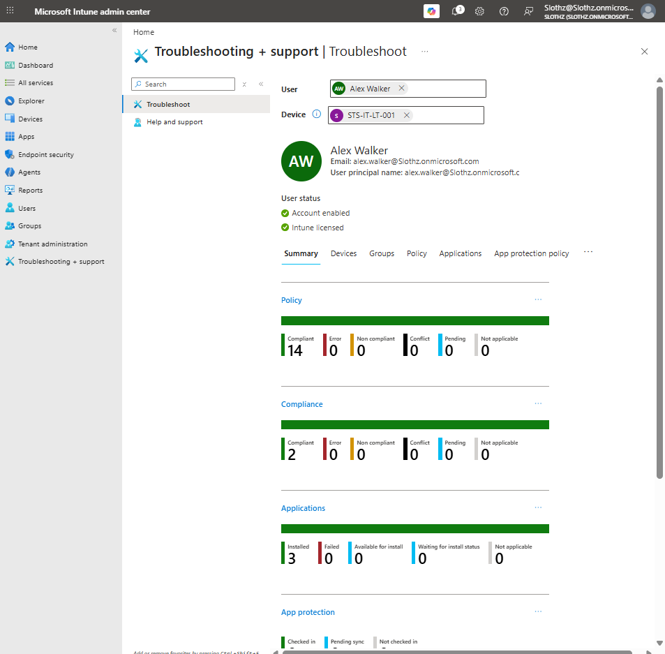

# INT-032 - Review Device Diagnostics and Troubleshooting Tools

## Change Summary

**Requested By:** IT Manager

**Business Reason:**  
Slothz Tech Solutions wants to document how Intune administrators can collect device diagnostics and review troubleshooting information for managed Windows devices.

**Risk Level:** Low

**Rollback Plan:**  
No destructive changes were made. Diagnostic collection was initiated for troubleshooting review only. No raw diagnostic logs were uploaded to GitHub.

---

## Business Scenario

Slothz Tech Solutions manages corporate Windows devices using Microsoft Intune.

When a device has enrollment, compliance, app deployment, or policy issues, administrators need a way to collect diagnostics and review troubleshooting data from the Intune admin center.

This ticket reviews device diagnostics and troubleshooting tools for the corporate Windows device `STS-IT-LT-001`.

---

## Objective

Review and document Intune diagnostics and troubleshooting tools.

The ticket validates:

- Device diagnostics page
- Collect diagnostics remote action
- Diagnostics collection status
- Device action status
- Troubleshooting and support overview
- Safe handling of diagnostic data

---

## Environment

| Component | Details |
|-----------|---------|
| Organization | Slothz Tech Solutions |
| Device Management | Microsoft Intune |
| Identity Platform | Microsoft Entra ID |
| Target Device | STS-IT-LT-001 |
| Primary User | Alex Walker |
| Device Ownership | Corporate |
| Operating System | Windows |
| Device Model | VirtualBox |

---

## Evidence

### Device Diagnostics Page

### Collect Diagnostics Action

### Collect Diagnostics Pending Action

### Diagnostics Collection Status

### Troubleshooting Support Overview

---

## Verification Summary

### Device Diagnostics Page

The device diagnostics page was reviewed for `STS-IT-LT-001`.

Initially, no previous device diagnostic attempts were found.

This confirmed where diagnostic collection attempts can be reviewed for a specific managed device.

---

### Collect Diagnostics Action

The Collect diagnostics remote action was selected from the device record.

The confirmation prompt explained that Intune would attempt to collect diagnostics from the device and that diagnostics could be reviewed from the Device diagnostics area.

This confirmed that diagnostic collection can be initiated from the Intune device record.

---

### Diagnostics Collection Status

After starting the collection, the device action status showed:

| Action | Status |
|--------|--------|
| Collect diagnostics | Pending |

The Device diagnostics page also showed the request with a pending diagnostics upload status.

This confirmed that the diagnostic collection request was successfully initiated and was waiting for the device/upload process.

---

### Troubleshooting and Support Overview

The Troubleshooting + support page was reviewed for Alex Walker and `STS-IT-LT-001`.

The overview showed:

- User account enabled
- Intune licensed
- Policy status summary
- Compliance status summary
- Application status summary
- Device selected for troubleshooting context

This confirmed that the Troubleshooting + support area provides a centralized view for reviewing user and device status.

---

## Diagnostic Data Handling

Raw diagnostic files were not downloaded or uploaded to GitHub.

Only screenshots of Intune status pages were documented.

This is important because diagnostic logs may contain device, user, tenant, or environment-specific information.

---

## Outcome

Device diagnostics and troubleshooting tools were successfully reviewed.

This ticket confirmed that:

- Device diagnostics can be reviewed from the device record.
- Collect diagnostics can be initiated as a remote action.
- Diagnostic collection status can be monitored.
- Troubleshooting + support provides a useful summary of user, device, policy, compliance, and application status.
- Raw diagnostic logs should not be published to a public repository.

No destructive device actions were performed.

---

## Lessons Learned

Device diagnostics are useful when troubleshooting enrollment, compliance, app deployment, policy, or device health issues.

Collect diagnostics is not the same as wiping, retiring, deleting, or resetting a device. It is a troubleshooting action.

Troubleshooting + support helps administrators review user and device context from one place.

Diagnostic logs should be handled carefully and should not be uploaded to public documentation repositories.

---

## Skills Demonstrated

- Microsoft Intune
- Device Diagnostics
- Collect Diagnostics
- Troubleshooting + Support
- Device Action Monitoring
- Policy Status Review
- Compliance Status Review
- App Status Review
- Safe Diagnostic Data Handling
- Technical Documentation
- GitHub
